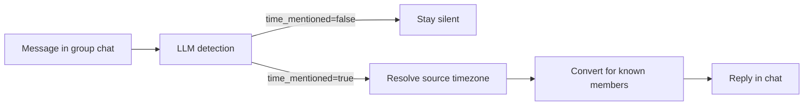

# Timezone Bot

A bot that helps distributed teams coordinate time in group chats — on **Telegram** and **Discord**, from a single shared core.

## What It Does

Timezone Bot watches normal conversation in group chats. When someone mentions a time coordination event, it detects it and replies with local times for every known member of that chat — no commands needed.

```text
Maria:  Let's sync at 3pm tomorrow

Bot:    15:00 Berlin 🇩🇪
        09:00 New York 🇺🇸
        23:00 Tokyo 🇯🇵
```

```text
User:   Deadline is 12:00 in London

Bot:    12:00 London 🇬🇧
        13:00 Berlin 🇩🇪
        08:00 New York 🇺🇸
```

> **Note:** The current MVP uses `one-shot / one-message` LLM detection intentionally — no multi-message history in this branch.

---

## Architecture

### Adapter + Shared Core

The central design idea: **platform adapters are thin delivery layers; all business logic lives in a shared core.**

```
┌─────────────────────────────────────────────────┐
│                  Shared Core                    │
│                                                 │
│  event_detection  →  geo  →  transform          │
│       ↓                        ↓                │
│  onboarding/pending          formatter          │
│       ↓                        ↓                │
│            storage  ←──────────┘               │
└──────────────┬──────────────────┬───────────────┘
               │                  │
    ┌──────────▼──────┐  ┌────────▼──────────┐
    │ Telegram Adapter│  │  Discord Adapter  │
    │   (aiogram)     │  │  (discord.py)     │
    └─────────────────┘  └───────────────────┘
```

The LLM **does not send replies** — it returns structured JSON detection only. The shared bot logic decides whether conversion is allowed; Telegram and Discord are delivery and UX adapters.

### Shared Core Modules

| Module | Responsibility |
|---|---|
| `event_detection/` | One-shot LLM call + JSON validation |
| `geo.py` | City/place → IANA timezone resolution |
| `transform.py` | UTC-pivot time conversion |
| `formatter.py` | Human-readable, grouped reply text |
| `storage/` | SQLite persistence + in-memory caches |
| `services/` | Cross-platform user service logic |

### Message Flow



---

## Docs

- [docs/ONBOARDING.md](docs/ONBOARDING.md) — prerequisites, local setup, configuration reference
- [docs/HANDOVER.md](docs/HANDOVER.md) — key architectural decisions and trade-offs
- [journal/](journal/) — canonical specs and source of truth
