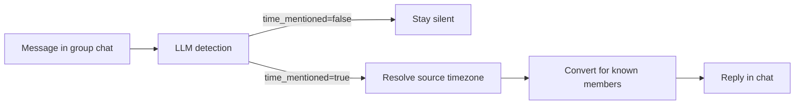

# Timezone Bot

A bot that helps distributed teams coordinate time in group chats — on **Telegram** and **Discord**, from a single shared core.

## What It Does

Timezone Bot watches normal conversation in group chats. When someone mentions a time coordination event, it detects it and replies with local times for every known member of that chat — no commands needed.

### 🌟 Flexible & Beautiful Formatting

You can configure the bot to display times in a compact sentence or as a detailed block with member names and event titles.

**Compact Mode (`inline_sentence`)**: Perfect for quick updates and preserving screen space.
```text
👤 Maria: Let's sync at 3pm tomorrow

🤖 It is 15:00 Berlin, 09:00 New York, 23:00 Tokyo
```

*(Handles multiple time points in one reply:)*
```text
👤 Jane: Standup at 10:30, then the retro is at 15:00.

🤖 It is 10:30 London, 11:30 Berlin

   It is 15:00 London, 16:00 Berlin
```

**Extended Mode (`block`)**: Great for larger teams or detailed coordination. Includes flags, usernames, and extracted event titles.
```text
👤 Anton: Due to the holiday, the final release review is postponed to tomorrow 5pm.

🤖 final release review
   17:00 Berlin 🇩🇪 @anton, @maria
   16:00 London 🇬🇧 @john
```

> **Note:** The current MVP uses `one-shot / one-message` LLM detection intentionally — no multi-message history in this branch.

---

## Architecture

### Adapter + Shared Core

The central design idea: **platform adapters are thin delivery layers; all business logic lives in a shared core.**

```
┌─────────────────────────────────────────────────┐
│                  Shared Core                    │
│                                                 │
│  event_detection  →  geo  →  transform          │
│       ↓                        ↓                │
│  onboarding/pending          formatter          │
│       ↓                        ↓                │
│            storage  ←──────────┘               │
└──────────────┬──────────────────┬───────────────┘
               │                  │
    ┌──────────▼──────┐  ┌────────▼──────────┐
    │ Telegram Adapter│  │  Discord Adapter  │
    │   (aiogram)     │  │  (discord.py)     │
    └─────────────────┘  └───────────────────┘
```

The LLM **does not send replies** — it returns structured JSON detection only. The shared bot logic decides whether conversion is allowed; Telegram and Discord are delivery and UX adapters.

### Shared Core Modules

| Module | Responsibility |
|---|---|
| `event_detection/` | One-shot LLM call + JSON validation |
| `geo.py` | City/place → IANA timezone resolution |
| `transform.py` | UTC-pivot time conversion |
| `formatter.py` | Human-readable, grouped reply text |
| `storage/` | SQLite persistence + in-memory caches |
| `services/` | Cross-platform user service logic |

### Message Flow



---

## Documentation

- [docs/setup.md](docs/setup.md) — Prerequisites, local setup, and configuration.
- [docs/architecture.md](docs/architecture.md) — Technical deep dive: Hexagonal Architecture, Pipeline, and Command patterns.
- [docs/decisions.md](docs/decisions.md) — Design decisions, trade-offs, and product roadmap.
- [docs/archive/](docs/archive/) — Historical project logs and session notes.
