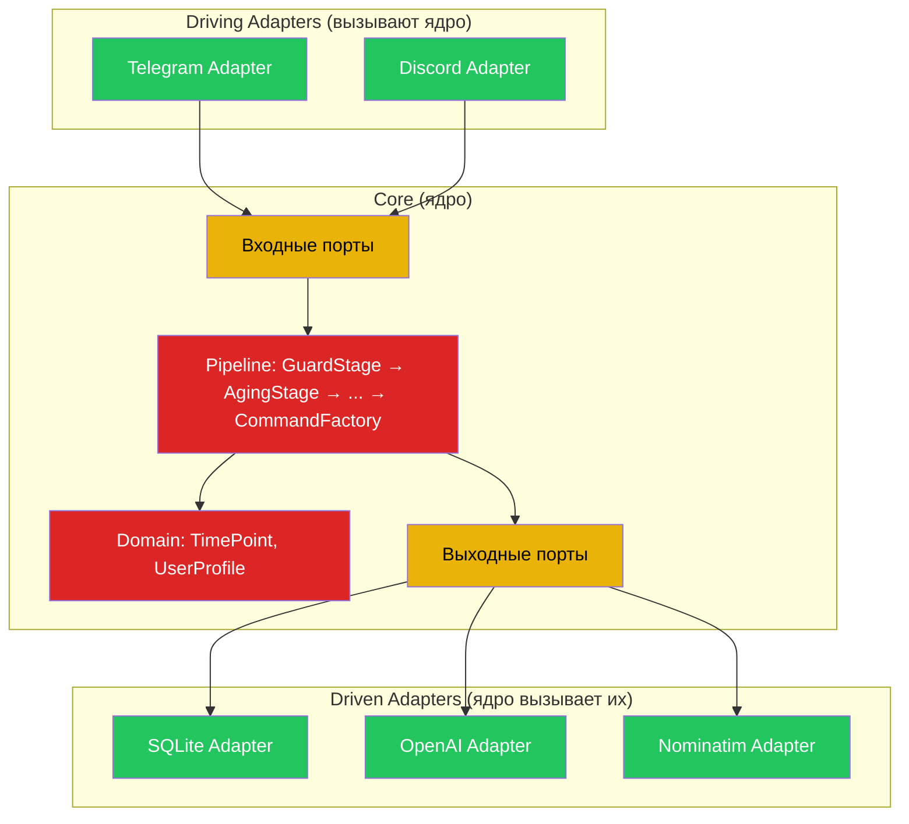
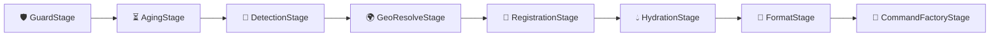
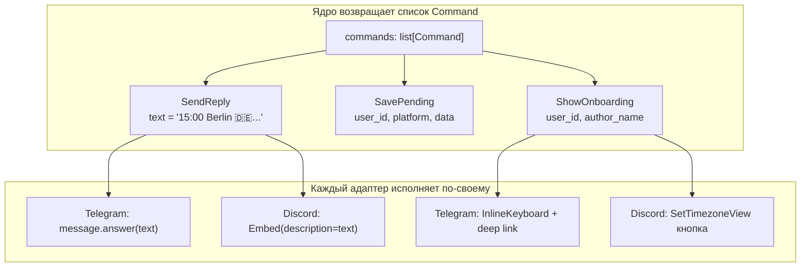
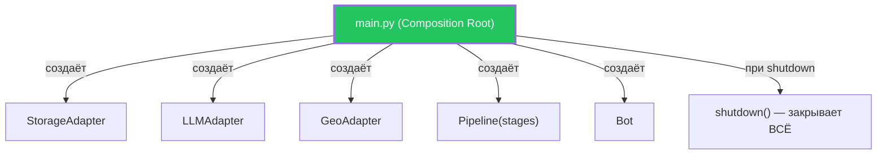
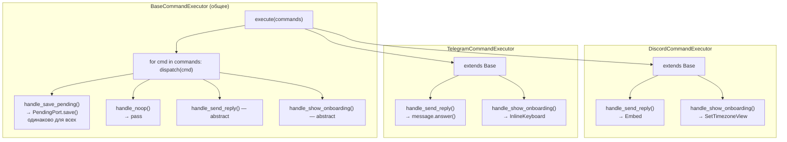
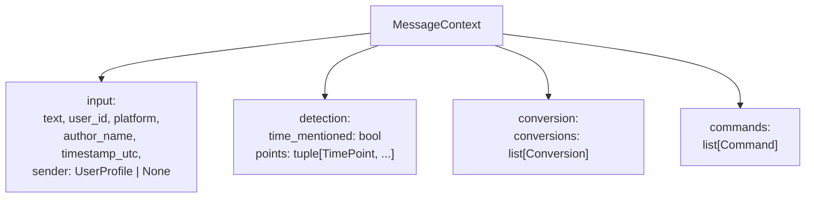

# Архитектурная Спецификация — Timezone Bot

> **Статус**: принята  
> **Дата**: 2026-04-11  
> **Паттерны**: Hexagonal Architecture + Pipe & Filters + Command + Template Method  
> **Стиль**: Hexagonal с элементами тактического DDD

---

## 1. Контекст

### Что делает система

Timezone Bot — Discord/Telegram бот, который обнаруживает упоминания времени в чат-сообщениях и автоматически конвертирует их для участников чата, находящихся в разных часовых поясах.

### Ограничения

- Учебный проект — приоритет понятности над масштабируемостью
- Две платформы (Telegram, Discord) с возможностью добавления новых
- Домен тонкий — мало бизнес-правил, много интеграций
- Однопроцессный runtime

### Почему Hexagonal, а не Clean / Layered

| Критерий | Выбор | Обоснование |
|----------|-------|-------------|
| Много интеграций (5 внешних систем) | Hexagonal | Фокус на портах и адаптерах |
| Тонкий домен | Hexagonal | Не нужно два внутренних кольца как в Clean |
| Нужно понять паттерн | Hexagonal | Одно правило: зависимости только внутрь |

---

## 2. Принятые Решения (ADR)

### ADR-1: Hexagonal Architecture

**Решение**: структура системы организована как три кольца — ядро, порты, адаптеры.

**Правило зависимостей**: стрелки импортов направлены **только внутрь**. Адаптер зависит от порта. Порт зависит от ядра. Ядро ни от кого не зависит.

**Тест на нарушение**: если в `core/` встречается слово `discord`, `aiogram`, `openai`, `sqlite` — правило нарушено.



---

### ADR-2: Pipe & Filters для потока данных

**Решение**: обработка сообщения — линейный конвейер (Pipeline). Один объект (`MessageContext`) рождается на входе и обогащается каждым Stage.

**Правило**: каждый Stage читает чужие данные, пишет только в свой слот. Любой Stage может остановить конвейер (ранний выход).



| Stage | Что делает | Ранний выход |
|-------|-----------|:---:|
| GuardStage | Отсекает ботов, пустые, слишком длинные | ✅ |
| AgingStage | Отсекает старые сообщения | ✅ |
| DetectionStage | Вызывает LLM через порт, ищет упоминания времени | ✅ (нет времени) |
| GeoResolveStage | Резолвит `tz_city` → IANA таймзону через `GeoPort` | — |
| RegistrationStage | Синхронизирует метаданные пользователя и membership в чате | — |
| HydrationStage | Загружает профиль отправителя и участников чата с timezone | — |
| FormatStage | Форматирует текст ответа | — |
| CommandFactoryStage | Собирает список Command-объектов (GoF) | — |

---

### ADR-3: Functional Core / Imperative Shell + Command Pattern (GoF)

**Решение**: конвейер (ядро) **решает** — что делать. Адаптер **исполняет** — как делать.

**Паттерн**: Command (GoF). Конвейер возвращает **список Command-объектов**, а не один action enum. Каждый Command — самодостаточная инструкция, несущая все данные для исполнения.

**Почему не enum**: enum `REPLY | ONBOARD | SKIP` приводит к комбинаторному взрыву (`REPLY_AND_ONBOARD`?). Со списком Command — комбинации бесплатны: `[SendReply(...), ShowOnboarding(...)]`.



**Ключевое свойство**: каждый Command **самодостаточен** — содержит все данные, нужные для исполнения. Адаптеру не нужно возвращаться к контексту конвейера.

**Тест**: `CommandFactory` — чистая функция без I/O, тестируется без моков.

---

### ADR-4: Typed Domain

**Решение**: доменные объекты — `@dataclass(frozen=True)`. Перечисления — `StrEnum`. В CI работает `mypy`.

**Обоснование**: каждый `isinstance()` в рантайме и каждый `.get()` на dict — признак того, что компилятору не дали достаточно информации.

| Было | Стало |
|------|-------|
| `platform: str` | `platform: Platform (StrEnum)` |
| `result: Dict[str, Any]` | `result: DetectionResult (dataclass)` |
| `sender_db: dict \| None` | `sender: UserProfile \| None` |
| `point: dict` | `point: TimePoint (frozen dataclass)` |

---

### ADR-5: Composition Root

**Решение**: `main.py` — единственное место, где создаются и связываются все зависимости. Никаких module-level singletons.

**Обоснование**: единый владелец состояния → чистый shutdown → предсказуемые тесты.



---

### ADR-6: Онбординг — решение в ядре, UI в адаптере

**Решение**: конвейер возвращает Command-объекты `[SavePending(...), ShowOnboarding(...)]`. Каждый Command самодостаточен — содержит user_id, данные сообщения, имя автора. Адаптер исполняет их через CommandExecutor (ADR-7) в порядке получения.

**Pending** — это порт с адаптером (сейчас InMemory, потенциально Redis).

---

### ADR-7: Template Method для исполнения Command (GoF)

**Решение**: адаптер исполняет `list[Command]` через `CommandExecutor` — базовый класс с методом `execute(commands)` и dispatch-логикой.

**Паттерн**: Template Method (GoF). Базовый класс реализует общую логику (SavePending, NoOp), наследники переопределяют платформо-специфичные методы (SendReply, ShowOnboarding).

**Почему Template Method**: из 4 типов Command — 2 одинаковы для всех платформ (SavePending → порт, NoOp → pass). Только SendReply и ShowOnboarding отличаются. Дублировать общий код в каждом адаптере — нарушение DRY.



**Расширение**: WhatsApp = новый наследник Base, 2 метода.

**Тест на нарушение**: если BaseCommandExecutor содержит `import discord` — утечка. Он живёт в `adapters/` но зависит только от `ports/` и `core/domain/commands`.

---

## 3. Структура Каталогов

```
src/
├── core/                              # 🔴 Ядро (Hexagonal — ни от кого не зависит)
│   ├── domain/                        #    Value Objects (DDD)
│   │   ├── value_objects.py           #    TimePoint, UserProfile, MessageContext
│   │   ├── commands.py                #    SendReply, SavePending, ShowOnboarding, NoOp (GoF Command)
│   │   └── enums.py                   #    Platform, ResponseStyle (StrEnum)
│   ├── pipeline/                      #    Pipe & Filters
│   │   ├── pipeline.py                #    Pipeline.run(ctx) → ctx
│   │   ├── stages.py                  #    GuardStage, AgingStage, DetectionStage, GeoResolveStage, RegistrationStage, HydrationStage, FormatStage, CommandFactoryStage
│   │   ├── command_factory.py         #    CommandFactory — собирает list[Command] (GoF)
│   │   └── contracts.py               #    Stage protocol
│   └── services/                      #    Domain Services (DDD)
│       ├── conversion.py              #    convert_time(), parse_time()
│       └── formatting.py              #    format_multi_conversion()
│
├── ports/                             # 🟡 Порты (Hexagonal — интерфейсы)
│   │                                  #    Вынесены из core/ чтобы adapters/ не импортировал core/
│   ├── storage.py                     #    StoragePort (Protocol)
│   ├── detection.py                   #    DetectionPort (Protocol)
│   ├── geocoding.py                   #    GeoPort (Protocol)
│   └── pending.py                     #    PendingPort (Protocol)
│
├── adapters/                          # 🟢 Адаптеры (Hexagonal — реализации)
│   ├── inbound/                       #    Вызывают ядро (Driving Adapters)
│   │   ├── telegram/                  #    Telegram-специфичный код
│   │   │   ├── bot.py
│   │   │   ├── handlers.py
│   │   │   └── middleware.py
│   │   └── discord/                   #    Discord-специфичный код
│   │       ├── bot.py
│   │       ├── slash_commands.py      #    /tb_help, /tb_settz (не путать с GoF Command)
│   │       ├── events.py
│   │       ├── ui.py
│   │       └── tasks.py
│   ├── outbound/                      #    Ядро вызывает их (Driven Adapters)
│   │   ├── sqlite_storage.py          #    StoragePort → SQLite
│   │   ├── openai_detector.py         #    DetectionPort → OpenAI
│   │   ├── nominatim_geo.py           #    GeoPort → Nominatim
│   │   └── memory_pending.py          #    PendingPort → In-Memory
│   └── executors/                     #    Command Executors (GoF Template Method)
│       ├── base.py                    #    BaseCommandExecutor — SavePending, NoOp
│       ├── discord_executor.py        #    DiscordCommandExecutor — SendReply, ShowOnboarding
│       └── telegram_executor.py       #    TelegramCommandExecutor — SendReply, ShowOnboarding
│
├── config.py                          #    Конфигурация
├── logger.py                          #    Логирование
└── main.py                            #    Composition Root
```

---

## 4. Контракты

### 4.1 Объект конвейера — MessageContext



### 4.2 Порты

| Порт | Тип | Методы |
|------|-----|--------|
| StoragePort | Driven | `get_user()`, `set_user()`, `get_chat_members()`, `add_chat_member()`, `remove_chat_member()`, `update_activity()` |
| DetectionPort | Driven | `detect(text, timestamp) → DetectionResult` |
| GeoPort | Driven | `resolve_city(name) → Location \| None` |
| PendingPort | Driven | `save(user_id, platform, data)`, `get_and_delete(user_id, platform) → list` |

### 4.3 Результат конвейера — `list[Command]` (GoF Command Pattern)

Каждый Command — самодостаточный объект (Value Object) с данными для исполнения:

| Command | Поля | Описание |
|---------|------|----------|
| `SendReply` | `text: str` | Отправить ответ с конвертацией времени |
| `SavePending` | `user_id: int, platform: Platform, data: dict` | Заморозить сообщение для будущей обработки |
| `ShowOnboarding` | `user_id: int, author_name: str` | Показать UI онбординга |
| `NoOp` | — | Явный пропуск (конвейер не обнаружил время) |

Конвейер возвращает `list[Command]`. Комбинации бесплатны:

| Сценарий | Возвращаемые Command |
|----------|---------------------|
| Нет времени в тексте | `[NoOp()]` |
| User настроен, время найдено | `[SendReply(text='...')]` |
| User новый, время найдено | `[SavePending(...), ShowOnboarding(...)]` |

---

## 5. Антипаттерны — Чего Избегаем

| Антипаттерн | Правило предотвращения |
|-------------|----------------------|
| Раздутый контекст | MessageContext — вложенная структура, не плоский dict |
| Взрыв портов | Один порт = одна внешняя система |
| Анемичное ядро | Тест: удали Discord → ядро работает? |
| Утечка платформы | Тест: слово `guild`/`embed` в `core/` → нарушение |
| God-factory | CommandFactory — таблица решений, не лестница if/else |
| Module-level singletons | Всё через Composition Root |

---

## 6. Принципы SOLID в проекте

Архитектура строго следует принципам SOLID. Вот как это выглядит на практике:

| Принцип | Значение | Как применяется здесь |
| :--- | :--- | :--- |
| **S** - Single Responsibility | У класса должна быть только одна причина для изменения. | Каждый этап pipeline делает ровно одну вещь. Сервис онбординга разделен на узкие задачи. |
| **O** - Open/Closed | Открыто для расширения, закрыто для модификации. | Чтобы добавить Discord, мы не переписывали ядро. Мы просто написали новый Адаптер. |
| **L** - Liskov Substitution | Объекты должны быть заменяемы их подтипами без поломки программы. | Вместо реального Geo-адаптера можно подставить `FakeGeoAdapter`, и ядро будет работать так же. |
| **I** - Interface Segregation | Много узких интерфейсов лучше, чем один «толстый». | Порты (интерфейсы) крошечные. Например, `GeoPort` отвечает только за резолв локаций. |
| **D** - Dependency Inversion | Зависеть от абстракций, а не от реализаций. | Ядро не импортирует `aiogram` или `sqlite`. Оно импортирует абстракции из `src/ports/`. |

---

## 7. Отложенные Решения

| Решение | Статус | Критерий перехода |
|---------|--------|------------------|
| SQLite → PostgreSQL | Отложено | >1000 пользователей или нужна репликация |
| InMemory pending → Redis | Отложено | Многопроцессный runtime |
| Контекст N сообщений для LLM | Отложено | Качество детекции недостаточно для коротких реплик |
| REST API адаптер | Отложено | Нужен внешний интерфейс помимо мессенджеров |
| Domain Events (Observer) | Отложено | Более 3 побочных эффектов на одно событие |

---

## 8. Проверка — 7 Вопросов Учителя

| Вопрос | Ответ архитектуры |
|--------|-------------------|
| Что домен, что транспорт? | `core/domain/` — домен. Адаптеры конвертируют на границе |
| Инварианты компилятора? | `frozen dataclass` + `StrEnum` + `mypy --strict` |
| Кто владеет состоянием? | Composition Root (`main.py`) |
| Что решает, что исполняет? | Конвейер решает → адаптер исполняет |
| Граница адаптеров? | Порты = явные Protocol-интерфейсы |
| Обратная связь при ошибке? | Типы ловят опечатки, тест на каждый фильтр |
| Сейчас vs потом? | Таблица отложенных решений с критериями (раздел 6) |

---
