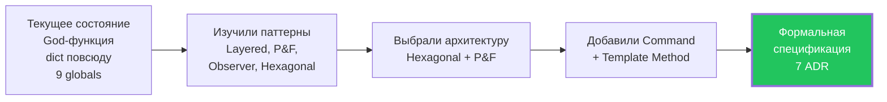
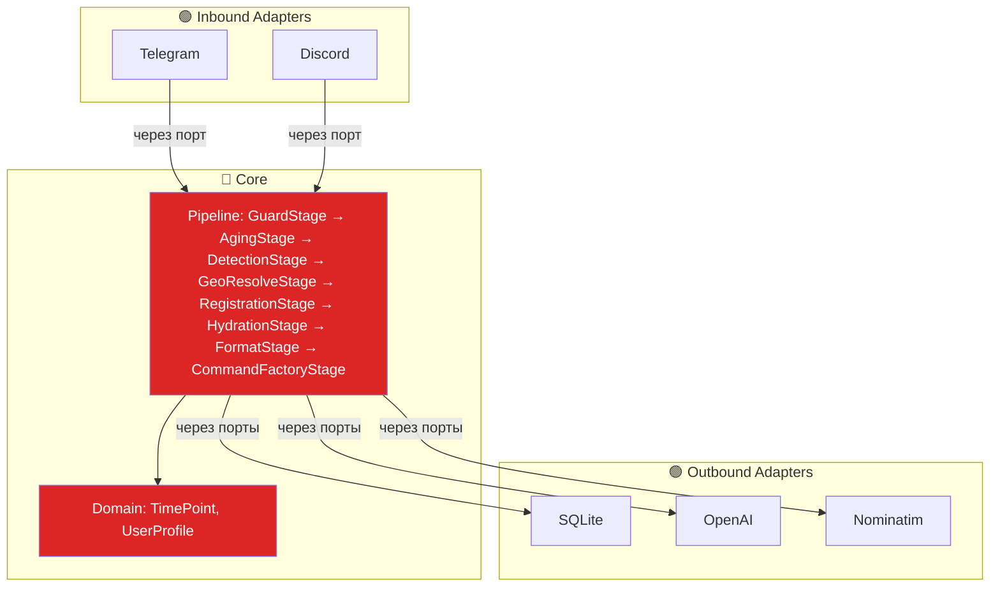
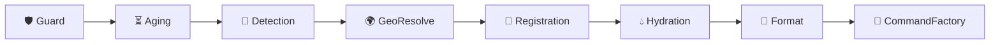
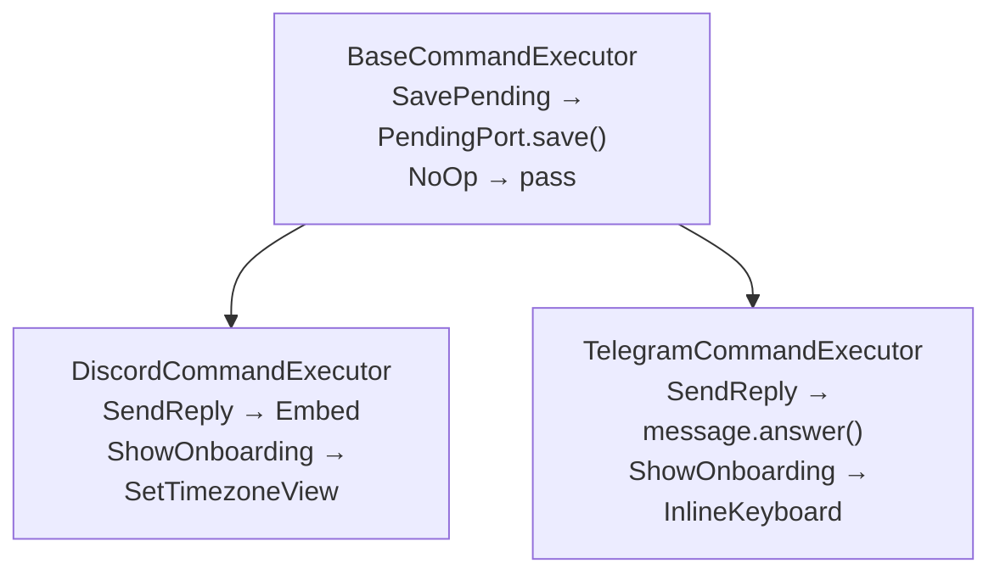
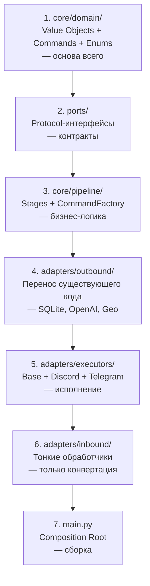

# Архитектурная Сессия — Итоговый Документ

> **Дата**: 2026-04-11  
> **Результат**: Архитектурная спецификация Timezone Bot  
> **Формальная спецификация**: [ARCHITECTURE.md](file:///Users/johnwunderbellen/Timezone_bot/docs/ARCHITECTURE.md)

---

## 1. Что Мы Сделали

Прошли путь от «как бы организовать проект?» до формальной спецификации с 7 ADR и 4 GoF-паттернами.



---

## 2. Выбранная Архитектура

### Внешнее: Hexagonal (кто от кого зависит)



**Правило**: зависимости только внутрь. Ядро не знает слов `discord`, `aiogram`, `openai`, `sqlite`.

### Внутреннее: Pipe & Filters (как данные проходят)



Один объект `MessageContext` рождается → обогащается каждым Stage → на выходе `list[Command]`.

### Выход: Command Pattern (что делать)

Конвейер возвращает **список Command-объектов**, а не enum:

| Сценарий | Commands |
|----------|---------|
| Нет времени | `[NoOp()]` |
| User настроен | `[SendReply(text='15:00 Berlin 🇩🇪...')]` |
| User новый | `[SavePending(...), ShowOnboarding(...)]` |

Каждый Command **самодостаточен** — несёт все данные для исполнения.

### Исполнение: Template Method (как делать)



---

## 3. Глоссарий Паттернов

| Имя в коде | Паттерн | Источник | Файл |
|---|---|---|---|
| Stage | Pipe & Filters | — | `core/pipeline/stages.py` |
| Command (SendReply, NoOp...) | Command | GoF | `core/domain/commands.py` |
| CommandFactory | Factory | GoF | `core/pipeline/command_factory.py` |
| BaseCommandExecutor | Template Method | GoF | `adapters/executors/base.py` |
| Port (StoragePort...) | Port | Hexagonal | `ports/` |
| Adapter (SQLite, Discord...) | Adapter | Hexagonal | `adapters/` |
| Value Object (TimePoint...) | Value Object | DDD | `core/domain/value_objects.py` |
| Pipeline | Pipe & Filters | — | `core/pipeline/pipeline.py` |
| Composition Root | DI | Clean | `main.py` |

---

## 4. Семь Вопросов Учителя — Как Отвечает Архитектура

| # | Вопрос | Ответ | Статус |
|---|--------|-------|:---:|
| 1 | Что домен, что транспорт? | `core/domain/` — домен. Адаптеры конвертируют на границе | ✅ |
| 2 | Инварианты компилятора? | `frozen dataclass` + `StrEnum` + `mypy` | ⚠️ доп. дисциплина |
| 3 | Кто владеет состоянием? | Composition Root (`main.py`) | ✅ |
| 4 | Что решает, что исполняет? | Pipeline решает → Executor исполняет | ✅ |
| 5 | Граница адаптеров? | Порты = Protocol-интерфейсы | ✅ |
| 6 | Обратная связь при ошибке? | Типы + тест на каждый Stage | ⚠️ доп. дисциплина |
| 7 | Сейчас vs потом? | Таблица отложенных решений с критериями | ✅ |

---

## 5. Антипаттерны — Правила Защиты

| Антипаттерн | Тест на нарушение |
|-------------|------------------|
| Раздутый контекст | MessageContext > 20 плоских полей? |
| Утечка платформы | Слово `guild`/`embed` в `core/`? |
| Анемичное ядро | Удали Discord → ядро компилируется? |
| God-factory | CommandFactory > 30 строк if/else? |
| Module-level singletons | `grep "^storage ="` в коде? |

---

## 6. Стратегия Тестирования

| Уровень | Что | Моки | Доля |
|---------|-----|:----:|-----:|
| Unit чистый | CommandFactory, Guard, Aging, ConversionService, Value Objects | Нет | 70% |
| Unit + Fake Port | DetectionStage, GeoResolveStage, HydrationStage | Fake | 20% |
| Integration | Pipeline целиком | Все Fake Ports | 8% |
| Executor | CommandExecutor | FakeMessage | 2% |

**Принцип**: Fake (свой класс, реализует Port) лучше чем Mock (unittest.mock).

---

## 7. Стресс-Тест: Добавить Историю Сообщений

Проверили: архитектура **выдерживает**. При добавлении контекста N предыдущих сообщений для LLM:

| Изменяется | Не изменяется |
|:---:|:---:|
| MessageContext (+1 поле) | Guard, Aging, Format, GeoResolve |
| +1 Stage (ContextStage) | Оба адаптера |
| StoragePort (+1 метод) | Detection/Geo порты |
| SQLite (+1 запрос) | CommandFactory, Executors |

**4 компонента тронуть, 9 — не трогать.**

---

## 8. Структура Проекта

```
src/
├── core/                              # 🔴 Ядро
│   ├── domain/
│   │   ├── value_objects.py           #    TimePoint, UserProfile, MessageContext
│   │   ├── commands.py                #    SendReply, SavePending, ShowOnboarding, NoOp
│   │   └── enums.py                   #    Platform, ResponseStyle
│   ├── pipeline/
│   │   ├── pipeline.py                #    Pipeline.run(ctx) → ctx
│   │   ├── stages.py                  #    GuardStage, AgingStage, ...
│   │   ├── command_factory.py         #    CommandFactory → list[Command]
│   │   └── contracts.py               #    Stage protocol
│   └── services/
│       ├── conversion.py
│       └── formatting.py
│
├── ports/                             # 🟡 Порты
│   ├── storage.py
│   ├── detection.py
│   ├── geocoding.py
│   └── pending.py
│
├── adapters/                          # 🟢 Адаптеры
│   ├── inbound/
│   │   ├── telegram/
│   │   └── discord/
│   ├── outbound/
│   │   ├── sqlite_storage.py
│   │   ├── openai_detector.py
│   │   ├── nominatim_geo.py
│   │   └── memory_pending.py
│   └── executors/
│       ├── base.py
│       ├── discord_executor.py
│       └── telegram_executor.py
│
└── main.py                            #    Composition Root
```

---

## 9. Что Дальше

В следующей сессии — **реализация**. Порядок:



---

## 10. Артефакты Сессии

| Артефакт | Содержание |
|----------|-----------|
| [ARCHITECTURE.md](file:///Users/johnwunderbellen/Timezone_bot/docs/ARCHITECTURE.md) | **Формальная спецификация** — 7 ADR, структура, контракты |
| [architecture_analysis.md](file:///Users/johnwunderbellen/.gemini/antigravity/brain/82f68ea8-d41f-4f17-a48a-819e345538c9/architecture_analysis.md) | Анализ текущего кода, граф зависимостей |
| [architecture_patterns_deep_dive.md](file:///Users/johnwunderbellen/.gemini/antigravity/brain/82f68ea8-d41f-4f17-a48a-819e345538c9/architecture_patterns_deep_dive.md) | Сравнение паттернов: Hexagonal, Mediator, CQRS, Strategy |
| [seven_architectural_questions.md](file:///Users/johnwunderbellen/.gemini/antigravity/brain/82f68ea8-d41f-4f17-a48a-819e345538c9/seven_architectural_questions.md) | Ответы на 7 вопросов учителя с примерами из кода |
| [chosen_architecture.md](file:///Users/johnwunderbellen/.gemini/antigravity/brain/82f68ea8-d41f-4f17-a48a-819e345538c9/chosen_architecture.md) | Визуальный гайд: Hexagonal + P&F |
| [onboarding_and_ui.md](file:///Users/johnwunderbellen/.gemini/antigravity/brain/82f68ea8-d41f-4f17-a48a-819e345538c9/onboarding_and_ui.md) | Где живёт онбординг и платформо-специфичный UI |
| [antipatterns_and_stress_test.md](file:///Users/johnwunderbellen/.gemini/antigravity/brain/82f68ea8-d41f-4f17-a48a-819e345538c9/antipatterns_and_stress_test.md) | 5 антипаттернов + стресс-тест (добавление истории) |
| [teacher_audit.md](file:///Users/johnwunderbellen/.gemini/antigravity/brain/82f68ea8-d41f-4f17-a48a-819e345538c9/teacher_audit.md) | Проверка архитектуры вопросами учителя: 5/7 → 7/7 |
| [intent_vs_enum.md](file:///Users/johnwunderbellen/.gemini/antigravity/brain/82f68ea8-d41f-4f17-a48a-819e345538c9/intent_vs_enum.md) | Почему Command-объекты лучше action enum |
| [command_execution.md](file:///Users/johnwunderbellen/.gemini/antigravity/brain/82f68ea8-d41f-4f17-a48a-819e345538c9/command_execution.md) | 4 варианта исполнения: match, Visitor, Registry, Template Method |
| [testing_strategy.md](file:///Users/johnwunderbellen/.gemini/antigravity/brain/82f68ea8-d41f-4f17-a48a-819e345538c9/testing_strategy.md) | Пирамида тестов, Fake vs Mock, структура тестов |
