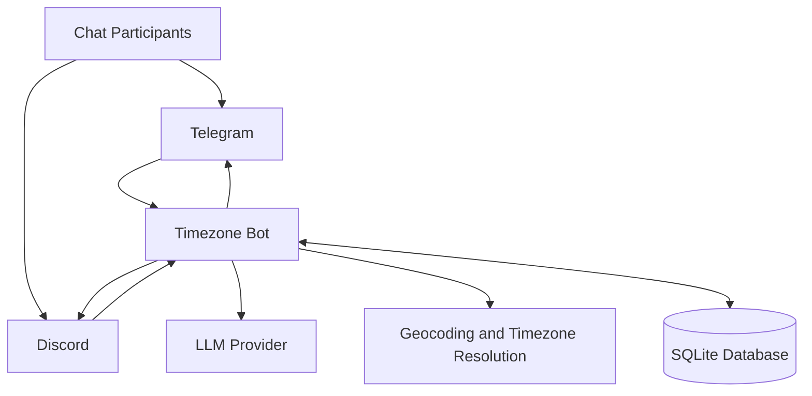
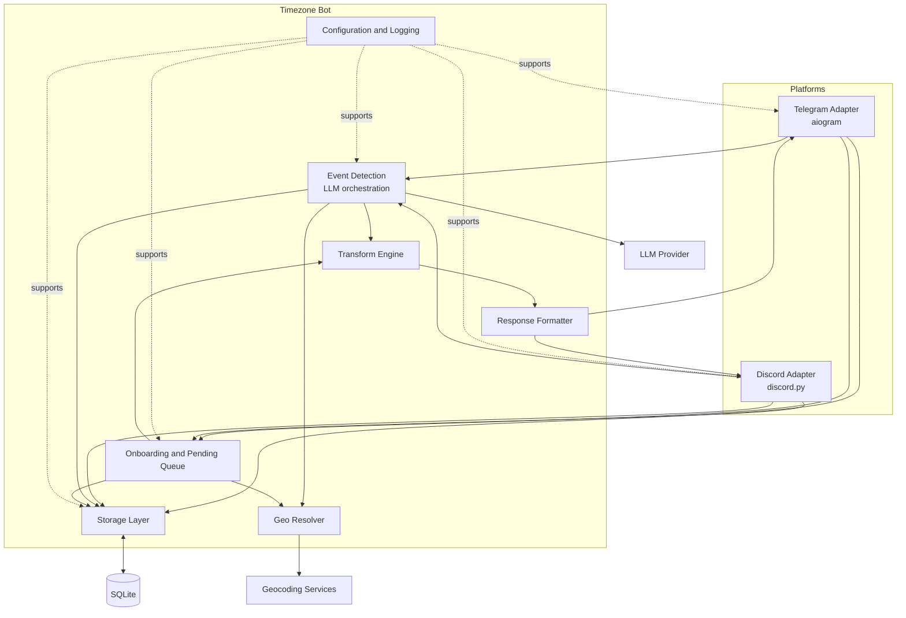
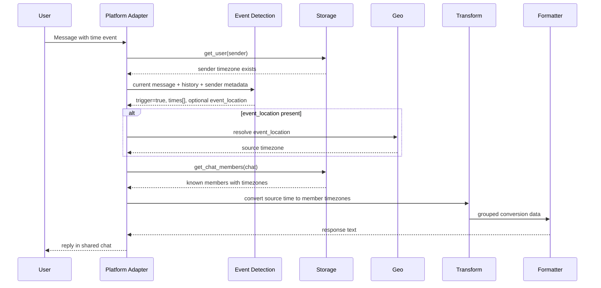
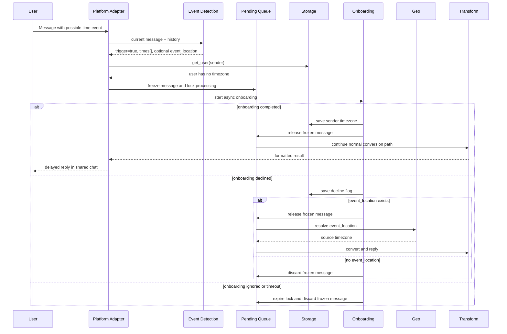

# 00. C4 Architecture

> High-level architecture reference for the Timezone Bot MVP.

## 1. Scope

This document captures the system context, main containers, and the primary runtime flow.
It complements the behavioral rules in [01_scope_and_MVP.md](/Users/johnwunderbellen/Timezone_bot/journal/01_scope_and_MVP.md) and [04_bot_logic.md](/Users/johnwunderbellen/Timezone_bot/journal/04_bot_logic.md).

## 2. System Context

### External Actors and Systems

- **Chat Participants**: users coordinating time in shared chats.
- **Telegram**: platform for group chat delivery and Telegram-private onboarding.
- **Discord**: platform for server chat delivery and Discord-native onboarding UI.
- **LLM Provider**: detects coordination events and extracts structured data.
- **Geocoding and Timezone Resolution**: resolves `event_location` or onboarding city input into IANA timezone.
- **SQLite Database**: stores users, membership, settings state, and related metadata.

## 3. Container Diagram

## 4. Container Responsibilities

| Container | Responsibility |
|---|---|
| Telegram Adapter | Receives Telegram updates, manages Telegram commands, DM onboarding entrypoints, cleanup of short-lived bot messages |
| Discord Adapter | Receives Discord events, manages slash/UI interactions, modal-based onboarding, cleanup and sync tasks |
| Event Detection | Builds context window, calls the LLM, interprets structured output, decides whether to proceed |
| Onboarding and Pending Queue | Starts onboarding for unknown users, stores frozen messages, releases or discards them based on outcome |
| Storage Layer | Persists users, chat membership, flags, timestamps, and related platform-aware records |
| Geo Resolver | Resolves city or `event_location` into coordinates, country, and IANA timezone |
| Transform Engine | Converts source time through UTC into each target member timezone |
| Response Formatter | Produces compact human-readable replies grouped for chat output |
| Configuration and Logging | Loads environment and config, exposes operational settings, provides observability |

## 5. Dynamic Diagram: Registered Author

## 6. Dynamic Diagram: Unknown Author with Onboarding

## 7. Architectural Constraints

- Shared business logic lives in shared core containers, not in platform adapters.
- Private chat is a support channel for onboarding only, not a separate product mode.
- Persistent timezone data uses IANA names only.
- LLM detection is mandatory in MVP; no regex fallback is part of the core design.
- Conversion output includes only known members of the current chat.
