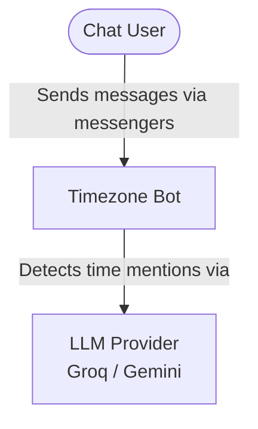
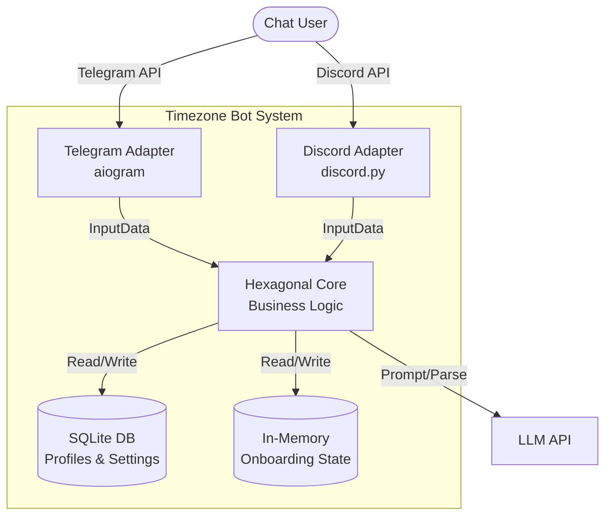
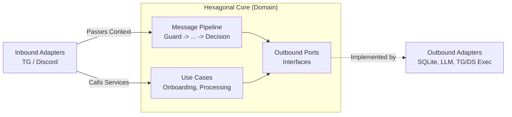

# 00. Architecture (C4 & Hexagonal)

This document describes the bot architecture using the C4 model projected onto Hexagonal Architecture (Ports and Adapters).

## 1. System Context (Level 1)
Interaction of the bot with the outside world.

## 2. Container Diagram (Level 2)
Internal system containers and transport.

## 3. Component Diagram (Level 3 - Core)
Internal structure of the Hexagonal Architecture.

**Key Layer Rules:**
- **Core:** Pure business logic, framework-agnostic. Contains only pure functions, pipelines, and dataclasses.
- **Ports:** Strict interfaces (abstract classes) for DB, LLM, system time, and message delivery.
- **Adapters:** Port implementations that perform actual network or disk I/O.
