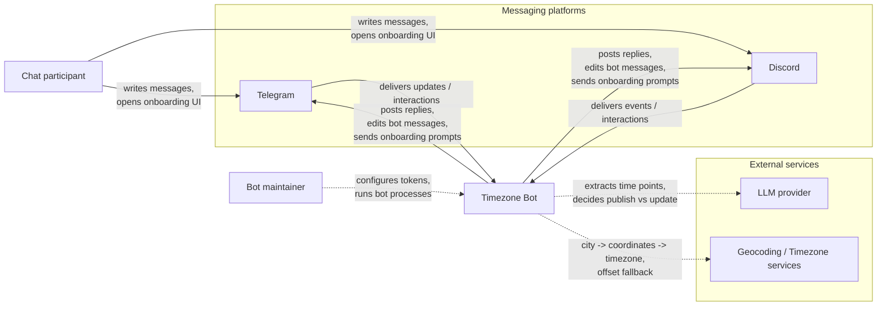
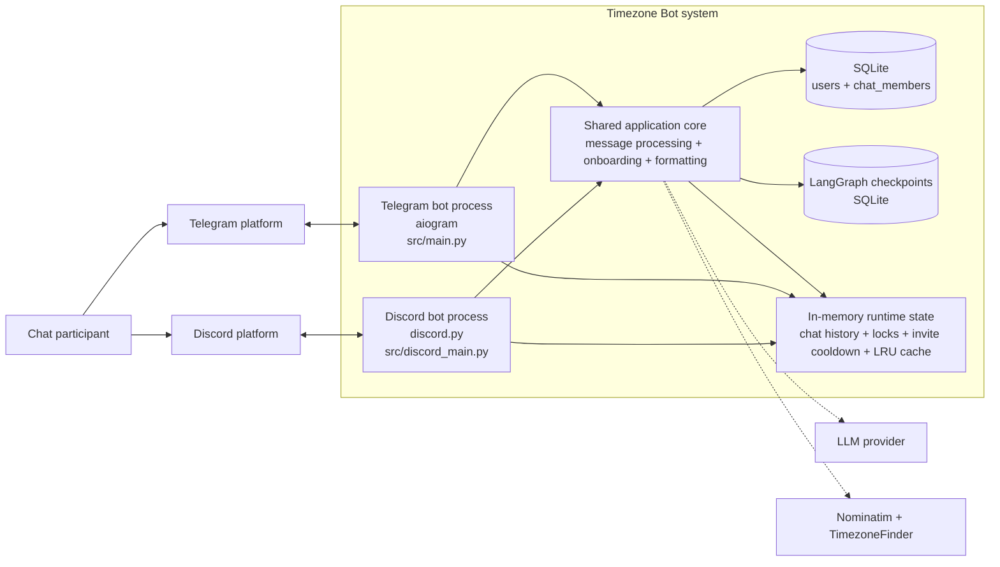
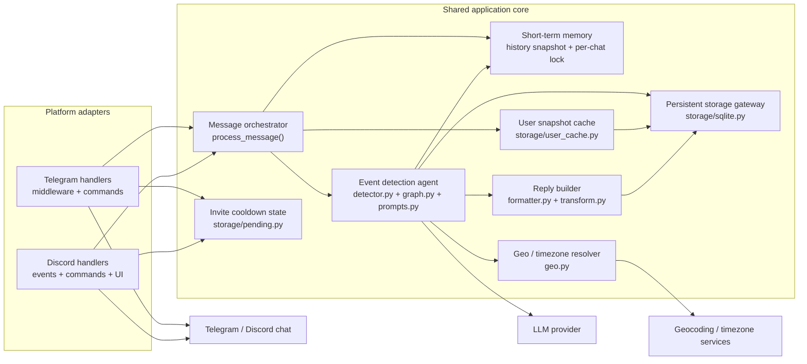
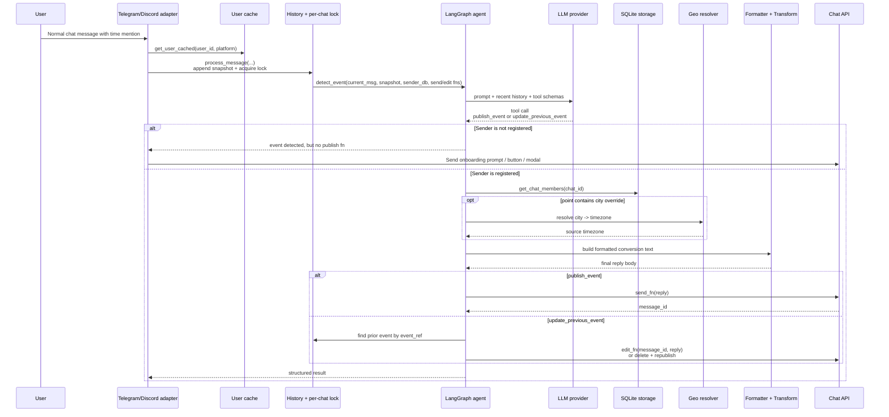

# 00. System Context

This document consolidates the high-level architecture of **Timezone Bot** in one place:

- `System Context` (C4 Level 1): who and what surrounds the system.
- `Container` (C4 Level 2): deployable/runtime building blocks.
- `Component` (C4 Level 3): main internal modules of the bot application.
- `Message-to-Publish Flow`: runtime sequence from platform adapter to message publication in chat.

The diagrams below are based on the current codebase, not only on older specs.

## 1. System Context (C4 Level 1)

### Context Notes

| Element | Role |
|---|---|
| **Chat participant** | Sends ordinary chat messages. May be registered (timezone known) or unregistered. |
| **Timezone Bot** | Detects time-related coordination messages, resolves source timezone, converts times for chat members, and publishes or updates bot replies. |
| **Telegram / Discord** | Delivery channels and UI surfaces. They provide events, slash commands, buttons, modals, replies, edits, and reactions. |
| **LLM provider** | Interprets message context, extracts event points, and decides whether to publish a new event or update an existing one. |
| **Geocoding / Timezone services** | Resolve city input into an IANA timezone and support manual offset fallback. |
| **Bot maintainer** | Runs the bot, configures secrets, and chooses runtime settings. |

## 2. Container Diagram (C4 Level 2)

### Container Responsibilities

| Container | Technology | Responsibility |
|---|---|---|
| **Telegram bot process** | Python, `aiogram` | Polls Telegram updates, handles group messages, onboarding deep-links, private setup, and forwards normalized events into shared processing. |
| **Discord bot process** | Python, `discord.py` | Handles guild messages, slash commands, buttons/modals, and forwards normalized events into shared processing. |
| **Shared application core** | Python modules in `src/` | Orchestrates message handling, event detection, lazy onboarding, reply building, and publish/update behavior. |
| **SQLite** | `aiosqlite` | Persistent source of truth for users and chat membership. |
| **LangGraph checkpoints** | SQLite via `AsyncSqliteSaver` | Persists graph state per chat thread for the event-detection agent. |
| **In-memory runtime state** | Python memory | Holds short-term chat history, per-chat locks, onboarding invite cooldown state, and cached user snapshots. |
| **LLM provider** | OpenAI-compatible chat API | Chooses `publish_event` or `update_previous_event` and returns extracted time points. |
| **Nominatim + TimezoneFinder** | `geopy`, `timezonefinder` | Converts user-entered city data into canonical timezone data. |

## 3. Component Diagram (C4 Level 3)

This diagram zooms into the **shared application core**, because that is where most architectural decisions live.

### Component Notes

| Component | Responsibility |
|---|---|
| **Platform adapters** | Translate Telegram/Discord events into a normalized call to `process_message(...)`; provide platform-specific `send_fn`, `edit_fn`, `delete_fn`. |
| **Message orchestrator** | Applies aging checks, appends history, serializes processing with per-chat locks, and delegates to the event-detection agent. |
| **Short-term memory** | Maintains recent chat context and message references used for update-in-place behavior. |
| **Event detection agent** | Builds prompt context, invokes the LLM with tool schemas, validates tool args, and executes `publish_event` / `update_previous_event`. |
| **Reply builder** | Converts source time into participant-local times and formats the final chat message. |
| **Invite cooldown state** | Prevents repeated onboarding prompts for the same user within the cooldown window. |
| **User snapshot cache** | Avoids repeated user lookups for hot users. |
| **Persistent storage gateway** | Stores user settings and chat membership; supplies member lists for final conversion output. |
| **Geo / timezone resolver** | Resolves user-entered city or manual offset into timezone metadata. |

## 4. Message-to-Publish Flow

This is the missing runtime diagram you asked for. The right name here is a **sequence diagram**: it shows how information moves from the platform adapter to a published or updated bot message.

### Why this sequence matters

- The **adapter** owns platform I/O and injects callbacks for send/edit/delete.
- `process_message()` is the **orchestration boundary**: aging checks, snapshotting, serialization, then handoff to the agent.
- The **agent** decides whether the message creates a new event or updates an earlier one.
- The final published message is assembled only after combining:
  - extracted `points` from the LLM,
  - sender or override timezone,
  - full chat membership from storage,
  - formatting rules from `formatter.py`.

## 5. Architectural Reading

The cleanest way to think about the project is:

1. **Adapters collect and normalize platform events.**
2. **The shared core decides whether the message is actionable.**
3. **The LLM agent chooses publish vs update.**
4. **Storage + geo + formatter provide the deterministic part of the reply.**
5. **The adapter publishes the result back into the original chat UX.**

## 6. Operational Note

Under high load, message handling is serialized **per chat** via a chat-level lock. This prevents concurrent corruption of the LangGraph thread state, but it has two consequences:

- A burst of messages in the same chat is processed one by one, not truly in parallel.
- If the queue grows, older messages may be dropped by the message-age guard instead of being answered late.

There is also one nuance to monitor if traffic grows substantially: processing is serialized per chat via a runtime lock, but persisted thread state still has no freshness cutoff after long inactivity. If old thread context starts hurting quality, the first place to tighten is thread retention/freshness policy in the event-detection layer.
