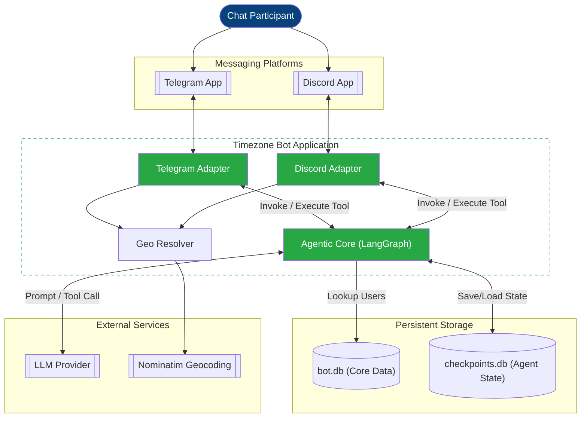

# 02. Container Diagram (C4 Model - Level 2)

This document provides a detailed view of the functional "containers" within the **Timezone Bot** system and their interactions with external systems and components.

## Container Diagram

## Description of Containers

| Container | Technology | Responsibility |
|-----------|------------|----------------|
| **Telegram Bot Process** | Python 3.12, `aiogram` | Handles Telegram messages, callback queries, and deep links. Orchestrates the onboarding flow. |
| **Discord Bot Process** | Python 3.12, `discord.py` | Handles Discord events, slash commands, and modals. Coordinates Discord-specific UI elements. |
| **Event Detection Pipeline** | LangGraph, LangChain | Orchestrates the agentic flow: detection, extraction, and tool-calling decisions. |
| **bot.db** | SQLite, `aiosqlite` | Stores persistent data: user settings, city/timezone, and chat memberships. |
| **graph_checkpoints.db** | SQLite, `langgraph` | Specialized database for agent state persistence, message history, and checkpointing. |
| **Geo/TZ Resolver** | `geopy`, `timezonefinder` | Local processing of city names into coordinates and timezones, complemented by Nominatim for external geocoding. |
| **In-Memory Cache** | `OrderedDict` (LRU) | Caches user snapshots and recent historical context to minimize database lookups and token usage. |
