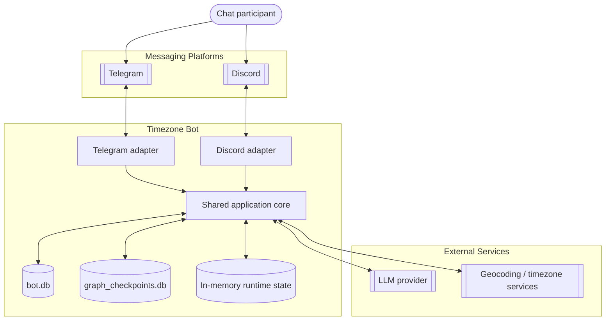

# 02. Container Diagram

This document describes the main runtime containers of the current system and the contracts between them.

## 1. Container View

## 2. Containers

| Container | Technology | Responsibility |
|---|---|---|
| Telegram adapter | Python, `aiogram` | Normalizes Telegram updates, commands, deep-link onboarding, and injects platform send/edit/delete callbacks. |
| Discord adapter | Python, `discord.py` | Normalizes guild messages, slash commands, button/modal onboarding, and injects platform send/edit/delete callbacks. |
| Shared application core | Python modules in `src/` | Runs orchestration, event detection, transformation, formatting, and onboarding policy. |
| `bot.db` | SQLite | Stores users, chat membership, and activity metadata. |
| `graph_checkpoints.db` | SQLite via LangGraph saver | Stores persisted agent thread state per chat. |
| In-memory runtime state | Python memory | Keeps recent chat history, per-chat locks, invite cooldown timestamps, and user cache entries. |
| LLM provider | OpenAI-compatible API | Produces structured event-detection decisions and tool calls. |
| Geocoding / timezone services | `geopy`, `timezonefinder` | Resolves user-entered city names or fallback time hints into IANA timezones. |

## 3. Important Boundaries

1. Adapters stay thin. They should not implement conversion logic.
2. The shared core owns onboarding rules and event-processing policy.
3. `bot.db` and LangGraph checkpoints solve different problems:
   - `bot.db` is product data,
   - checkpoints are agent thread memory.
4. Short-term history is in-memory only and is not reconstructed after restart.
5. Detection for unregistered users runs in isolation and must not pollute the real persisted chat thread.

## 4. Rebuild Notes

If the project were rebuilt from specs only, preserve this container split. It keeps platform code small and lets Telegram and Discord share almost all business logic.
