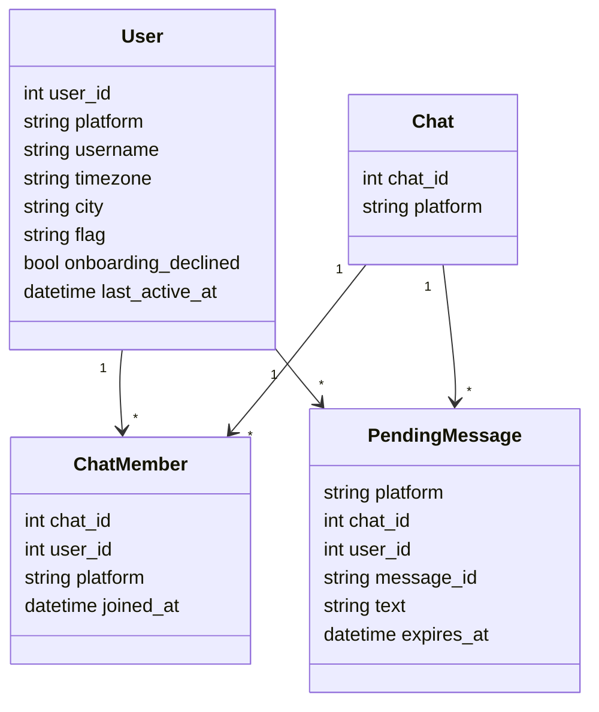
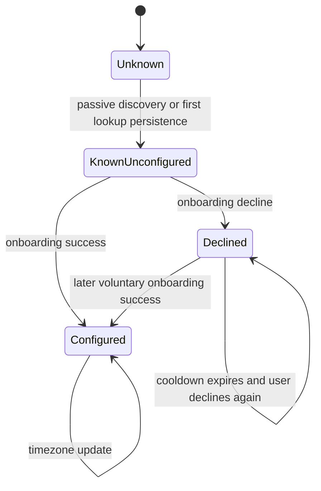
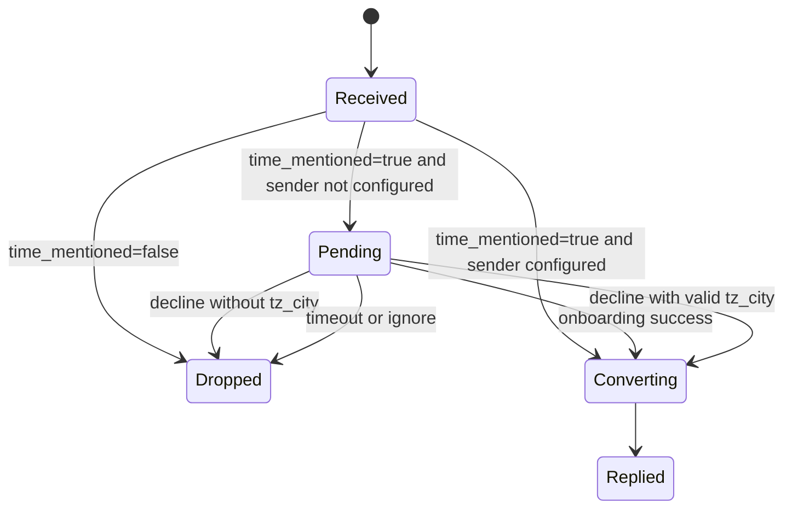

# 02. Domain Model

## 1. Purpose

This document defines the core domain entities, terms, states, and invariants used across the Timezone Bot specifications.

## 2. Core Terms

### User

A person interacting with the bot on a specific platform.

Identity key:

- `user_id`
- `platform`

The same human on Telegram and Discord is treated as two separate platform users unless future identity linking is introduced.

### Chat

A shared conversation context where time coordination happens.

Examples:

- Telegram group
- Discord server context used for message coordination

### Known User

A user who already has a record in persistent storage.

This does not imply that the user has completed timezone setup.

### Configured User

A known user with a non-null stored IANA timezone.

Configured users are eligible:

- to be used as message authors for normal conversion,
- to appear in conversion output for their chat.

### Unconfigured User

A known user with no stored timezone.

Reasons may include:

- passive discovery from chat activity,
- onboarding started but not completed,
- explicit onboarding decline.

### Declined User

An unconfigured user with `onboarding_declined = 1`.

Meaning:

- the user explicitly refused to share timezone at that moment,
- the system should avoid immediate repeated prompting, subject to cooldown policy,
- the user may still voluntarily onboard later.

### Unknown User

A sender for whom no persistent user record is available at lookup time.

In practice, passive collection may quickly turn an unknown sender into a known but unconfigured user during the same processing pipeline.

### Member

A user associated with a specific chat in `chat_members`.

A user may be:

- a member of multiple chats on the same platform,
- a known user without being a member of the current chat,
- a member without being configured.

### Pending Message

A frozen message that triggered lazy onboarding and is waiting for onboarding outcome before final processing.

Properties:

- tied to original author,
- tied to original chat context,
- expires by timeout,
- lives in memory, not in durable storage.

### Explicit Source Location

A location extracted from a message that can define the source timezone for the current conversion.

Detector contract note:

- the current LLM schema exposes this field as `tz_city`.
- the name is historical shorthand: it means source-location text, not durable user city data.

Examples:

- `"12:00 in London"`
- `"Meet at 9 by New York time"`

Rules:

- one-message override only,
- not persisted as user profile state,
- never overwrites stored sender timezone.

### Time Coordination Event

A message that the LLM classifies as requiring timezone conversion behavior.

The exact detection is delegated to the LLM, but the runtime contract is binary:

- `time_mentioned=true`
- `time_mentioned=false`

## 3. Entity Model

## 4. User State Model

## 5. Message Processing State Model

## 6. Invariants

- Only configured users may appear in conversion output.
- Only members of the current chat may appear in conversion output.
- Stored user timezone must be an IANA timezone name or `NULL`.
- explicit source-location text may influence only the current message.
- Decline status must not permanently block later voluntary onboarding.
- Pending messages must expire; they are not retained indefinitely.
- Private chat is an onboarding support channel, not an independent product mode.

## 7. Derived Runtime Categories

The runtime must be able to distinguish these sender categories:

| Category | Meaning | Can convert plain `12:00`? | Can convert `12:00 in London`? |
|---|---|---|---|
| Unknown / unconfigured | No stored timezone | No | Yes, if explicit source-location text resolves |
| Declined | Explicitly refused timezone storage | No | Yes, if explicit source-location text resolves |
| Configured | Stored IANA timezone exists | Yes | Yes |

## 8. Responsibilities by Entity

| Entity | Primary spec |
|---|---|
| User, Member | [05_storage.md](/Users/johnwunderbellen/Timezone_bot/journal/05_storage.md) |
| Pending Message | [15_onboarding_capture.md](/Users/johnwunderbellen/Timezone_bot/journal/15_onboarding_capture.md) |
| Explicit Source Location | [06_city_to_timezone.md](/Users/johnwunderbellen/Timezone_bot/journal/06_city_to_timezone.md) |
| Time Coordination Event | [14_llm_module.md](/Users/johnwunderbellen/Timezone_bot/journal/14_llm_module.md) |
| Runtime decision rules | [04_bot_logic.md](/Users/johnwunderbellen/Timezone_bot/journal/04_bot_logic.md) |
