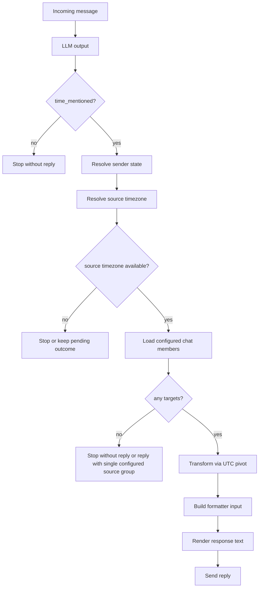

# 03. Runtime Contracts

## 1. Purpose

This document defines the runtime contracts between the main processing stages:

- LLM detection,
- source-timezone resolution,
- time transformation,
- response formatting.

Its goal is to make the data flow reconstructable without reading code.

## 2. Pipeline Overview



## 3. Stage Contracts

### 3.1 LLM Output Contract

Input origin:

- normalized current message,
- anchor timestamp.

Required output:

```json
{
  "time_mentioned": true,
  "points": [
    {
      "time": "12:00",
      "tz_city": "London",
      "event_title": "Deadline",
      "am_pm_clear": true
    }
  ]
}
```

Semantics:

- `time_mentioned=false` means the runtime must stop without conversion.
- `points` contains zero or more extracted time points.
- `tz_city` is an optional per-point source-time override for the current message only.
- `event_title` is optional presentation metadata and must not change conversion logic.
- `am_pm_clear` controls ambiguity annotation and does not change the underlying time value.

## 4. Canonical Runtime Inputs

After LLM and sender lookup, the runtime should be able to assemble this conceptual input:

```json
{
  "platform": "telegram|discord",
  "chat_id": 123,
  "message_id": 456,
  "sender": {
    "user_id": 789,
    "configured": true,
    "declined": false,
    "timezone": "Europe/Berlin"
  },
  "detection": {
    "time_mentioned": true,
    "points": [
      {
        "time": "12:00",
        "tz_city": "London",
        "event_title": "Deadline",
        "am_pm_clear": true
      }
    ]
  }
}
```

Not every field must exist literally in code, but this is the semantic contract the pipeline must satisfy.

## 5. Source Timezone Resolution Contract

### 5.1 Resolution Order

For each message, source timezone is resolved in this order:

1. resolved timezone from point `tz_city`,
2. sender's stored timezone,
3. otherwise no source timezone.

### 5.2 Resolution Rules

- `tz_city` is a per-point override only.
- `tz_city` must never update stored sender timezone.
- If sender is declined or unconfigured, `tz_city` may still enable conversion.
- If neither `tz_city` nor sender timezone is available, plain local times must not be converted.

### 5.3 Geo Resolver Output Contract

Success shape:

```json
{
  "label": "London",
  "timezone": "Europe/London",
  "country_code": "GB",
  "flag": "🇬🇧"
}
```

Failure shape:

```json
null
```

## 6. Transformation Contract

### 6.1 Transform Input

The transform stage receives:

- one extracted time point object,
- one resolved source timezone,
- a list of configured target members in the current chat,
- anchor date/time for correct calendar and DST interpretation.

Conceptual input:

```json
{
  "point": {
    "time": "12:00",
    "tz_city": "London",
    "event_title": "Deadline",
    "am_pm_clear": true
  },
  "source_timezone": "Europe/London",
  "anchor_timestamp_utc": "2026-03-29T10:00:00Z",
  "targets": [
    {
      "user_id": 1,
      "username": "alice",
      "timezone": "Europe/Berlin",
      "city": "Berlin",
      "flag": "🇩🇪"
    }
  ]
}
```

### 6.2 Transform Rules

- transformation must always pass through UTC,
- direct zone-to-zone arithmetic is not the contract,
- target list contains only configured members of the current chat,
- transform may include the sender if the sender is configured and belongs to the current chat,
- DST correctness depends on IANA timezone data and anchor date.

### 6.3 Transform Output

The transform stage returns normalized conversion rows for one time point.

Conceptual output:

```json
{
  "event_title": "Deadline",
  "source": {
    "time_text": "12:00",
    "timezone": "Europe/London",
    "label": "London",
    "flag": "🇬🇧"
  },
  "rows": [
    {
      "timezone": "Europe/Berlin",
      "label": "Berlin",
      "flag": "🇩🇪",
      "local_time": "13:00",
      "day_shift": 0,
      "users": ["alice"]
    }
  ]
}
```

## 7. Formatter Contract

### 7.1 Formatter Input

The formatter receives one or more transformed time-point payloads and rendering options.

Required semantics:

- rows are already timezone-resolved,
- each row is already associated with target users,
- formatter does not decide whether conversion is allowed,
- formatter is responsible for grouping, ordering, and presentation only.
- formatter may use `event_title` only when explicitly present and enabled by configuration.

### 7.2 Formatter Output

Formatter returns a single reply string ready for platform adapter delivery.

Formatting responsibilities:

- group users who share the same timezone/location row,
- render day-shift markers such as `+1` or `-1`,
- support multiple time points in one atomic reply,
- respect display limit configuration,
- optionally include usernames.

## 8. Stop Conditions

The runtime must stop without sending a conversion reply in these cases:

### 8.1 Stop Before Transform

- LLM returned `time_mentioned=false`,
- `time_mentioned=true` but `points` is empty or unusable,
- sender is unconfigured and onboarding is still pending,
- sender is declined or unconfigured and no valid `tz_city` can define source timezone,
- source timezone resolution failed and sender has no stored timezone.

### 8.2 Stop After Target Lookup

- no configured chat members are available as targets,
- formatting input is empty after filtering.

## 9. Outcome Matrix

| Sender state | Explicit source location (`tz_city`) | Source timezone available? | Action |
|---|---|---|---|
| Configured | No | Yes | Convert |
| Configured | Yes and resolvable | Yes | Convert using override |
| Configured | Yes but not resolvable | Yes | Fallback to sender timezone |
| Unconfigured | No | No | Start onboarding or stop |
| Unconfigured | Yes and resolvable | Yes | Convert only if runtime rules allow after onboarding outcome |
| Declined | No | No | Stop without conversion |
| Declined | Yes and resolvable | Yes | Convert |

## 10. Invariants

- The formatter must never invent missing timezone data.
- The transform stage must never persist profile changes.
- The geo stage must never overwrite stored user timezone from runtime message text.
- Conversion output must include only configured members of the current chat.
- One message produces at most one bot reply for the conversion scenario.
- Synchronous network-bound geo resolution must not block the main async runtime path.
- LLM execution may use a primary attempt plus a fallback attempt, but both must honor the same detection/output contract.
- LLM fallback activation and complete failure must be logged explicitly.

## 11. Relation to Other Specs

- [01_scope_and_MVP.md](/Users/johnwunderbellen/Timezone_bot/journal/01_scope_and_MVP.md): product rules
- [02_domain_model.md](/Users/johnwunderbellen/Timezone_bot/journal/02_domain_model.md): terms and state model
- [04_bot_logic.md](/Users/johnwunderbellen/Timezone_bot/journal/04_bot_logic.md): runtime branching logic
- [06_city_to_timezone.md](/Users/johnwunderbellen/Timezone_bot/journal/06_city_to_timezone.md): geo resolution
- [07_response_format.md](/Users/johnwunderbellen/Timezone_bot/journal/07_response_format.md): presentation details
- [14_llm_module.md](/Users/johnwunderbellen/Timezone_bot/journal/14_llm_module.md): LLM interface
