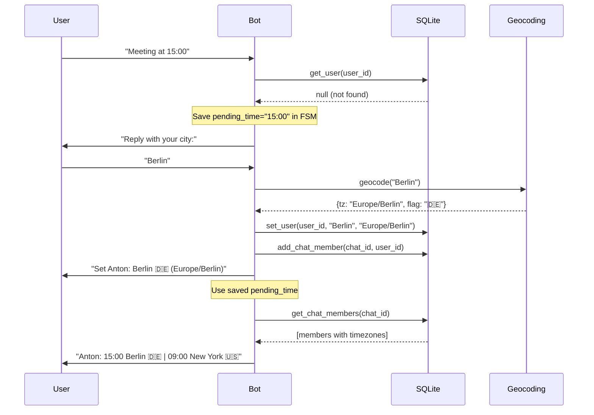
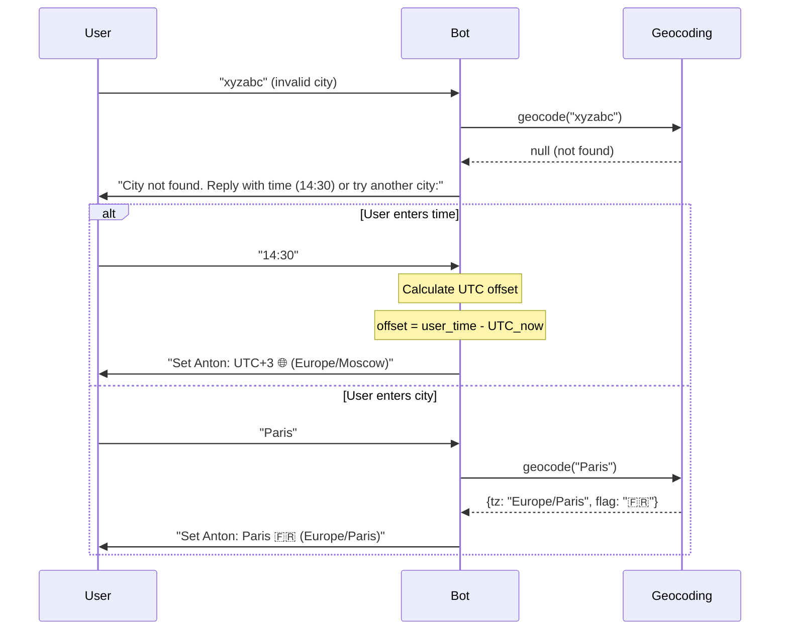

# 🤖 Technical Spec: Bot Logic Module

## 1. Architecture Overview

```
┌─────────────────┐
│  Telegram API   │
└────────┬────────┘
         │ message
         ▼
┌────────────────────────────────────────────────────────┐
│                     BOT CORE                           │
│                                                        │
│  ┌─────────┐   ┌─────────────┐   ┌────────────────┐   │
│  │ Capture │──▶│ Transform   │──▶│ Response       │   │
│  │ (Regex) │   │ (UTC-Pivot) │   │ (Format)       │   │
│  └─────────┘   └─────────────┘   └────────────────┘   │
│       │                                               │
│       ▼                                               │
│  ┌──────────────────────────────────────────────┐    │
│  │              Storage (SQLite)                 │    │
│  │  users: timezone, city                        │    │
│  │  chat_members: who is in which chat           │    │
│  └──────────────────────────────────────────────┘    │
│       │                                               │
│       ▼ (if user not found)                          │
│  ┌─────────────┐                                     │
│  │ City → TZ   │ (Geocoding)                         │
│  └─────────────┘                                     │
└────────────────────────────────────────────────────────┘
         │
         ▼ reply
┌─────────────────┐
│  Telegram Chat  │
└─────────────────┘
```

### Integration Note
We leverage the standard **Telegram Bot API** via the **aiogram** library.
This ensures reliability and follows standard practices for handling:
- Message objects & updates (Long Polling)
- User & Chat entities
- Asynchronous event loop
- **ForceReply**: Auto-opens reply mode when bot asks for user input (improves UX)

---

## 2. Core Workflow

### Trigger
Бот слушает все сообщения в чатах и проверяет на срабатывание capture module (обнаружение времени).

### Flow: Happy Path (юзер в БД)

```
1. [TRIGGER]     → Capture module находит время в сообщении
2. [LOOKUP]      → Проверка sender_id в SQLite
3. [FOUND]       → Получаем timezone отправителя
4. [SCAN]        → Получаем список других юзеров чата из БД
5. [TRANSFORM]   → Вызов TTM для конвертации во все зоны
6. [REPLY]       → Бот реплеит:
                   "14:00 Berlin 🇩🇪 | 08:00 New York 🇺🇸 | 22:00 Tokyo 🇯🇵"
```


### Flow: New User (юзера нет в БД)

```
1. [TRIGGER]     → Capture module находит время
2. [LOOKUP]      → Проверка sender_id в SQLite
3. [NOT FOUND]   → Юзер отсутствует в БД
4. [SAVE TIME]   → Сохраняем pending_time в FSM state
5. [ASK CITY]    → Бот спрашивает: "Reply with your city name:"
6. [PARSE]       → Попытка определить timezone по городу
   │
   ├─ [SUCCESS]  → Сохраняем в SQLite
   │              → "Set: Berlin 🇩🇪"
   │              → Используем pending_time для конвертации
   │              → "Anton: 15:00 Berlin 🇩🇪 | 09:00 New York 🇺🇸"
   │
   └─ [FAIL]     → "City not found. Reply with your current time (e.g. 14:30)
                    or try another city name:"
                 → Юзер отвечает:
                    ├─ [TIME]  → Вычисляем offset, сохраняем UTC+X
                    └─ [CITY]  → Повторяем geocoding
```

#### Sequence Diagram: New User Flow



#### Sequence Diagram: Fallback Flow (City Not Found)



---

## 3. Resolved Questions

- [x] ~~Rate limiting для ответов бота?~~ → `cooldown_seconds` в конфиге (default: 0 = off)
- [x] ~~Приватные чаты vs групповые?~~ → Только групповые. Приватные не нужны.


