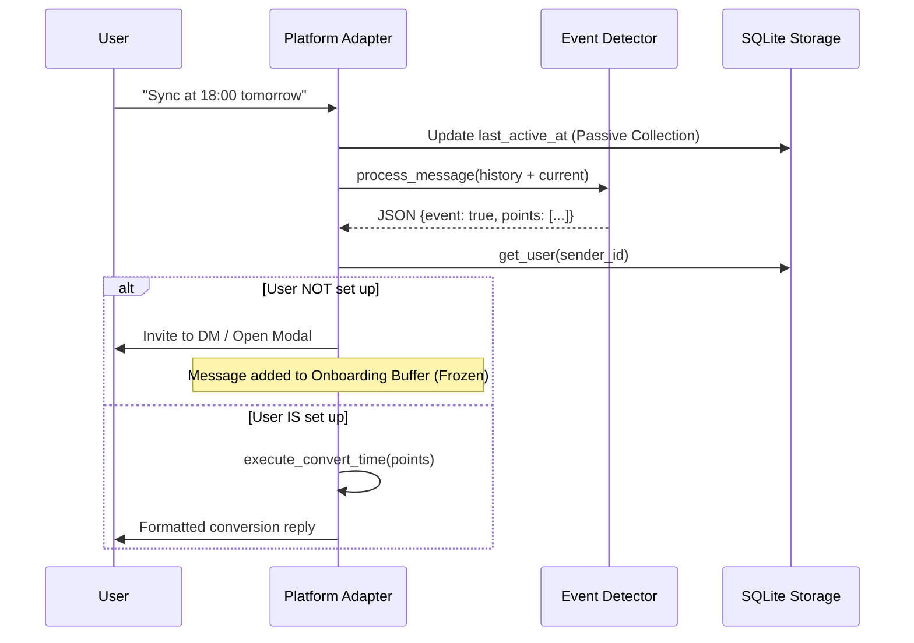
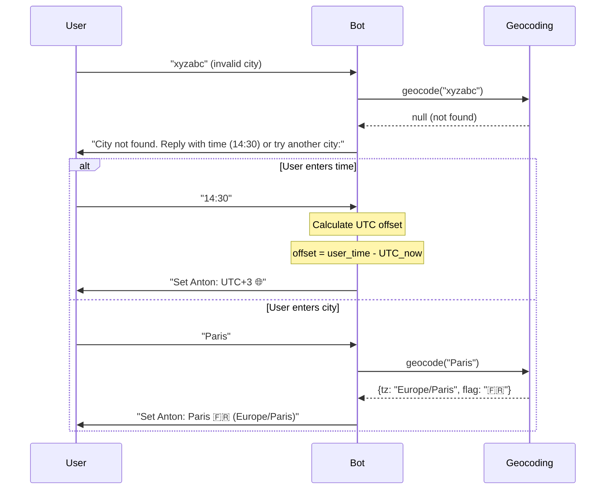

# 🤖 Technical Spec: Bot Logic Module

## 1. Architecture Overview

```
┌─────────────────┐
│  Telegram API   │
└────────┬────────┘
         │ message
         ▼
┌────────────────────────────────────────────────────────┐
│                     BOT CORE                           │
│                                                        │
│  ┌────────────────────┐      ┌────────────────────┐    │
│  │  Event Detector    │      │ DB Lookup (User)   │    │
│  │  (LLM)             │─────▶│ YES → Transform    │    │
│  └─────────┬──────────┘      │ NO  → Onboard      │    │
│            │                 └─────────┬──────────┘    │
│            ▼                           ▼               │
│        trigger=false             ┌──────────────┐      │
│            │                     │ Response     │      │
│         (history)                │ (Vertical)   │      │
│                                  └──────────────┘      │
│                                                        │
│  ┌──────────────────────────────────────────────┐    │
│  │              Storage (SQLite)                 │    │
│  │  users, chats, members, pending_queue         │    │
│  └──────────────────────────────────────────────┘    │
└────────────────────────────────────────────────────────┘
         │
         ▼ reply
┌─────────────────┐
│  Telegram Chat  │
└─────────────────┘
```

### Integration Note
We leverage the standard **Telegram Bot API** via the **aiogram** library.
This ensures reliability and follows standard practices for handling:
- Message objects & updates (Long Polling)
- User & Chat entities
- Asynchronous event loop
- **ForceReply**: Auto-opens reply mode when bot asks for user input (improves UX)

---

## 2. Core Workflow

### Trigger
Bot listens to all messages in group chats. For each message:
1. **LLM Gate**: Send the message window to the **Event Detector LLM** (`14_llm_module.md`).
2. **Continues only if** LLM returns `trigger=true`. Otherwise the message is silently saved to history.
3. **DB lookup**: Check if the sender exists in SQLite.
   - If **found** → proceed to Conversion.
   - If **not found** → Trigger **Lazy Onboarding** (Freeze message, send DM invite).
4. LLM output provides `times[]` (extracted times) and optional `event_location`.

> **Note**: `capture.py` (regex) is no longer used for prefiltering or time extraction. Times are extracted by the LLM.

### Flow: Happy Path (user exists in DB)

```
1. [DB LOOKUP]   → sender found in SQLite
2. [LLM GATE]    → Event Detection LLM called with full message window:
                   - if trigger=false → stop (no reply)
                   - if trigger=true  → continue
### Key Principles
- **Passive Discovery**: Registration of chat members is passive (captured from regular messages).
- **DM for Personal Setup**: Setup and settings dialogues are moved to private messages (Telegram) or Modals (Discord) to prevent group spam.
- **LLM-First Architecture**: Every message is analyzed by the LLM orchestrator; no regular expression pre-filtering is used.

---

## 2. Platform Nuances

### 2.1 Telegram
Uses `aiogram`'s middleware for passive collection. Onboarding is triggered via a DM invite message in the group with an auto-cleanup TTL.

### 2.2 Discord
Uses `discord.py`'s `on_message` for passive collection. Onboarding is triggered via ephemeral buttons and Modals.

---

## 3. Core Message Processing Lifecycle


```mermaid
sequenceDiagram
    participant User
    participant Bot as Platform Adapter
    participant LLM as Event Detector
    participant DB as SQLite Storage

    User->>Bot: "Sync at 18:00 tomorrow"
    Bot->>DB: Update last_active_at (Passive Collection)
    Bot->>LLM: process_message(history + current)
    LLM-->>Bot: JSON {event: true, points: [...]}
    
    Bot->>DB: get_user(sender_id)
    alt User NOT set up
        Bot->>User: Invite to DM / Open Modal
        Note over Bot: Message added to Onboarding Buffer (Frozen)
    else User IS set up
        Bot->>Bot: execute_convert_time(points)
        Bot->>User: Formatted conversion reply
    end
```

### 3.1 Onboarding Buffer (The "Frozen" Message)
If a user is not registered, their current coordination message is "frozen" in memory (`pending.py`). Once they complete their setup in DM/Modal, the bot automatically releases this message and performs the conversion in the original group chat.

---

## 4. Configuration Timers
- `settings_cleanup_timeout_seconds`: 30s (Default)
- `onboarding_timeout_seconds`: 120s (Default)
- `dm_onboarding_cooldown_seconds`: 600s (Default)

#### Sequence Diagram: event_location Override

```mermaid
sequenceDiagram
    participant U as User
    participant B as Bot
    participant LLM as Event Detector LLM
    participant G as Geocoding
    participant DB as SQLite

    U->>B: "Давайте в 12:00 по ньюйорку"
    B->>DB: get_user(user_id)
    DB-->>B: {tz: "Europe/Paris"}
    B->>LLM: detect(window, sender_tz="Europe/Paris")
    LLM-->>B: {trigger:true, times:["12:00"], event_location:"New York"}
    Note over B: event_location overrides source TZ
    B->>G: geocode("New York")
    G-->>B: {tz: "America/New_York"}
    B->>DB: get_chat_members(chat_id)
    DB-->>B: [members with timezones]
    Note over B: Convert 12:00 America/New_York → all zones
    B->>U: "Anton Lubny:
           12:00 New York 🇺🇸
           18:00 Paris 🇫🇷
           20:00 Moscow 🇷🇺"
```

#### Sequence Diagram: Fallback Flow (City Not Found)


```mermaid
sequenceDiagram
    participant U as User
    participant B as Bot
    participant G as Geocoding

    U->>B: "xyzabc" (invalid city)
    B->>G: geocode("xyzabc")
    G-->>B: null (not found)
    B->>U: "City not found. Reply with time (14:30) or try another city:"

    alt User enters time
        U->>B: "14:30"
        Note over B: Calculate UTC offset
        Note over B: offset = user_time - UTC_now
        B->>U: "Set Anton: UTC+3 🌐"
    else User enters city
        U->>B: "Paris"
        B->>G: geocode("Paris")
        G-->>B: {tz: "Europe/Paris", flag: "🇫🇷"}
        B->>U: "Set Anton: Paris 🇫🇷 (Europe/Paris)"
    end
```

---

## 3. Resolved Questions

- [x] ~~Rate limiting for bot responses?~~ → `cooldown_seconds` in config (default: 0 = off)
- [x] ~~Private chats vs group chats?~~ → Group only. Private not needed.
- [x] ~~Regex prefilter?~~ → Removed. Every message goes to LLM.
- [x] ~~Who extracts times?~~ → LLM returns `times[]` in output JSON.
- [x] ~~event_location updates DB?~~ → No. One-time pivot override only.
