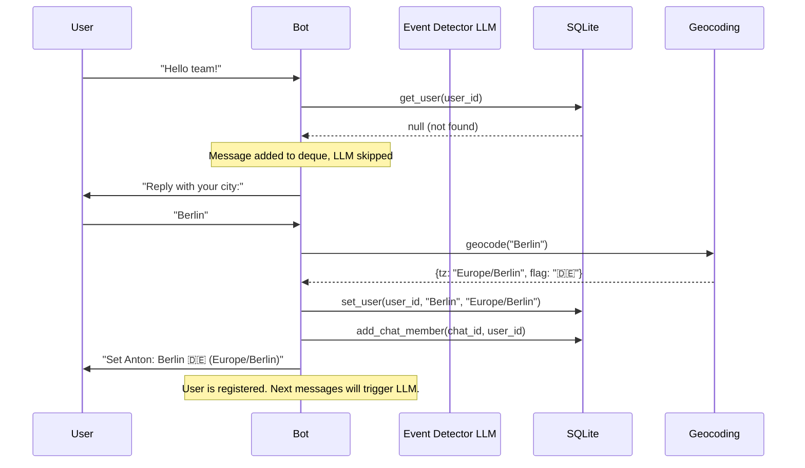
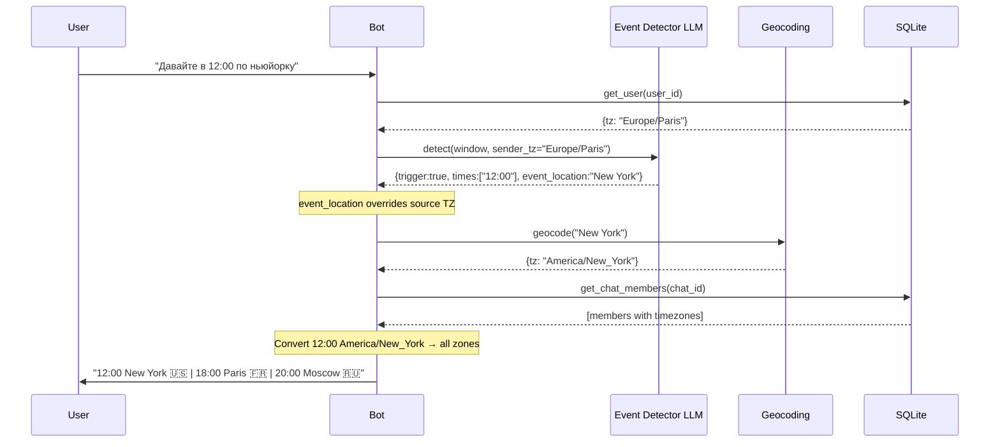
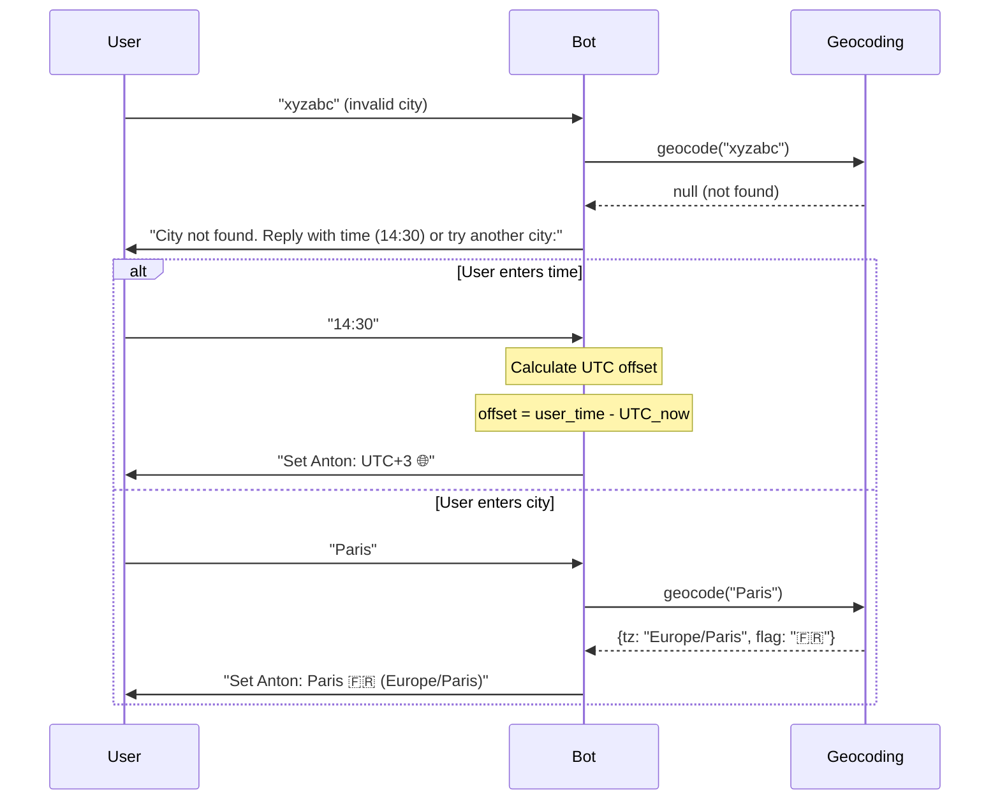

# 🤖 Technical Spec: Bot Logic Module

## 1. Architecture Overview

```
┌─────────────────┐
│  Telegram API   │
└────────┬────────┘
         │ message
         ▼
┌────────────────────────────────────────────────────────┐
│                     BOT CORE                           │
│                                                        │
│  ┌───────────────────────────────────────────────┐    │
│  │  DB Lookup (sender exists?)                   │    │
│  │    NO → Onboarding Flow → save TZ → requeue   │    │
│  │    YES → continue                             │    │
│  └──────────────────────┬────────────────────────┘    │
│                         │                             │
│                         ▼                             │
│              ┌────────────────────┐                   │
│              │  Event Detector    │                   │
│              │  (LLM)             │                   │
│              └─────────┬──────────┘                   │
│          trigger=false │ trigger=true                 │
│              ↓         │                              │
│           (ignore)     ▼                              │
│              ┌─────────────────┐   ┌──────────────┐  │
│              │ Transform       │──▶│ Response     │  │
│              │ (UTC-Pivot)     │   │ (Format)     │  │
│              └─────────────────┘   └──────────────┘  │
│                                                        │
│  ┌──────────────────────────────────────────────┐    │
│  │              Storage (SQLite)                 │    │
│  │  users: timezone, city                        │    │
│  │  chat_members: who is in which chat           │    │
│  └──────────────────────────────────────────────┘    │
│       │                                               │
│       ▼ (if user not found)                          │
│  ┌─────────────┐                                     │
│  │ City → TZ   │ (Geocoding)                         │
│  └─────────────┘                                     │
└────────────────────────────────────────────────────────┘
         │
         ▼ reply
┌─────────────────┐
│  Telegram Chat  │
└─────────────────┘
```

### Integration Note
We leverage the standard **Telegram Bot API** via the **aiogram** library.
This ensures reliability and follows standard practices for handling:
- Message objects & updates (Long Polling)
- User & Chat entities
- Asynchronous event loop
- **ForceReply**: Auto-opens reply mode when bot asks for user input (improves UX)

---

## 2. Core Workflow

### Trigger
Bot listens to all messages in group chats. For each message:
1. **DB lookup**: Check if the sender exists in SQLite.
   - If **not found** → run Onboarding Flow first (see below), then re-process the message.
2. **LLM Gate**: Send the message window to the **Event Detector LLM** (`13_event_detection.md`).
3. **Continues only if** LLM returns `trigger=true`. Otherwise the message is ignored.
4. LLM output provides `times[]` (extracted times) and optional `event_location`.

> **Note**: `capture.py` (regex) is no longer used for prefiltering or time extraction. Times are extracted by the LLM.

### Flow: Happy Path (user exists in DB)

```
1. [DB LOOKUP]   → sender found in SQLite
2. [LLM GATE]    → Event Detection LLM called with full message window:
                   - if trigger=false → stop (no reply)
                   - if trigger=true  → continue
                     LLM returns: times[], event_location
3. [SOURCE TZ]   → if event_location != null:
                     geocode(event_location) → source_tz
                   else:
                     use sender's DB timezone → source_tz
4. [SCAN]        → Get list of other chat members from DB
5. [TRANSFORM]   → Convert times[] from source_tz → UTC → all member zones
6. [REPLY]       → Bot replies:
                   "14:00 New York 🇺🇸 | 20:00 Berlin 🇩🇪 | 22:00 Moscow 🇷🇺"
```

### Flow: New User (sender not in DB)

```
1. [DB LOOKUP]   → sender NOT found in SQLite
2. [IGNORE TIME] → Original message is added to deque (for future context) but NOT evaluated for time.
3. [ONBOARDING]  → Run standard onboarding immediately:
                   Bot asks: "Reply with your city name:"
   │
   ├─ [SUCCESS]  → Geocode city → save TZ to SQLite
   │              → "Set: Berlin 🇩🇪 (Europe/Berlin)"
   │
   └─ [FAIL]     → "City not found. Reply with your current time (e.g. 14:30)
                    or try another city name:"
                   → [TIME]  → Calculate UTC offset, save UTC+X
                   → [CITY]  → Repeat geocoding
4. [DONE]        → User is registered. Future messages will be evaluated by LLM.
```

#### Sequence Diagram: New User Flow


```mermaid
sequenceDiagram
    participant U as User
    participant B as Bot
    participant LLM as Event Detector LLM
    participant DB as SQLite
    participant G as Geocoding

    U->>B: "Hello team!"
    B->>DB: get_user(user_id)
    DB-->>B: null (not found)
    Note over B: Message added to deque, LLM skipped
    B->>U: "Reply with your city:"
    U->>B: "Berlin"
    B->>G: geocode("Berlin")
    G-->>B: {tz: "Europe/Berlin", flag: "🇩🇪"}
    B->>DB: set_user(user_id, "Berlin", "Europe/Berlin")
    B->>DB: add_chat_member(chat_id, user_id)
    B->>U: "Set Anton: Berlin 🇩🇪 (Europe/Berlin)"
    Note over B: User is registered. Next messages will trigger LLM.
```

#### Sequence Diagram: event_location Override


```mermaid
sequenceDiagram
    participant U as User
    participant B as Bot
    participant LLM as Event Detector LLM
    participant G as Geocoding
    participant DB as SQLite

    U->>B: "Давайте в 12:00 по ньюйорку"
    B->>DB: get_user(user_id)
    DB-->>B: {tz: "Europe/Paris"}
    B->>LLM: detect(window, sender_tz="Europe/Paris")
    LLM-->>B: {trigger:true, times:["12:00"], event_location:"New York"}
    Note over B: event_location overrides source TZ
    B->>G: geocode("New York")
    G-->>B: {tz: "America/New_York"}
    B->>DB: get_chat_members(chat_id)
    DB-->>B: [members with timezones]
    Note over B: Convert 12:00 America/New_York → all zones
    B->>U: "12:00 New York 🇺🇸 | 18:00 Paris 🇫🇷 | 20:00 Moscow 🇷🇺"
```

#### Sequence Diagram: Fallback Flow (City Not Found)


```mermaid
sequenceDiagram
    participant U as User
    participant B as Bot
    participant G as Geocoding

    U->>B: "xyzabc" (invalid city)
    B->>G: geocode("xyzabc")
    G-->>B: null (not found)
    B->>U: "City not found. Reply with time (14:30) or try another city:"

    alt User enters time
        U->>B: "14:30"
        Note over B: Calculate UTC offset
        Note over B: offset = user_time - UTC_now
        B->>U: "Set Anton: UTC+3 🌐"
    else User enters city
        U->>B: "Paris"
        B->>G: geocode("Paris")
        G-->>B: {tz: "Europe/Paris", flag: "🇫🇷"}
        B->>U: "Set Anton: Paris 🇫🇷 (Europe/Paris)"
    end
```

---

## 3. Resolved Questions

- [x] ~~Rate limiting for bot responses?~~ → `cooldown_seconds` in config (default: 0 = off)
- [x] ~~Private chats vs group chats?~~ → Group only. Private not needed.
- [x] ~~Regex prefilter?~~ → Removed. Every message goes to LLM.
- [x] ~~Who extracts times?~~ → LLM returns `times[]` in output JSON.
- [x] ~~event_location updates DB?~~ → No. One-time pivot override only.
