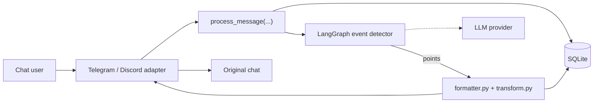
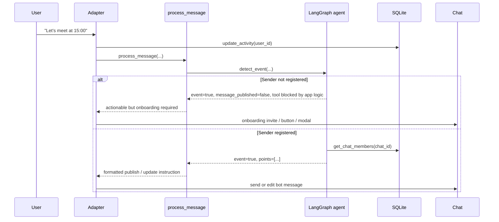

# Technical Spec: Bot Logic

This document describes the runtime behavior of Timezone Bot across Telegram and Discord.

---

## 1. Purpose

The bot watches normal chat messages, detects coordination times, and publishes timezone conversions for tracked members of the same chat.

Core product rules:

- Users do not need to invoke a conversion command.
- Time detection is LLM-driven.
- Conversion output is deterministic once `points` are extracted.
- Unregistered users do not trigger immediate chat replies; they receive onboarding prompts instead.
- After successful onboarding, the bot starts working from the user's **next** message. Old messages are not replayed.

---

## 2. Runtime Shape

```mermaid
flowchart LR
    User["Chat user"] --> Adapter["Telegram / Discord adapter"]
    Adapter --> Orchestrator["process_message(...)"]
    Orchestrator --> Agent["LangGraph event detector"]
    Agent -->|points| Reply["formatter.py + transform.py"]
    Reply --> Adapter
    Adapter --> Chat["Original chat"]

    Orchestrator --> Storage[("SQLite")]
    Agent -.-> LLM["LLM provider"]
    Reply --> Storage
```

---

## 3. Main Message Lifecycle

### 3.1 Every incoming group/guild message

For every normal non-bot message:

1. Update user activity in storage.
2. Determine whether the sender already has a timezone.
3. Call `process_message(...)`.
4. If the sender is registered:
   - pass `send_fn`, `edit_fn`, `delete_fn`;
   - allow real `publish_event` / `update_previous_event`.
5. If the sender is not registered:
   - run the same agent reasoning flow;
   - block real publish side effects in the action layer;
   - if the message is actionable, show onboarding prompt if cooldown allows.

### 3.2 App-logic gated onboarding mode

For unregistered users the model still reasons in the normal agent flow and may choose
`publish_event` or `update_previous_event`.

The difference is in execution:

- the action layer blocks real publish/update side effects;
- instead it writes an app-logic marker into agent memory;
- onboarding UX is triggered from the returned actionable result.

### 3.3 Real publish/update mode

For registered users:

1. The agent extracts one or more `points`.
2. The action layer selects `publish_event` or `update_previous_event`.
3. The reply builder converts extracted times to all tracked members.
4. The adapter posts the final chat message or edits a previous one.

---

## 4. Onboarding Logic

### 4.1 Telegram

Telegram onboarding is DM-based:

1. User writes an actionable message in a group.
2. Bot runs the normal reasoning pass.
3. If cooldown allows, bot posts a single group invite with a deep link to DM.
4. User completes city/timezone setup in DM.
5. Bot confirms success and explicitly tells the user that conversion starts from the **next** message.

If the user ignores onboarding:

- nothing is replayed later;
- the bot may re-invite only after cooldown expires and another actionable message appears.

If the user declines:

- `onboarding_declined=True` is stored;
- future auto-invites stop until the user explicitly sets timezone again.

### 4.2 Discord

Discord onboarding is component/modal-based:

1. User writes an actionable message in a guild.
2. Bot runs the normal reasoning pass.
3. Bot shows a targeted onboarding prompt with button.
4. User completes city/timezone setup via modal or manual time fallback.
5. Bot confirms success and explicitly says conversion starts from the **next** message.

Decline semantics match Telegram:

- explicit decline disables future auto-invites,
- incomplete onboarding does not replay old messages.

---

## 5. Conversion Logic

Once `points` are extracted, conversion is deterministic:

1. Resolve source timezone:
   - use `point.city` override if present and resolvable;
   - otherwise use sender's stored timezone.
2. Load tracked members of the chat.
3. Convert each point from source timezone to every member timezone.
4. Format grouped, human-readable output.

Important invariant:

- the LLM decides **what** time points exist;
- the conversion layer decides **how** those points are transformed and rendered.

---

## 6. Message Update Logic

The bot supports in-place edits for follow-up clarifications.

High-level rule:

- if a new message refines an existing event, the agent may choose `update_previous_event(event_ref=...)`;
- the action layer decides between:
  - edit in place,
  - delete + republish.

This decision depends on:

- edit feature flag,
- distance from the original event in the chat thread.

---

## 7. Sequence Diagram

```mermaid
sequenceDiagram
    participant User
    participant Adapter
    participant Core as process_message
    participant Agent as LangGraph agent
    participant DB as SQLite
    participant Chat

    User->>Adapter: "Let's meet at 15:00"
    Adapter->>DB: update_activity(user_id)
    Adapter->>Core: process_message(...)
    Core->>Agent: detect_event(...)

    alt Sender not registered
        Agent-->>Core: event=true, message_published=false, tool blocked by app logic
        Core-->>Adapter: actionable but onboarding required
        Adapter->>Chat: onboarding invite / button / modal
    else Sender registered
        Agent->>DB: get_chat_members(chat_id)
        Agent-->>Core: event=true, points=[...]
        Core-->>Adapter: formatted publish / update instruction
        Adapter->>Chat: send or edit bot message
    end
```

---

## 8. Operational Notes

### 8.1 Per-chat serialization

Each chat is processed under a dedicated lock. This prevents concurrent corruption of agent memory, but means a burst in one chat is serialized.

### 8.2 Stale-drop behavior

If a message waits too long in the per-chat queue, it may be dropped by the message-age guard instead of being processed late.

### 8.3 Snapshot timing nuance

Short-term history snapshotting currently happens before lock acquisition. Under extreme burst load, snapshot timing and execution order can diverge slightly.

---

## 9. Rebuild Checklist

If this file were used to rebuild the runtime logic, the implementation must preserve:

1. Unregistered users use app-logic gated execution instead of real publish side effects.
2. No replay of old pre-onboarding messages.
3. Per-chat serialized LLM processing.
4. Deterministic conversion after LLM extraction.
5. Publish vs update split with edit-or-republish logic.
