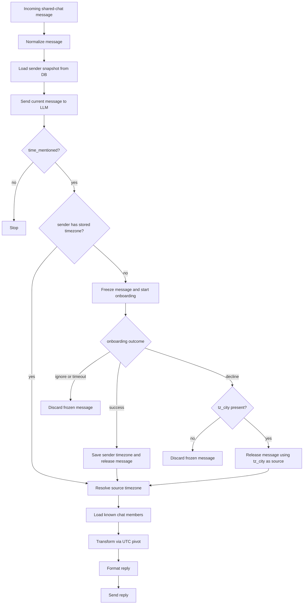

# 04. Bot Logic Module

## 1. Purpose

This document defines the runtime decision logic of the bot after a message arrives from Telegram or Discord.

## 2. Processing Principles

- Every shared-chat message may be analyzed by the LLM pipeline.
- The bot replies only when the LLM detects a time coordination event.
- Conversion is produced only for known members with stored timezones.
- Private chat is used only for onboarding.
- Unknown authors are onboarded lazily: only after an event is detected.

## 3. Main Runtime Flow

```mermaid
flowchart TD
    A[Incoming shared-chat message] --> B[Normalize message]
    B --> C[Load sender snapshot from DB]
    C --> D[Send current message to LLM]
    D --> E{time_mentioned?}
    E -- no --> F[Stop]
    E -- yes --> G{sender has stored timezone?}
    G -- yes --> H[Resolve source timezone]
    G -- no --> I[Freeze message and start onboarding]
    I --> J{onboarding outcome}
    J -- success --> K[Save sender timezone and release message]
    J -- decline --> L{tz_city present?}
    J -- ignore or timeout --> M[Discard frozen message]
    L -- yes --> N[Release message using tz_city as source]
    L -- no --> O[Discard frozen message]
    K --> H
    N --> H
    H --> P[Load known chat members]
    P --> Q[Transform via UTC pivot]
    Q --> R[Format reply]
    R --> S[Send reply]
```

## 4. Detailed Decision Rules

### 4.1 No Event

If the LLM returns `time_mentioned=false`:

- no conversion is attempted,
- no onboarding is triggered,
- stop.

### 4.2 Registered Sender

If `time_mentioned=true` and the sender has a stored timezone:

- use sender timezone as the default source timezone,
- override it per point with `tz_city` if present and resolvable,
- convert the extracted time points for known members of the current chat.

### 4.3 Unknown Sender

If `time_mentioned=true` and the sender has no stored timezone:

1. freeze the message in the pending queue,
2. start onboarding asynchronously,
3. prevent immediate reply from this processing path,
4. resolve the message only after onboarding outcome is known.

### 4.4 Onboarding Outcomes

| Outcome | Behavior |
|---|---|
| Success | Save timezone, release pending message, continue normal conversion |
| Decline | Save decline flag; convert only if point `tz_city` makes the source timezone explicit |
| Ignore / timeout | Expire lock and discard pending message |

### 4.5 Declined Sender Rule

A sender who declined onboarding can still trigger conversion later if the message itself contains explicit source-location context, for example:

- `"12:00 London time"` -> convertible
- `"12:00"` -> not convertible

The decline flag prevents repeated immediate prompting, but does not permanently block later voluntary onboarding.

## 5. Source Time Resolution

Source timezone is determined in this order:

1. resolved point `tz_city`, if present,
2. sender stored timezone, if present,
3. otherwise no conversion.

`tz_city` is a one-message override only. It must never overwrite the sender's stored timezone.

## 6. Chat Membership Rule

The output contains only known members of the current chat who already have stored timezones.

Implications:

- users who never wrote in the chat do not appear,
- users without stored timezone do not appear,
- the bot does not attempt participant extraction from message text.

## 7. Concurrency and Locks

- A pending message from an unknown sender is locked until onboarding resolves or expires.
- Onboarding completion releases only the frozen messages that belong to that sender and chat context according to pending queue rules.

## 8. Configurable Timers

- `settings_cleanup_timeout_seconds`: TTL for short-lived shared-chat bot messages.
- `onboarding_timeout_seconds`: max pending duration before discard.
- `dm_onboarding_cooldown_seconds`: delay before re-inviting a previously ignored user.
- `max_message_age_seconds`: stale-message guard. If the bot is offline, platforms like Telegram may queue messages. Upon restart, any fetched message older than this threshold is intentionally discarded to prevent a flood of late or irrelevant replies.

## 9. Reply Lifetime and Visibility

- Conversion replies are not temporary by default.
- Short-lived onboarding prompts and lightweight command-noise replies may be temporary according to platform UX rules.
- Message lifetime and visibility are platform-specific delivery concerns:
  - Telegram may auto-delete selected bot messages after a timeout.
  - Discord may use ephemeral interaction responses for private setup UX.
- These delivery rules must not change conversion logic or onboarding decision logic.

## 10. Non-Goals of This Module

- recurring schedule interpretation,
- regex fallback for event detection,
- durable private-chat mode,
- updating stored sender timezone from `tz_city`.
