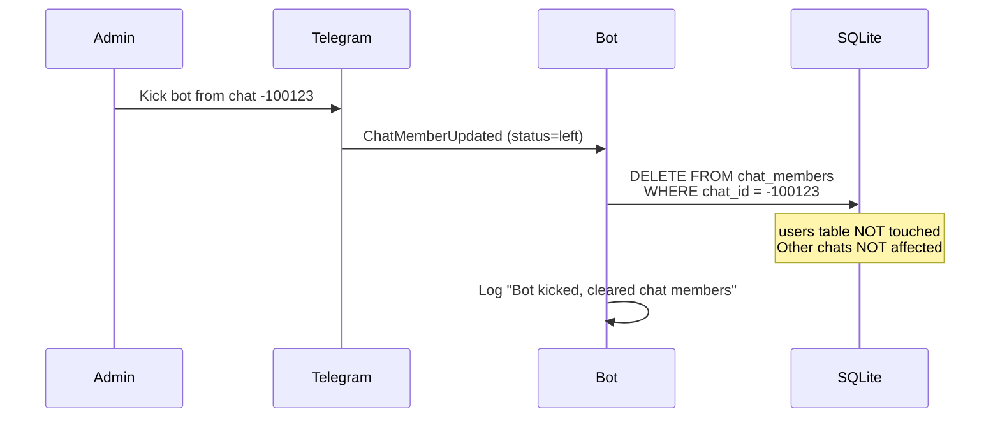

# Technical Spec: Storage Module (SQLite)

## 1. Overview

Модуль хранения данных о пользователях и их принадлежности к чатам.
Используем **aiosqlite** (async SQLite) — быстро, надёжно, совместимо с aiogram.

**Файл БД:** `./data/bot.db`

```
┌─────────────────────┐         ┌─────────────────────┐
│       users         │         │    chat_members     │
├─────────────────────┤         ├─────────────────────┤
│ user_id (PK)        │◀────────│ user_id (FK)        │
│ username            │         │ chat_id             │
│ timezone (IANA)     │         │ joined_at           │
│ city                │         └─────────────────────┘
│ created_at          │                   │
│ updated_at          │                   │
└─────────────────────┘                   ▼
                                   Chat 1: [user1, user2, user3]
                                   Chat 2: [user1, user4]
```

---

## 2. Schema


### 2.1 Таблица `users`

Хранит информацию о юзерах и их таймзонах.

```sql
CREATE TABLE users (
    user_id     INTEGER PRIMARY KEY,  -- Telegram user ID
    username    TEXT,                  -- @username (может быть NULL)
    timezone    TEXT NOT NULL,         -- IANA name: 'Europe/Berlin'
    city        TEXT,                  -- Город для отображения: 'Berlin'
    created_at  TEXT DEFAULT (datetime('now')),
    updated_at  TEXT DEFAULT (datetime('now'))
);
```

### 2.2 Таблица `chat_members`

Связь many-to-many: какие юзеры в каких чатах.

```sql
CREATE TABLE chat_members (
    chat_id     INTEGER NOT NULL,      -- Telegram chat ID
    user_id     INTEGER NOT NULL,      -- FK → users.user_id
    joined_at   TEXT DEFAULT (datetime('now')),
    PRIMARY KEY (chat_id, user_id),
    FOREIGN KEY (user_id) REFERENCES users(user_id) ON DELETE CASCADE
);

CREATE INDEX idx_chat_members_chat ON chat_members(chat_id);
```

---

## 3. Data Rules

| Rule | Description |
|------|-------------|
| **IANA Only** | Timezone хранится ТОЛЬКО как IANA name (`Europe/Moscow`). Числовые offset (`+3`) запрещены. |
| **No History** | При смене timezone — просто UPDATE, историю не храним. |
| **Passive Collection** | Бот накапливает юзеров по мере чтения сообщений в чате. |
| **Exit Listening** | Если юзер вышел из чата — удаляем запись из `chat_members`. |
| **Display Limit** | Максимум юзеров в ответе — задаётся в `configuration.yaml`. |

---

## 4. API Operations

### 4.1 Users

```python
# Получить timezone юзера
get_user(user_id: int) -> dict | None

# Создать/обновить юзера
set_user(user_id: int, city: str, timezone: str, flag: str, username: str) -> None
```

### 4.2 Chat Members

```python
# Получить всех юзеров чата (с их timezone)
get_chat_members(chat_id: int) -> list[dict]

# Добавить юзера в чат
add_chat_member(chat_id: int, user_id: int) -> None

# Удалить юзера из чата (вышел/кикнут)
remove_chat_member(chat_id: int, user_id: int) -> None
```

---

## 5. Member Tracking Strategy

### Принцип: Passive Collection + Exit Listening

Бот **НЕ требует прав админа** и не может получить полный список участников чата.
Вместо этого — накапливает базу постепенно.

### События для отслеживания:

| Event | Action |
|-------|--------|
| Любое сообщение в чате | `add_chat_member(chat_id, user_id)` если юзера нет |
| `ChatMemberUpdated` (юзер left/kicked) | `remove_chat_member(chat_id, user_id)` |
| `ChatMemberUpdated` (бот кикнут) | `clear_chat_members(chat_id)` — забываем про чат |

### Bot Kicked Flow:



**Что сохраняется:**
- Таблица `users` (timezone каждого юзера)
- Связи юзеров с другими чатами

**Что удаляется:**
- Только записи `chat_members` для данного `chat_id`
### aiogram Handler:

```python
from aiogram import Router
from aiogram.types import Message, ChatMemberUpdated

router = Router()

# Passive collection: записываем юзера при любом сообщении
@router.message()
async def on_any_message(message: Message):
    await add_user_to_chat(message.chat.id, message.from_user.id)

# Exit listening: удаляем при выходе
@router.chat_member()
async def on_member_update(event: ChatMemberUpdated):
    if event.new_chat_member.status in ('left', 'kicked'):
        await remove_user_from_chat(event.chat.id, event.new_chat_member.user.id)
```

### Ограничения:

- Юзеры появляются в БД только после первого сообщения
- "Молчуны" не будут в списке конвертации
- Это **ожидаемое поведение**, не баг

---

## 6. Example Queries

```sql
-- Все юзеры конкретного чата с их timezone
SELECT u.user_id, u.username, u.timezone, u.city
FROM users u
JOIN chat_members cm ON u.user_id = cm.user_id
WHERE cm.chat_id = ?;

-- Проверить есть ли юзер в БД
SELECT timezone, city FROM users WHERE user_id = ?;

-- Обновить timezone юзера
UPDATE users 
SET timezone = ?, city = ?, updated_at = datetime('now')
WHERE user_id = ?;
```

---

## 7. File Location & Initialization

```
project/
└── data/
    └── bot.db        # SQLite database file
```

**Init script:**
```python
def init_db(db_path: str = "./data/bot.db"):
    os.makedirs(os.path.dirname(db_path), exist_ok=True)
    conn = sqlite3.connect(db_path)
    conn.executescript(SCHEMA_SQL)
    conn.close()
```

---

## 8. Resolved Questions

- [x] ~~Нужен ли rate limiting для запросов к БД?~~ → Нет, SQLite справляется
- [x] ~~Использовать async sqlite?~~ → Да, `aiosqlite` (см. Overview)
- [x] ~~Максимум юзеров на чат?~~ → `display_limit_per_chat` в `configuration.yaml`

