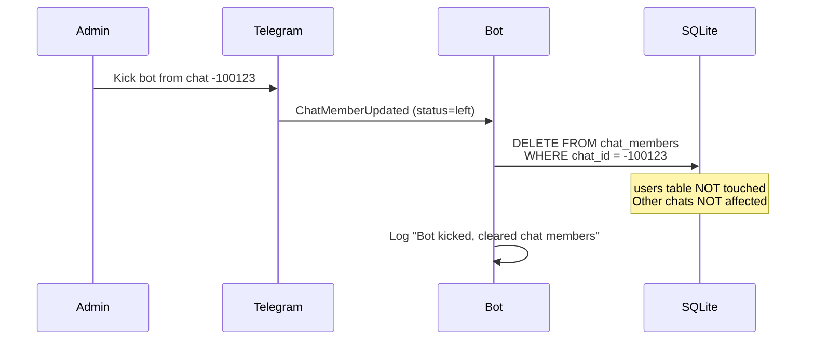

# Technical Spec: Storage Module (SQLite)

## 1. Overview

Модуль хранения данных о пользователях и их принадлежности к чатам.
Используем **aiosqlite** (async SQLite) — быстро, надёжно, совместимо с aiogram.

> [!NOTE]
> **UPDATE 2026-02-03**: Модуль рефакторинг в пакет `src/storage/`.
> Добавлена поддержка мульти-платформенности (Telegram/Discord) через колонку `platform`. (на будующее)

**Файл БД:** `./data/bot.db`

```
┌─────────────────────┐         ┌─────────────────────┐
│       users         │         │    chat_members     │
├─────────────────────┤         ├─────────────────────┤
│ user_id (PK)        │◀────────│ user_id (FK)        │
│ username            │         │ chat_id             │
│ timezone (IANA)     │         │ joined_at           │
│ city                │         └─────────────────────┘
│ created_at          │                   │
│ updated_at          │                   │
└─────────────────────┘                   ▼
                                   Chat 1: [user1, user2, user3]
                                   Chat 2: [user1, user4]
```

---

## 2. Schema


### 2.1 Таблица `users`

Хранит информацию о юзерах и их таймзонах.

```sql
CREATE TABLE users (
    user_id     INTEGER,               -- Platform-specific user ID
    platform    TEXT DEFAULT 'telegram', -- 'telegram', 'discord'
    username    TEXT,                  -- @username (может быть NULL)
    timezone    TEXT NOT NULL,         -- IANA name: 'Europe/Berlin'
    city        TEXT,                  -- Город для отображения: 'Berlin'
    flag        TEXT DEFAULT '',       -- Flag emoji
    created_at  TEXT DEFAULT (datetime('now')),
    updated_at  TEXT DEFAULT (datetime('now')),
    PRIMARY KEY (user_id, platform)
);
```

### 2.2 Таблица `chat_members`

Связь many-to-many: какие юзеры в каких чатах.

```sql
CREATE TABLE chat_members (
    chat_id     INTEGER NOT NULL,      -- Platform chat ID
    user_id     INTEGER NOT NULL,      -- Part of FK
    platform    TEXT DEFAULT 'telegram', -- Part of FK
    joined_at   TEXT DEFAULT (datetime('now')),
    PRIMARY KEY (chat_id, user_id, platform),
    FOREIGN KEY (user_id, platform) REFERENCES users(user_id, platform) ON DELETE CASCADE
);

CREATE INDEX idx_chat_members_chat ON chat_members(chat_id, platform);
```

---

## 3. Data Rules

| Rule | Description |
|------|-------------|
| **IANA Only** | Timezone хранится ТОЛЬКО как IANA name (`Europe/Moscow`). Числовые offset (`+3`) запрещены. |
| **No History** | При смене timezone — просто UPDATE, историю не храним. |
| **Passive Collection** | Бот накапливает юзеров по мере чтения сообщений в чате. |
| **Exit Listening** | Если юзер вышел из чата — удаляем запись из `chat_members`. |
| **Display Limit** | Максимум юзеров в ответе — задаётся в `configuration.yaml`. |

---

## 4. API Operations

### 4.1 Users

```python
# Получить timezone юзера
get_user(user_id: int, platform: str) -> dict | None

# Создать/обновить юзера
set_user(user_id: int, city: str, timezone: str, flag: str, username: str, platform: str) -> None
```

### 4.2 Chat Members

```python
# Получить всех юзеров чата (с их timezone)
get_chat_members(chat_id: int, platform: str) -> list[dict]

# Добавить юзера в чат
add_chat_member(chat_id: int, user_id: int, platform: str) -> None

# Удалить юзера из чата (вышел/кикнут)
remove_chat_member(chat_id: int, user_id: int, platform: str) -> None

# Очистить чат
clear_chat_members(chat_id: int, platform: str) -> None
```

---

## 5. Member Tracking Strategy

### Принцип: Passive Collection + Exit Listening

Бот **НЕ требует прав админа** и не может получить полный список участников чата.
Вместо этого — накапливает базу постепенно.

### События для отслеживания:

| Event | Action |
|-------|--------|
| Любое сообщение в чате | `add_chat_member(chat_id, user_id)` если юзера нет |
| `ChatMemberUpdated` (юзер left/kicked) | `remove_chat_member(chat_id, user_id)` |
| `ChatMemberUpdated` (бот кикнут) | `clear_chat_members(chat_id)` — забываем про чат |

### Bot Kicked Flow:



**Что сохраняется:**
- Таблица `users` (timezone каждого юзера)
- Связи юзеров с другими чатами

**Что удаляется:**
- Только записи `chat_members` для данного `chat_id`
### aiogram Handler:

```python
from aiogram import Router
from aiogram.types import Message, ChatMemberUpdated

router = Router()

# Passive collection: записываем юзера при любом сообщении
@router.message()
async def on_any_message(message: Message):
    await add_user_to_chat(message.chat.id, message.from_user.id)

# Exit listening: удаляем при выходе
@router.chat_member()
async def on_member_update(event: ChatMemberUpdated):
    if event.new_chat_member.status in ('left', 'kicked'):
        await remove_user_from_chat(event.chat.id, event.new_chat_member.user.id)
```

### Ограничения:

- Юзеры появляются в БД только после первого сообщения
- "Молчуны" не будут в списке конвертации
- Это **ожидаемое поведение**, не баг

---

## 6. Example Queries

```sql
-- Все юзеры конкретного чата с их timezone
SELECT u.user_id, u.username, u.timezone, u.city
FROM users u
JOIN chat_members cm ON u.user_id = cm.user_id
WHERE cm.chat_id = ?;

-- Проверить есть ли юзер в БД
SELECT timezone, city FROM users WHERE user_id = ?;

-- Обновить timezone юзера
UPDATE users 
SET timezone = ?, city = ?, updated_at = datetime('now')
WHERE user_id = ?;
```

---

## 7. File Location & Initialization

```
project/
└── data/
    └── bot.db        # SQLite database file
```

**Init script:**
```python
def init_db(db_path: str = "./data/bot.db"):
    os.makedirs(os.path.dirname(db_path), exist_ok=True)
    conn = sqlite3.connect(db_path)
    conn.executescript(SCHEMA_SQL)
    conn.close()
```

---

## 8. Resolved Questions

- [x] ~~Нужен ли rate limiting для запросов к БД?~~ → Нет, SQLite справляется
- [x] ~~Использовать async sqlite?~~ → Да, `aiosqlite` (см. Overview)
- [x] ~~Максимум юзеров на чат?~~ → `display_limit_per_chat` в `configuration.yaml`
- [ ] **In-Memory Caching** → Описано в секции 9

---

## 9. In-Memory Caching Layer (Future Enhancement)

### 9.1 Motivation

Текущая реализация обращается к SQLite при каждом запросе данных. Для высоконагруженных сценариев это может стать узким местом:

| Операция | Текущее поведение | С кешированием |
|----------|-------------------|----------------|
| `get_user()` | Disk I/O каждый раз | Memory lookup (O(1)) |
| `get_chat_members()` | JOIN query каждый раз | Memory lookup (O(1)) |
| `set_user()` | Disk write | Memory + Disk write |

> [!NOTE]
> Это **опциональная оптимизация**. Для MVP текущая SQLite-реализация достаточна.

---

### 9.2 Architecture: CachedStorage Decorator

Паттерн: **Decorator** поверх существующего интерфейса `Storage`.

```
┌─────────────────────────────────────────────────────────────┐
│                     Application Layer                       │
│   (commands, handlers — обращаются к storage.get_user())    │
└─────────────────────────────┬───────────────────────────────┘
                              │
                              ▼
┌─────────────────────────────────────────────────────────────┐
│                   CachedStorage (Singleton)                 │
│  ┌──────────────────┐     ┌──────────────────────────────┐  │
│  │  In-Memory Cache │     │  Delegated Storage (SQLite)  │  │
│  │  ─────────────── │────▶│  ──────────────────────────  │  │
│  │  users: Dict     │     │  Actual disk I/O             │  │
│  │  chats: Dict     │     │  Source of truth             │  │
│  └──────────────────┘     └──────────────────────────────┘  │
└─────────────────────────────────────────────────────────────┘
                              │
                              ▼
                       ┌─────────────┐
                       │   SQLite    │
                       │   bot.db    │
                       └─────────────┘
```

---

### 9.3 Data Flow

**Startup:** При `init()` — читаем всех юзеров и чаты из БД в память.

**Read (Cache-First):** Сначала ищем в `dict`, если нет — идём в БД и кешируем.

**Write (Write-Through):** Сначала пишем в БД (source of truth), затем обновляем кеш.

> [!IMPORTANT]
> **Write-Through** гарантирует consistency: при crash данные не теряются.

---

### 9.4 Implementation

**Новый файл:** `src/storage/cached.py` — класс `CachedStorage(Storage)` как decorator над `SQLiteStorage`.

**Структуры данных:**
- `_users: dict[(user_id, platform), user_data]`
- `_chats: dict[(chat_id, platform), list[members]]`

**Включение:** Флаг `storage.use_cache: true` в `configuration.yaml`.

---

### 9.5 Trade-offs

| Aspect | Benefit | Cost |
|--------|---------|------|
| **Latency** | ✅ O(1) reads | — |
| **Disk I/O** | ✅ Reduced | — |
| **Memory** | — | ⚠️ All data in RAM |
| **Cold Start** | — | ⚠️ Slower init |

---

### 9.6 Resolved Questions

- [x] **Инвалидация кеша?** → Не нужна (single-instance + write-through)
- [x] **TTL?** → Не нужен (данные меняются только через наш код)
- [x] **Метрики hit/miss?** → Достаточно unit-тестов

---

### 9.7 Out of Scope

| Технология | Почему не применимо |
|------------|---------------------|
| **Read Replicas** | SQLite не поддерживает |
| **Connection Pooling** | SQLite = single-writer |
| **Redis** | Overkill для single-instance |
| **LRU Eviction** | Весь датасет ~50KB |

---

## 10. Future Considerations

> [!NOTE]
> Реализована стандартная SQLite версия. Раздел 9 — готовая архитектура для будущей оптимизации.

- **In-Memory Caching**: Включается через `storage.use_cache: true`
