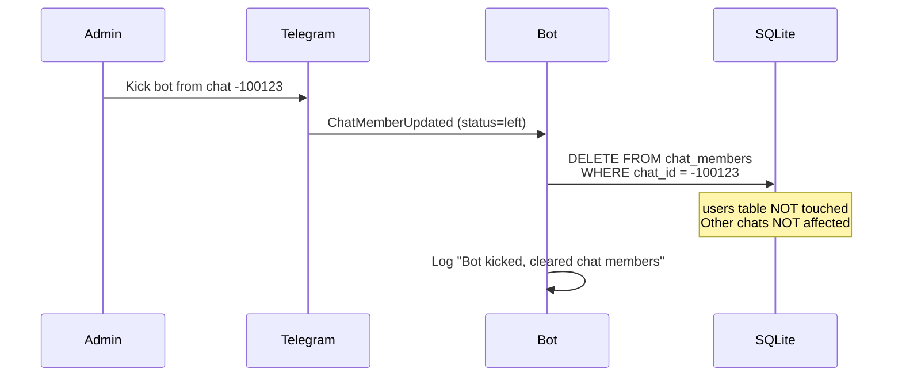

# Technical Spec: Storage Module (SQLite)

## 1. Overview

Data storage module for users and their chat membership.
Using **aiosqlite** (async SQLite) — fast, reliable, compatible with aiogram.

> [!NOTE]
> **UPDATE 2026-02-03**: Module refactored into package `src/storage/`.
> Added multi-platform support (Telegram/Discord) via `platform` column.

**DB File:** `./data/bot.db`

```
┌─────────────────────┐         ┌─────────────────────┐
│       users         │         │    chat_members     │
├─────────────────────┤         ├─────────────────────┤
│ user_id (PK)        │◀────────│ user_id (FK)        │
│ username            │         │ chat_id             │
│ timezone (IANA)     │         │ joined_at           │
│ city                │         └─────────────────────┘
│ created_at          │                   │
│ updated_at          │                   │
└─────────────────────┘                   ▼
                                   Chat 1: [user1, user2, user3]
                                   Chat 2: [user1, user4]
```

---

## 2. Schema


### 2.1 Table `users`

Stores user information and their timezones.

```sql
CREATE TABLE users (
    user_id     INTEGER,               -- Platform-specific user ID
    platform    TEXT DEFAULT 'telegram', -- 'telegram', 'discord'
    username    TEXT,                  -- @username (can be NULL)
    timezone    TEXT NOT NULL,         -- IANA name: 'Europe/Berlin'
    city        TEXT,                  -- City for display: 'Berlin'
    flag        TEXT DEFAULT '',       -- Flag emoji
    created_at  TEXT DEFAULT (datetime('now')),
    updated_at  TEXT DEFAULT (datetime('now')),
    PRIMARY KEY (user_id, platform)
);
```

### 2.2 Table `chat_members`

Many-to-many relationship: which users are in which chats.

```sql
CREATE TABLE chat_members (
    chat_id     INTEGER NOT NULL,      -- Platform chat ID
    user_id     INTEGER NOT NULL,      -- Part of FK
    platform    TEXT DEFAULT 'telegram', -- Part of FK
    joined_at   TEXT DEFAULT (datetime('now')),
    PRIMARY KEY (chat_id, user_id, platform),
    FOREIGN KEY (user_id, platform) REFERENCES users(user_id, platform) ON DELETE CASCADE
);

CREATE INDEX idx_chat_members_chat ON chat_members(chat_id, platform);
```

---

## 3. Data Rules

| Rule | Description |
|------|-------------|
| **IANA Only** | Timezone is stored ONLY as IANA name (`Europe/Moscow`). Numeric offsets (`+3`) are prohibited. |
| **No History** | When changing timezone — just UPDATE, no history stored. |
| **Passive Collection** | Bot accumulates users as it reads messages in the chat. |
| **Exit Listening** | If user left the chat — delete record from `chat_members`. |
| **Display Limit** | Maximum users in response — set in `configuration.yaml`. |

---

## 4. API Operations

### 4.1 Users

```python
# Get user timezone
get_user(user_id: int, platform: str) -> dict | None

# Create/update user
set_user(user_id: int, city: str, timezone: str, flag: str, username: str, platform: str) -> None
```

### 4.2 Chat Members

```python
# Get all chat users (with their timezone)
get_chat_members(chat_id: int, platform: str) -> list[dict]

# Add user to chat
add_chat_member(chat_id: int, user_id: int, platform: str) -> None

# Remove user from chat (left/kicked)
remove_chat_member(chat_id: int, user_id: int, platform: str) -> None

# Clear chat
clear_chat_members(chat_id: int, platform: str) -> None
```

---

## 5. Member Tracking Strategy

### Principle: Passive Collection + Exit Listening

Bot **does NOT require admin rights** and cannot get the full list of chat participants.
Instead — it accumulates the database gradually.

### Events to Track:

| Event | Action |
|-------|--------|
| Any message in chat | `add_chat_member(chat_id, user_id)` if user not present |
| `ChatMemberUpdated` (user left/kicked) | `remove_chat_member(chat_id, user_id)` |
| `ChatMemberUpdated` (bot kicked) | `clear_chat_members(chat_id)` — forget the chat |

### Bot Kicked Flow:



**What is preserved:**
- Table `users` (each user's timezone)
- User connections to other chats

**What is deleted:**
- Only `chat_members` records for the given `chat_id`
### aiogram Handler:

```python
from aiogram import Router
from aiogram.types import Message, ChatMemberUpdated

router = Router()

# Passive collection: record user on any message
@router.message()
async def on_any_message(message: Message):
    await add_user_to_chat(message.chat.id, message.from_user.id)

# Exit listening: remove on exit
@router.chat_member()
async def on_member_update(event: ChatMemberUpdated):
    if event.new_chat_member.status in ('left', 'kicked'):
        await remove_user_from_chat(event.chat.id, event.new_chat_member.user.id)
```

### Limitations:

- Users appear in DB only after their first message
- "Lurkers" won't be in the conversion list
- This is **expected behavior**, not a bug

---

## 6. Example Queries

```sql
-- All users of a specific chat with their timezone
SELECT u.user_id, u.username, u.timezone, u.city
FROM users u
JOIN chat_members cm ON u.user_id = cm.user_id
WHERE cm.chat_id = ?;

-- Check if user exists in DB
SELECT timezone, city FROM users WHERE user_id = ?;

-- Update user timezone
UPDATE users 
SET timezone = ?, city = ?, updated_at = datetime('now')
WHERE user_id = ?;
```

---

## 7. File Location & Initialization

```
project/
└── data/
    └── bot.db        # SQLite database file
```

**Init script:**
```python
def init_db(db_path: str = "./data/bot.db"):
    os.makedirs(os.path.dirname(db_path), exist_ok=True)
    conn = sqlite3.connect(db_path)
    conn.executescript(SCHEMA_SQL)
    conn.close()
```

---

## 8. Resolved Questions

- [x] ~~Rate limiting for DB queries?~~ → No, SQLite handles it
- [x] ~~Use async sqlite?~~ → Yes, `aiosqlite` (see Overview)
- [x] ~~Maximum users per chat?~~ → `display_limit_per_chat` in `configuration.yaml`
- [ ] **In-Memory Caching** → Described in section 9

---

## 9. In-Memory Caching Layer (Future Enhancement)

### 9.1 Motivation

Current implementation queries SQLite on every request. For high-load scenarios this may become a bottleneck:

| Operation | Current Behavior | With Caching |
|----------|-------------------|----------------|
| `get_user()` | Disk I/O every time | Memory lookup (O(1)) |
| `get_chat_members()` | JOIN query every time | Memory lookup (O(1)) |
| `set_user()` | Disk write | Memory + Disk write |

> [!NOTE]
> This is an **optional optimization**. For MVP the current SQLite implementation is sufficient.

---

### 9.2 Architecture: CachedStorage Decorator

Pattern: **Decorator** over existing `Storage` interface.

```
┌─────────────────────────────────────────────────────────────┐
│                     Application Layer                       │
│   (commands, handlers — call storage.get_user())            │
└─────────────────────────────┬───────────────────────────────┘
                              │
                              ▼
┌─────────────────────────────────────────────────────────────┐
│                   CachedStorage (Singleton)                 │
│  ┌──────────────────┐     ┌──────────────────────────────┐  │
│  │  In-Memory Cache │     │  Delegated Storage (SQLite)  │  │
│  │  ─────────────── │────▶│  ──────────────────────────  │  │
│  │  users: Dict     │     │  Actual disk I/O             │  │
│  │  chats: Dict     │     │  Source of truth             │  │
│  └──────────────────┘     └──────────────────────────────┘  │
└─────────────────────────────────────────────────────────────┘
                              │
                              ▼
                       ┌─────────────┐
                       │   SQLite    │
                       │   bot.db    │
                       └─────────────┘
```

---

### 9.3 Data Flow

**Startup:** On `init()` — read all users and chats from DB into memory.

**Read (Cache-First):** First look in `dict`, if not found — go to DB and cache.

**Write (Write-Through):** First write to DB (source of truth), then update cache.

> [!IMPORTANT]
> **Write-Through** guarantees consistency: data is not lost on crash.

---

### 9.4 Implementation

**New file:** `src/storage/cached.py` — class `CachedStorage(Storage)` as decorator over `SQLiteStorage`.

**Data structures:**
- `_users: dict[(user_id, platform), user_data]`
- `_chats: dict[(chat_id, platform), list[members]]`

**Enabling:** Flag `storage.use_cache: true` in `configuration.yaml`.

---

### 9.5 Trade-offs

| Aspect | Benefit | Cost |
|--------|---------|------|
| **Latency** | ✅ O(1) reads | — |
| **Disk I/O** | ✅ Reduced | — |
| **Memory** | — | ⚠️ All data in RAM |
| **Cold Start** | — | ⚠️ Slower init |

---

### 9.6 Resolved Questions

- [x] **Cache invalidation?** → Not needed (single-instance + write-through)
- [x] **TTL?** → Not needed (data changes only through our code)
- [x] **Hit/miss metrics?** → Unit tests are sufficient

---

### 9.7 Out of Scope

| Technology | Why Not Applicable |
|------------|---------------------|
| **Read Replicas** | SQLite doesn't support |
| **Connection Pooling** | SQLite = single-writer |
| **Redis** | Overkill for single-instance |
| **LRU Eviction** | Entire dataset ~50KB |

---

## 10. Future Considerations

> [!NOTE]
> Standard SQLite version is implemented. Section 9 — ready architecture for future optimization.

- **In-Memory Caching**: Enabled via `storage.use_cache: true`
