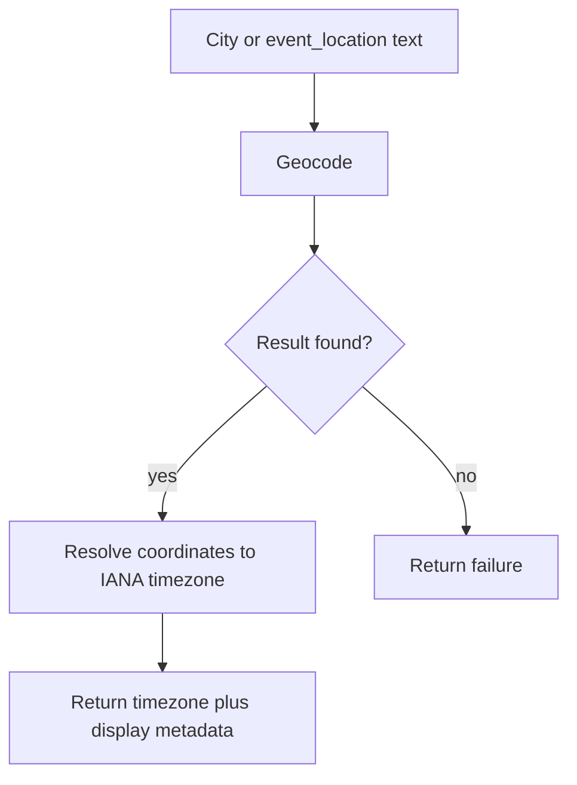

# 06. City to Timezone Resolution

## 1. Purpose

Resolve a human-entered city or an LLM-extracted `event_location` into an IANA timezone and display metadata.

## 2. Inputs

This module is used in two cases:

1. **Onboarding input**: the user enters their city in private onboarding.
2. **Event override**: the LLM extracts `event_location` from a message such as `"12:00 in London"`.

## 3. Output Contract

Successful resolution returns:

- normalized place label,
- IANA timezone name,
- optional country code,
- optional flag emoji.

Failure returns no timezone.

## 4. Core Rules

- Persistent user timezone must be stored only as an IANA timezone name.
- `event_location` is a one-message override and must not update stored user timezone.
- MVP uses best-match resolution; explicit disambiguation UI is out of scope.
- If location cannot be resolved, no source timezone is produced from this module.
- External geocoding calls must not block the main async event loop; runtime integration should use non-blocking wrappers or background-thread execution for sync libraries.

## 5. Resolution Flow

## 6. Onboarding Behavior

During onboarding:

- the bot asks the user for a city or place name,
- if the input resolves, the timezone is saved,
- if the input does not resolve, the bot asks the user to try another city.

MVP rule:

- no durable UTC-offset fallback is used for account setup,
- no numeric offset is stored as a user timezone.

## 7. Event Location Behavior

For runtime conversion:

- if `event_location` resolves, it becomes the source timezone for this message,
- if it does not resolve, normal fallback rules apply,
- if the sender has no stored timezone and `event_location` also fails, conversion must not proceed.

Examples:

- `"12:00 in London"` -> source timezone can be `Europe/London`
- `"12:00"` from unknown sender -> cannot convert

## 8. Technology

| Component | Purpose |
|---|---|
| `geopy` | Geocoding |
| `timezonefinder` | Coordinates to IANA timezone |

Implementation note:

- if the selected geocoding library is synchronous, the application must wrap it in an async-safe execution boundary before calling it from async handlers or detector flow.

## 9. Edge Cases

| Case | Handling |
|---|---|
| Multiple matches | Use best match in MVP |
| Empty input | Ask again |
| Invalid place | Ask again during onboarding, or fail this override during runtime |
| Place in local language | Delegate to geocoding service |

## 10. Out of Scope

- interactive disambiguation for multiple cities,
- durable manual UTC offset registration,
- storing alternate aliases for the same place,
- changing stored timezone from runtime `event_location`.
