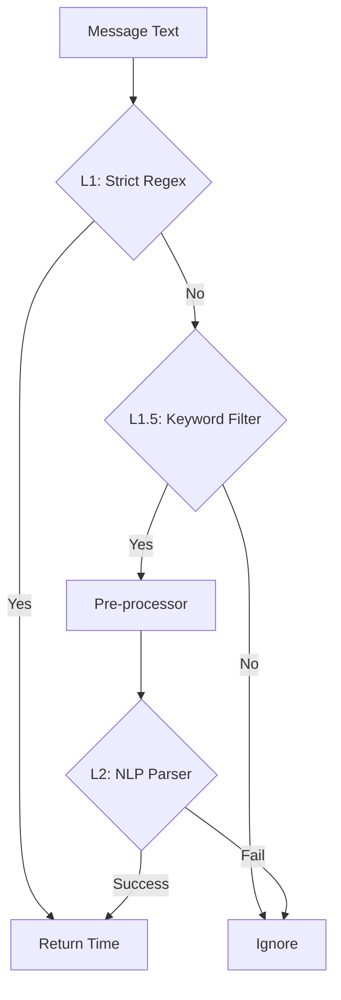

# 12. NLP & Fuzzy Capture Specification

## Goal
Улучшить распознавание времени, добавив поддержку естественного языка ("в 9 вечера", "завтра утром") и нечёткий поиск (fuzzy matching) для названий городов.

## Architecture: Hybrid Capture Pipeline

Мы используем трехуровневую систему фильтрации для баланса между производительностью и точностью.

### L1: Strict Regex (Current MVP)
*   **Задача**: Мгновенное распознавание жестких форматов.
*   **Инструмент**: `re` (Standard Lib).
*   **Patterns**: `HH:MM`, `HH:MM am/pm`, `HH am/pm`.
*   **Cost**: ~0.0ms.

### L1.5: Keyword Filter (Trigger Words)
*   **Задача**: Отсеять сообщения без временного контекста.
*   **Keywords** (defined in `configuration.yaml`):
    *   Time units: `hour`, `minute`, `min`, `час`, `минут` (EXCLUDED: `sec`, `секунда` to avoid noise).
    *   Time of day: `morning`, `evening`, `noon`, `midnight`, `утра`, `вечера`, `дня`, `ночи`, `полдень`, `полночь`.
    *   Relative: `in`, `ago`, `later`, `через`, `завтра`, `tomorrow`, `сегодня`, `today`.

    **Anti-Spam Rule**:
    L1.5 требует наличия **цифры** (`\d`) в сообщении для запуска NLP, чтобы избежать ложных срабатываний на идиомы ("Wait a minute", "Man of the hour").
    *Исключение*: "Strong keywords", которые самодостаточны (`noon`, `midnight`, `полдень`, `полночь`). Для них цифра не обязательна.

### L1.8: Pre-processor (Russian/Colloquial Support)
*   **Задача**: Нормализация сленга и русских оборотов, которые плохо понимает стандартный парсер.
*   **Replacements**:
    *   `вечера/вечером` -> `pm` ("9 вечера" -> "9 pm")
    *   `утра/утром` -> `am`
    *   `дня` -> `pm` ("3 часа дня" -> "3 часа pm")
    *   `ночи` -> `am` ("4 ночи" -> "4 am")
    *   `полдень` -> `12:00`
    *   `полночь` -> `00:00`
    *   `mins` -> `minutes`
    *   `в {N}` / `at {N}` -> `в {N}:00` / `at {N}:00` (Fix: "завтра в 8" -> "завтра в 8:00")

### L2: NLP Parser (Deep Capture)
*   **Инструмент**: `dateparser` (Python Library).
*   **Settings**: `languages=['ru', 'en']`, `PREFER_DATES_FROM='future'`.
*   **Behavior**: Извлекает подстроку, распознанную как дата/время.

## Philosophy & Conclusion
В ходе экспериментов мы пришли к выводу, что **Telegram-переписка зачастую деловая**, и люди склонны использовать строгие форматы (12:30, 11pm).
Поэтому:
1.  **L1 (Regex)** — главный рабочий инструмент. 100% точность, 0 ложных срабатываний.
2.  **L1.5 (NLP)** — вспомогательный слой для явных команд ("завтра в 8", "через 2 часа").
3.  **Anti-Spam** — мы намеренно ограничили NLP (правило цифры), чтобы бот не реагировал на обычный текст. Лучше пропустить сомнительное ("вечером созвон"), чем отреагировать не в тему.

---

## Fuzzy City Search (RapidFuzz)
*Planned for future.*
*Planned for future.*
