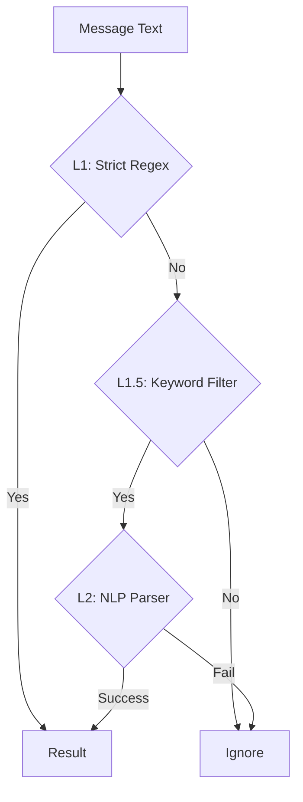

# 12. NLP & Fuzzy Capture Specification

## Goal
Улучшить распознавание времени, добавив поддержку естественного языка ("в 9 вечера", "завтра утром") и нечёткий поиск (fuzzy matching) для названий городов.

## Architecture: Hybrid Capture Pipeline

Мы используем трехуровневую систему фильтрации для баланса между производительностью и точностью.

### L1: Strict Regex (Current MVP)
*   **Задача**: Мгновенное распознавание жестких форматов.
*   **Инструмент**: `re` (Python Standard Library).
*   **Паттерны**: `HH:MM`, `HH:MM am/pm`, `HH am/pm`.
*   **Cost**: ~0.0ms.

### L1.5: Keyword Filter (Trigger Words)
*   **Задача**: Отсеять сообщения, в которых явно нет времени, чтобы не нагружать L2.
*   **Логика**: Проверка на наличие слов-маркеров в тексте.
*   **Keywords (RU/EN)**:
    *   `вечера`, `утра`, `дня`, `ночи`
    *   `morning`, `evening`, `afternoon`, `night`
    *   `at`, `in`, `в`, `через`
    *   `noon`, `midnight`, `полдень`, `полночь`
*   **Cost**: ~0.0ms (поиск подстроки).

### L2: NLP Parser (Deep Capture)
*   **Задача**: Понимание естественного языка.
*   **Инструмент**: `dateparser` (Python Library).
*   **Примеры**:
    *   "в 9 вечера" -> 21:00
    *   "через 2 часа" -> now + 2h
    *   "завтра в 10" -> tomorrow 10:00
*   **Cost**: High (~50-500ms). Запускается редко благодаря L1.5.

---

## Fuzzy City Search (RapidFuzz)

Отдельная задача для команды `/tb_settz` (установка города).

*   **Problem**: Юзер пишет "Moscw" или "Snt Petersburg".
*   **Solution**: `rapidfuzz` (Levenshtein distance).
*   **Logic**:
    1.  Юзер присылает текст.
    2.  Прямой поиск в БД городов (как сейчас).
    3.  Если нет -> RapidFuzz по списку известных крупных городов.
    4.  Если score > 80 -> Считаем, что нашли.
    5.  Если score 60-80 -> Саджестим: "Did you mean Moscow?".

---

## Dependencies
*   `dateparser` (для времени)
*   `rapidfuzz` (для городов)
