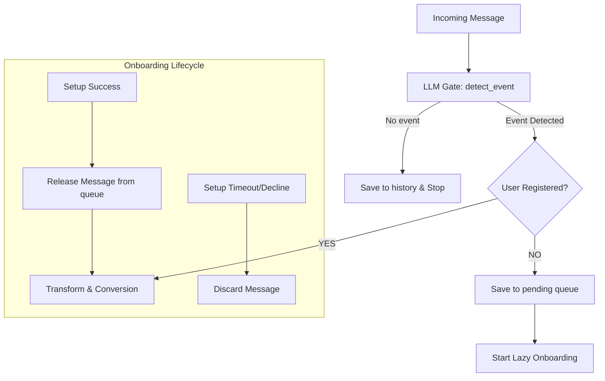

# Technical Spec: LLM Module

> **Version**: 2.1 — LLM with JSON Mode (Direct Orchestration)

---

## 1. Overview

This module describes the full lifecycle of a message from the moment it arrives in the bot
(Telegram or Discord) until the bot sends the converted time back to the chat.

The LLM is now the **orchestrator**, not just a classifier:

1. **LLM call**: Current message + Context history + Sender metadata are sent.
   The LLM decides whether the message contains a time-coordination event and fills a structured JSON response (JSON Mode).
2. **Post-LLM registration gate**: 
   - If `event == false` → message is silently added to history for future context.
   - If `event == true` AND author is **unregistered** → Onboarding is started (Lazy Onboarding).
   - If `event == true` AND author is **registered** → proceed to Conversion.
3. **Execution**: The detector parses the JSON and (if event is true) calls `execute_convert_time`.

### Why this shape?

| Concern | Old approach | New approach |
|---|---|---|
| Onboarding trigger | Regex detected unknown user | Algorithm checks DB on every message |
| Time detection | Regex prefilter → LLM classify | LLM does both detection and extraction |
| Conversion trigger | LLM calls tool directly | Detector processes JSON output |
| Context window | Two-pass (pass 1 single, pass 2 with history) | Single pass with configurable history |

---

## 2. Key Architectural Principles

- **Single-pass, history-first**: Every LLM call receives the current message together with the
  N most recent messages from the in-memory cache (n controlled by `context_messages` in config).
  The two-pass retry is removed; the bias toward silence (`trigger=false` when uncertain) is
  preserved by the decision policy.
- **LLM is agnostic to platform**: The LLM never sees Telegram/Discord-specific IDs.
  The message window uses an internal normalized representation (section 4.1).
- **In-memory cache only**: History is never persisted. On restart the buffer is empty; the first
  N real messages will refill it.
- **One DB for both platforms**: Telegram and Discord share the same SQLite DB (see `05_storage.md`).
  User lookup uses `platform + platform_user_id` as the composite key.

---

## 3. Module File Map

```
src/
├── event_detection/
│   ├── __init__.py         # Public API: process_message(platform, chat_id, msg, sender_db)
│   ├── client.py           # OpenAI-SDK client; agnostic base_url config
│   ├── prompts.py          # System prompt + JSON schema + tool definition
│   ├── history.py          # Per-chat deque (ring buffer); snapshot helpers
│   ├── detector.py         # Orchestration: history → LLM → tool dispatch
│   └── tools.py            # convert_time tool wrapper → Transform → Formatter → Reply
```

> **Note**: This module was previously planned as `src/llm/` but remains in `src/event_detection/` for stability.

---

## 4. Inputs

### 4.1 Message Window (Context sent to LLM)

Each item in the window (history + current message) is the same normalized shape:

| Field | Type | Notes |
|---|---|---|
| `platform` | `"telegram" \| "discord"` | Source platform |
| `chat_id` | `str` | Normalized string; platform-specific integer cast to str |
| `message_id` | `str` | Platform-specific |
| `author_id` | `str` | Platform user ID (cast to str) |
| `author_name` | `str` | Display name / username |
| `text` | `str` | Truncated to `max_message_length_chars` |
| `timestamp_utc` | `str` | ISO 8601 `Z` suffix, e.g. `2026-03-04T10:00:00Z` |

**Sender fields** (for the newest message only, injected by the gateway before calling the LLM):

| Field | Type | Source |
|---|---|---|
| `sender_id` | `str` | Same as `author_id` of the newest message |
| `sender_name` | `str` | Same as `author_name` of the newest message |
| `sender_timezone_iana` | `str` | From DB (`05_storage.md`) |
| `anchor_timestamp_utc` | `str` | Timestamp of the newest message |

### 4.2 History Buffer

- **Keyed by** `(platform, chat_id)`.
- **Length**: up to `context_messages` items (ring buffer, oldest dropped automatically).
- **Taken before appending** the current message so the snapshot excludes it (see section 6).

---

## 5. Pre-LLM Gate: Registration Check

**Executed by the gateway (adapter), not by the LLM.**



### Rules

1. **No Event**: The message is ignored for conversion but stored in history.
2. **Event + Not registered**: The message is frozen in `pending_queue`. Onboarding is triggered.
3. **Event + Registered**: Message proceeds to conversion.
4. **Onboarding completion**: Messages are released and processed.
5. **Onboarding timeout/decline**: Messages are **discarded** to prevent stale results.

> **Rationale**: We preserve context. No messages are ever "dropped" during onboarding; they are merely delayed until the user is ready or the interaction times out.

---

## 6. LLM Pipeline

### 6.1 Snapshot (frozen history)

```python
async def process_message(platform, chat_id, msg):
    key = (platform, chat_id)
    dq = message_history.setdefault(key, deque(maxlen=context_messages))

    # 1. Freeze history BEFORE appending current message
    snapshot = list(dq)      # [msg_n-3, msg_n-2, msg_n-1] — up to context_messages items

    # 2. Append current message (for future callers)
    dq.append(msg)

    # 3. Per-chat lock: one LLM call at a time
    lock = chat_locks.setdefault(key, asyncio.Lock())
    if lock.locked():
        return   # msg is in deque; will be used as history for next call

    async with lock:
        await run_llm(msg, snapshot, sender_db)
```

### 6.2 Prompt Composition

The system prompt remains in `prompts.py`. The user-turn message sent to the LLM is a plain-text
block with clearly labelled sections:

```
SENDER: id=123456  name=Alice
ANCHOR: 2026-03-13T17:00:00Z

HISTORY:
[Bob]: We should sync soon.
[Carol]: Agreed, let's pick a time.

CURRENT MESSAGE:
[Alice]: Созвон завтра в 14:00?
```

---

297: Testing via `promptfoo`:
298: - `tests/promptfoo/promptfooconfig.yaml`
299: - `tests/promptfoo/cases.yaml`
300: 
301: Tests assert binary `event` status and correctness of `points[]` extraction (including `event_type`).

---

To ensure reliable production monitoring, the pipeline uses **`logging.LoggerAdapter`** to automatically inject context into all log entries (debug, info, error).

**Context fields:**
- `platform`: `telegram` or `discord`
- `chat_id`: The unique identifier for the conversation.

The entry point `process_message` wraps the global logger with an `extra_prefix` before passing it down to the detector.

---

## 13. Non-Goals (v2.0)

- Recurring meetings («каждый вторник»)
- Full participant extraction from message text
- Fallback to regex time extraction if LLM is unavailable
- Updating sender's DB timezone from `event_location`
- Persisting history buffer across restarts
