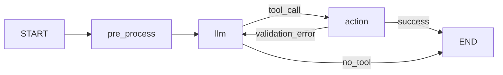

# Technical Spec: LLM Module

> **Version**: 3.0 — LangGraph & Native Tools

---

## 1. Overview

The LLM module coordinate the event detection pipeline through a structured **Agentic Graph** (powered by LangGraph). Unlike a simple classifier, the LLM acts as an autonomous agent that can decide to "publish" findings or "update" previous ones using native tool-calling capabilities.

### Why this shape?

| Old Approach (JSON Mode) | New Approach (LangGraph + Tools) |
|---|---|
| Manual JSON parsing/validation | Native tool schemas with built-in validation |
| Fixed sequence (Detection → Extraction) | Dynamic branching (LLM decides tool vs talk) |
| Snapshot-only history | Native `BaseMessage` state with automated reducers |
| Hardcoded update logic | `update_previous_event` tool with smart history scanning |

---

## 2. Core Architecture

### 2.1 State Management (`GraphState`)
The agent maintains a state consisting of a message list (`Annotated[list[BaseMessage], add_messages]`). This list persists within the chat's lifecycle and includes:
- **SystemMessage**: The behavioral prompt.
- **HumanMessage**: User messages with embedded timestamps (Zulu).
- **AIMessage**: LLM responses, including tool call definitions.
- **ToolMessage**: Result of tool executions (e.g., "✅ Published event #1").

### 2.2 The Graph Flow

```mermaid
graph LR
    START --> pre_process
    pre_process --> llm
    llm -->|tool_call| action
    action -->|validation_error| llm
    action -->|success| END
    llm -->|no_tool| END
```
- **`pre_process`**: JIT history cleanup (token trimming and old message removal).
- **`llm`**: Invokes the model with the current context and tool definitions.
- **`action`**: Executes `publish_event` or `update_previous_event` and handles side effects (chat replies/edits).

---

## 3. Module File Map

```
src/
└── event_detection/
    ├── __init__.py         # Entry point: process_message(...)
    ├── client.py           # Model initialization & API config
    ├── graph.py            # LangGraph definition, nodes, and tool implementations
    ├── history.py          # Short-term in-memory history snapshotting
    ├── prompts.py          # System prompt & Tool schemas (docs-centric)
    └── tools.py            # Business logic for conversions & formatting
```

---

## 4. Inputs & Context

### 4.1 Input Normalization
Before entering the graph, messages are normalized to include standard metadata:
- **`timestamp_utc`**: ISO 8601 Zulu (`YYYY-MM-DDTHH:MM:SSZ`).
- **`anchor_timestamp_utc`**: The context pivot point for relative time resolution.
- **`sender_db`**: User's timezone and location from the persistent storage.

### 4.2 Context Window
The graph uses a dual-layered trimming strategy:
1. **Configurable Count**: `context_messages` (default: 5) limits the number of recent chat messages.
2. **Token Limit**: A failsafe just-in-time trimmer (`max_tokens` in `configuration.yaml`) ensures the total prompt context (system + history + current) stays within limits.

---

## 5. Execution Logic

### 5.1 Tool Dispatch
The LLM selects one of the tools documented in [18_llm_tools.md](18_llm_tools.md).

### 5.2 Registration Gate (Lazy Onboarding)
If an event is detected but the user is unregistered, the pipeline performs a **detection-only** pass and stops before any real publish side effect. The user may receive an onboarding invite if cooldown allows, and the bot will only process future messages after setup is complete.

---

## 6. History Persistence
History is kept in an in-memory `defaultdict` of LangChain history objects. 
- **Volatile**: Cleared on bot restart.
- **Distance-Aware**: The `update_previous_event` logic scans this history to find the correct `message_id` for in-place edits.

---

## 7. Monitoring & Logging
The pipeline utilizes `logging.LoggerAdapter` to inject `platform` and `chat_id` into every log entry, ensuring total traceability of agent decisions across Discord and Telegram.
