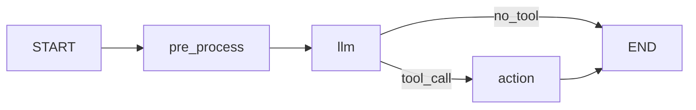

# Technical Spec: LLM Module

This document specifies the event-detection module that powers Timezone Bot.

---

## 1. Purpose

The LLM module answers one question for each incoming chat message:

> Does this message create or refine a coordination event with one or more time points?

If yes, it must return structured tool arguments that the deterministic layers can safely execute.

The LLM module does **not** perform timezone conversion itself.

---

## 2. Responsibilities

The module is responsible for:

- interpreting natural-language time mentions,
- extracting structured `points`,
- deciding between:
  - `publish_event`
  - `update_previous_event`
  - no tool call
- preserving agent memory inside a chat thread,
- avoiding real publish side effects for unregistered users.

The module is not responsible for:

- final chat formatting,
- membership loading,
- city fallback UI,
- onboarding UI logic.

---

## 3. Architecture

### 3.1 Entry point

`process_message(...)` in `src/event_detection/__init__.py` is the orchestration boundary.

It handles:

- message aging,
- per-chat serialization,
- calling `detect_event(...)`,
- forwarding the normalized result back to the adapter.

### 3.2 Agent runtime

`detect_event(...)` in `src/event_detection/detector.py`:

- builds the current message context,
- prepares side-effect dependencies (`send_fn`, `edit_fn`, `delete_fn`, reply builder),
- registers those dependencies in a process-local runtime context keyed by `thread_id`,
- reuses a shared compiled LangGraph workflow,
- normalizes the result for callers.

### 3.3 Graph

The LangGraph workflow in `src/event_detection/graph.py` has three conceptual stages:


```mermaid
graph LR
    START --> pre_process
    pre_process --> llm
    llm -->|tool_call| action
    llm -->|no_tool| END
    action --> END
```

#### `pre_process`

- trims old messages if needed;
- keeps graph state bounded.

#### `llm`

- calls a cached tool-bound `ChatOpenAI` runnable with current context and tool schemas.

#### `action`

- validates tool arguments,
- executes publish/update side effects,
- reads side-effect dependencies from runtime context rather than `RunnableConfig.configurable`,
- writes `ToolMessage` state back into the graph.

---

## 4. Inputs

Every processed message enters the module with:

| Field | Meaning |
|---|---|
| `message_text` | Raw incoming text |
| `chat_id` | Platform chat/guild ID |
| `user_id` | Sender ID |
| `platform` | `telegram`, `discord`, or special eval mode |
| `author_name` | Sender display name |
| `timestamp_utc` | ISO-8601 UTC timestamp |
| `sender_db` | User timezone/city snapshot, if known |

Optional callbacks:

- `send_fn`
- `edit_fn`
- `delete_fn`

These callbacks are adapter-owned side-effect hooks. They are not serialized into LangGraph config; instead they are wrapped into a runtime `ActionContext`.

That separation is what makes the difference between:

- **real publish/update mode**, and
- **app-logic gated mode** for onboarding.

---

## 5. Memory Model

### 5.1 Real chat thread

For registered users, the agent uses a persisted LangGraph thread:

- thread key: usually `"{platform}_{chat_id}"`;
- storage: `data/graph_checkpoints.db`;
- runtime: one shared compiled graph app per process;
- purpose: remember previously published/updated events.

The active prompt window is assembled by **recent human turns**, not raw message-object count.
That keeps `event_ref` traces attached to the turns that created them.

### 5.2 Unregistered sender behavior

For unregistered users:

- the module may still detect `event=True`,
- it uses the normal persisted chat thread,
- but the action layer must not execute real publish/update side effects,
- and it must write a clearly distinct app-logic `ToolMessage` instead of a fake publish/update result.

### 5.3 Runtime helpers

The runtime still uses lightweight process-local helpers for:

- per-chat locks,
- per-invocation `ActionContext` registry,
- invite cooldowns,
- user snapshot cache.

Conversational reasoning memory itself now lives in persisted LangGraph thread state.

---

## 6. Execution Rules

### 6.1 If no event is found

- no tool is called,
- the message remains only as context.

### 6.2 If a new event is found

- the model should call `publish_event(points=[...])`.

### 6.3 If a previously published event is being refined

- the model should call `update_previous_event(event_ref=..., points=[...])`.

### 6.4 If the sender is not onboarded

- the module may compute `event=True`,
- but must not trigger real publish side effects,
- the tool result becomes an app-logic skip marker in thread memory,
- and the product flow continues with onboarding UX instead of conversion output.

---

## 7. Constraints

### 7.1 Time format

Tool arguments must use strict `HH:MM` format.

### 7.2 Deterministic downstream behavior

Once `points` are produced, downstream processing must be deterministic.

The LLM decides:

- which points exist,
- whether this is a publish or update.

The deterministic layers decide:

- source timezone resolution,
- member conversion,
- output rendering,
- actual chat API calls.

### 7.3 Safe failure

If validation fails or the model output is malformed:

- do not publish broken chat output,
- prefer returning `event=False` or forcing a retry path inside the graph.

Retry routing should rely on structured tool metadata, not only on string prefixes inside tool text.

---

## 8. Files

```text
src/event_detection/
├── __init__.py      # process_message(...)
├── detector.py      # detect_event(...)
├── graph.py         # LangGraph nodes, routing, tool side effects
├── runtime.py       # per-chat locks, shared graph runtime, action-context registry
├── prompts.py       # system prompt
└── client.py        # cached ChatOpenAI + bound-tool runnable
```

---

## 9. Rebuild Checklist

To rebuild this module faithfully, preserve:

1. Tool-calling agent shape (`publish_event` / `update_previous_event`).
2. Persisted per-chat thread memory via LangGraph checkpoints.
3. App-logic gated onboarding behavior for unregistered users.
4. Per-chat serialized execution in `process_message(...)`.
5. Deterministic conversion/rendering outside the LLM.
6. Shared graph runtime instead of compile-per-message.
