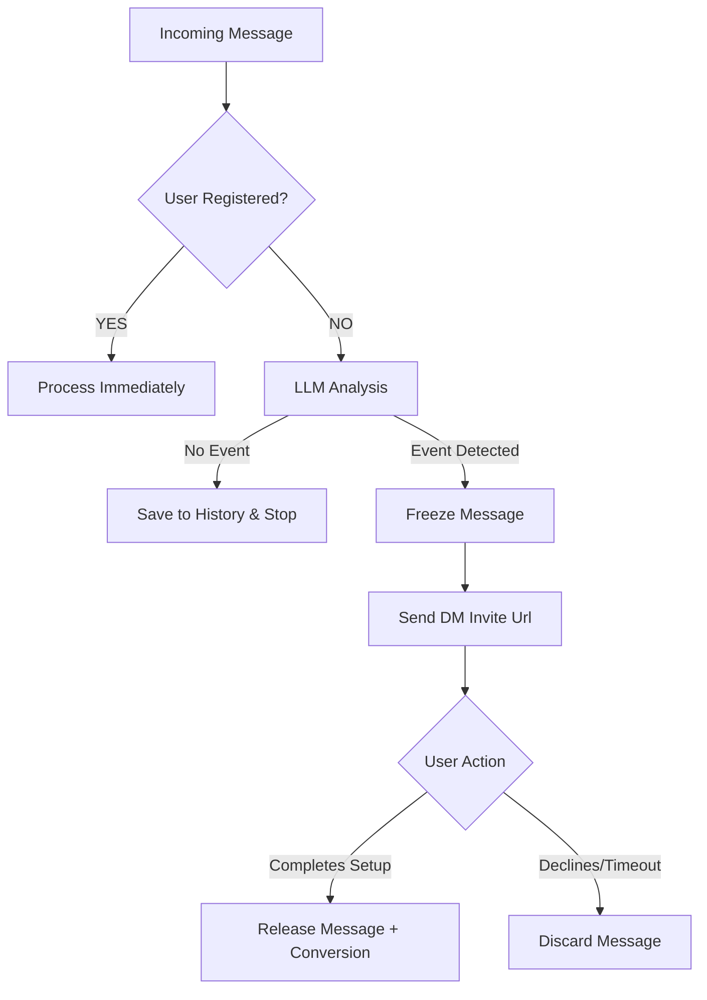

# Timezone Bot: UX & Onboarding Specification

This document defines the user experience guidelines and implementations for the Timezone Bot across different platforms.

## 1. Core Philosophy: Zero-Friction & Context Preservation

> [!TIP]
> **The Golden Rule:** Users should never be forced to interrupt their conversation flow to interact with the bot.

- **Graceful Handling**: The bot must gracefully handle missing data (like a missing timezone) without throwing errors or breaking the user's flow.
- **Background Queuing**: If the bot needs setup info from a user, it must queue their messages in the background, allow them to complete the setup, and then seamlessly process the backlog.
- **Pristine Chats**: Bot configuration and utility messages should leave zero trace in active chat histories once they are no longer needed.

---

## 2. Current Implementation (As-Is)

### 2.1 Telegram User Experience
Telegram lacks native Ephemeral Messages and Modals for group chats. We use **DM-based onboarding via deep links** to keep the group chat pristine while conducting the full setup dialogue in the bot's private messages.

#### Onboarding Flow
1. **Trigger:** A new user (not in the database) sends a message. The LLM evaluates it:
   - If **no time event** detected → message is silently added to history for context.
   - If **time event** detected → Onboarding is triggered (Lazy Onboarding).
3. **Cooldown Check:** The bot checks if a DM invite was already sent within the `dm_onboarding_cooldown_seconds` window (default: 600s). If so, the message is only queued — no new invite is sent.
4. **Invite:** If cooldown allows, the bot sends a minimal message to the group:
   > "Hi {Name}! Tap the button to quickly set up your timezone 👇"
   > **Button:** `[📍 Set up timezone]` ← URL button to `t.me/bot?start=onboard_{userId}_{chatId}`
5. **Auto-Cleanup:** The invite message is automatically deleted from the group after `settings_cleanup_timeout_seconds` (default: 10s).
6. **DM — Welcome Step:**
   - User clicks the URL button → Bot opens private chat.
   - The bot sends a concise greeting: *"What am I"*, *"How to use me"*, and two buttons: `[📍 Set up timezone]` and `[🔒 Data Privacy]`.
   - **Data Privacy:** Shows information about data storage and the 30-day auto-deletion policy.
7. **DM — City Prompt:**
   - On clicking `[📍 Set up timezone]`, the bot sends detailed instructions: *"Tell me your city... e.g. Paris, France or Paris, Texas, USA."*
   - The user types their city.
   - On success: timezone saved, confirmation sent in DM, and **all pending messages from all chats** are processed and sent to their original groups.
8. **DM — Decline / Ignore:**
   - If the user declines, they are marked as `onboarding_declined=True` and the **pending queue is discarded**.
   - If they ignore (timeout), messages in the queue expire after `onboarding_timeout_seconds` (default: 120s) and are **discarded** to prevent stale coordination responses.
9. **Security:** The deep-link payload is validated. If another user tries to use it, the bot ignores it.

#### ⭐ UX Principles & Cleanup Rules
- **Non-disruptive**: No intrusive dialogs in the group. All setup happens "behind the scenes" in DM.
- **Context Preservation**: Messages sent during onboarding are never lost; they are released the moment the user is ready.
- **Clean Chats**: All system messages have a TTL.
  - **Group Invites:** 10s (`settings_cleanup_timeout_seconds`)
  - **Help / Me / Members:** 10s (both command and reply)
  - **DM Context:** Important info (Welcome, City Prompt) **stays** for reference; transient commands (like `/tb_help` inputs) are cleaned up.

#### 🛠️ Configurable Timers (`configuration.yaml`)
| Parameter | Default | Description |
| :--- | :--- | :--- |
| `settings_cleanup_timeout_seconds` | 30s | TTL for system/help messages in groups. |
| `onboarding_timeout_seconds` | 120s | How long to wait for a user before discarding their pending coordination messages. |
| `dm_onboarding_cooldown_seconds` | 10m | Cooldown to prevent spamming invitations. |
| `max_message_age_seconds` | 30s | How old a message can be before the bot ignores it (preventing catch-up spam). |

---

## 3. Lazy Onboarding Flow Diagram

---

### 2.2 Discord User Experience
Discord offers native Ephemeral Messages and Modals, allowing for a strictly targeted UX without cluttering the chat history at all.

#### Onboarding Flow
1. **Trigger:** A new user mentions a time in a guild.
2. **Queuing:** The message is queued, similar to Telegram.
3. **Prompt:** The bot replies to the user, mentioning them directly:
   > "{Name}, set your timezone to convert times!"
   > **Button:** `[Set Timezone]`
4. **Accept Path (Modals):**
   - User clicks the button. (Other users see an ephemeral "Not for you" message if they click).
   - A Discord Modal pops up: *"Set Your Timezone"* with a text input field for *"Your City"*.
   - User submits the form.
   - The bot processes the city, saves the timezone, and releases the queued messages for conversion.
5. **Fallback:**
   - If the city is invalid, the bot responds with an ephemeral message containing a `FallbackView`: `[Try Again]` (reopens city modal) or `[Enter Time]` (opens a modal to enter manual time).

---

## 3. Future Directions
- **Smart re-invite timing:** Instead of a fixed cooldown, track user activity patterns and invite at optimal times.
- **Multi-chat awareness:** If a user has already set their timezone in one group, skip onboarding in other groups.

---

## 4. Historical Context: What We Tried & Discarded

> [!NOTE]
> This section documents past design decisions to prevent repeating old mistakes.

| Feature Attempted | Why We Discarded It | The Solution We Built |
| :--- | :--- | :--- |
| **Strict ForceReply in Telegram** | Users frequently ignored or forgot to use the Telegram reply function. They would just type "London" in the chat, leading to a locked `FSMContext` state. | Relaxed the check. If the user is in the `waiting_for_city` state, the bot accepts their next text message as the city input. |
| **Leaving Bot Prompts in the Chat** | In active Telegram groups, leaving "What city are you in?" and the user's "London" messages severely cluttered the conversation with onboarding noise. | Implemented **Auto-Cleanup**. The bot actively deletes inline buttons, `ForceReply` prompts, and the user's setup submission messages. |
| **Inline Buttons + ForceReply in Group Chat (v1)** | Even with auto-cleanup, the onboarding dialogue (buttons, city input, fallback prompts) polluted the group chat. Multiple messages were exchanged in the shared space before cleanup could run. | Moved the entire onboarding dialogue to **DM via deep links**. The group chat only ever sees a single auto-deleting invite message. |
