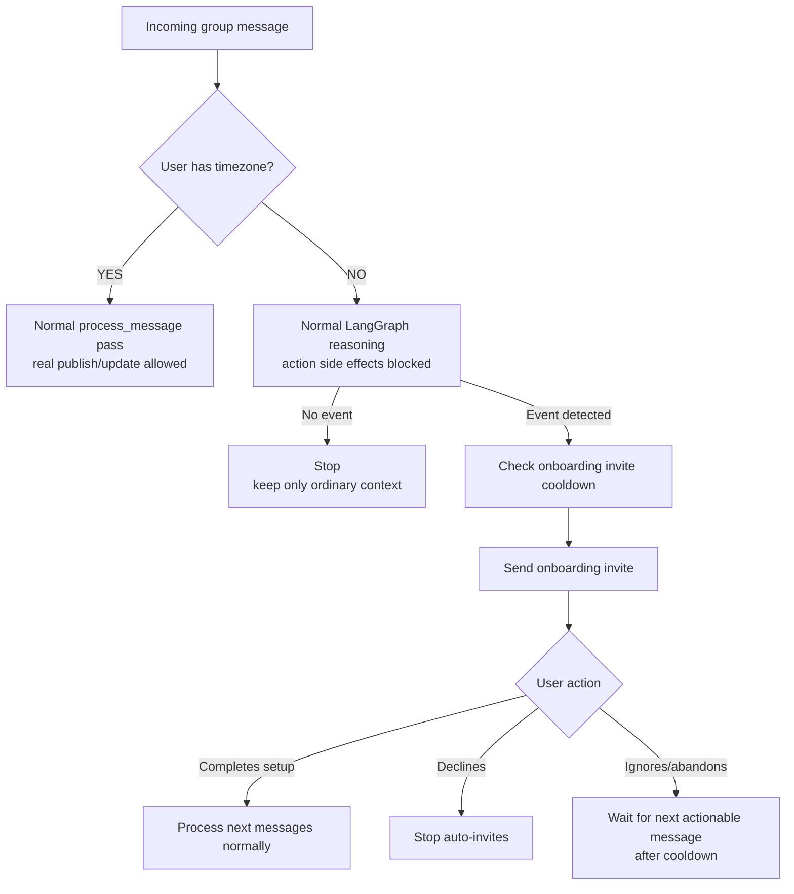

# Timezone Bot: UX & Onboarding Specification

This document defines the user experience guidelines and implementations for the Timezone Bot across different platforms.

## 1. Core Philosophy: Zero-Friction & Context Preservation

> [!TIP]
> **The Golden Rule:** Users should never be forced to interrupt their conversation flow to interact with the bot.

- **Graceful Handling**: The bot must gracefully handle missing data (like a missing timezone) without throwing errors or breaking the user's flow.
- **Background Prompting**: If the bot needs setup info from a user, it prompts them once and then relies on an invite cooldown to avoid repeated nagging. It does not queue or replay old chat messages.
- **Pristine Chats**: Bot configuration and utility messages should leave zero trace in active chat histories once they are no longer needed.

---

## 2. Current Implementation (Target Behavior)

The current architecture uses a **LangGraph agent with persisted thread state**, and onboarding follows one critical rule:

> **Before the user completes onboarding, the bot may run the normal agent reasoning flow, but it must not execute real publish/update side effects.**

That means the first pass for an unregistered user is an **app-logic gated pass**:
- it may use the normal persisted chat thread,
- it may trigger an onboarding invite if cooldown allows,
- but it must **not** persist a fake published/updated event result.
- instead, if the model chose a tool, thread memory gets a distinct marker such as:
  `No event action executed due to app logic. Reason: sender not registered; onboarding required.`

After setup completes, the bot starts handling the user's **next** messages normally.

### 2.1 Telegram User Experience
Telegram lacks native Ephemeral Messages and Modals for group chats. We use **DM-based onboarding via deep links** to keep the group chat pristine while conducting the full setup dialogue in the bot's private messages.

#### Onboarding Flow
1. **Trigger:** A new user (timezone missing) sends a message in a group. The bot performs the **normal LangGraph reasoning pass**, but action execution is gated by application logic:
   - If **no time event** is detected → onboarding is not shown.
   - If **time event** is detected → onboarding is triggered (Lazy Onboarding), but no chat reply is published yet.
2. **Cooldown Check:** The bot checks if a DM invite was already sent within the `dm_onboarding_cooldown_seconds` window (default: 600s). If cooldown is still active, the bot does nothing further for that message and waits for a later actionable message.
4. **Invite:** If cooldown allows, the bot sends a minimal message to the group:
   > "Hi {Name}! Tap the button to quickly set up your timezone 👇"
   > **Button:** `[📍 Set up timezone]` ← URL button to `t.me/bot?start=onboard_{userId}_{chatId}`
5. **Auto-Cleanup:** The invite message is automatically deleted from the group after `settings_cleanup_timeout_seconds` (default: 10s).
6. **DM — Welcome Step:**
   - User clicks the URL button → Bot opens private chat.
   - The bot sends a concise greeting: *"What am I"*, *"How to use me"*, and two buttons: `[📍 Set up timezone]` and `[🔒 Data Privacy]`.
   - **Data Privacy:** Shows information about data storage and the 30-day auto-deletion policy.
7. **DM — City Prompt:**
   - On clicking `[📍 Set up timezone]`, the bot sends detailed instructions: *"Tell me your city... e.g. Paris, France or Paris, Texas, USA."*
   - The user types their city.
   - On success: timezone is saved, confirmation is sent in DM, and the bot starts working from the user's **next** chat message.
8. **DM — Decline / Ignore:**
   - If the user declines, they are marked as `onboarding_declined=True`.
   - If they ignore or abandon the flow, nothing is replayed later; the bot will only re-invite after the onboarding cooldown expires and a new actionable message appears.
9. **Security:** The deep-link payload is validated. If another user tries to use it, the bot ignores it.
10. **Memory boundary:** The initial onboarding-time pass is **not allowed** to create a fake published event in the persisted LangGraph chat thread. Real publish/update traces are written only when a registered user is processed normally; unregistered actionable messages produce an app-logic skip marker instead.

#### ⭐ UX Principles & Cleanup Rules
- **Non-disruptive**: No intrusive dialogs in the group. All setup happens "behind the scenes" in DM.
- **No Backlog Replay**: Messages written before the user finishes setup are not replayed later. Once onboarding completes, the bot starts from the next message.
- **Clean Chats**: All system messages have a TTL.
  - **Group Invites:** 10s (`settings_cleanup_timeout_seconds`)
  - **Help / Me / Members:** 10s (both command and reply)
  - **DM Context:** Important info (Welcome, City Prompt) **stays** for reference; transient commands (like `/tb_help` inputs) are cleaned up.

#### 🛠️ Configurable Timers (`configuration.yaml`)
| Parameter | Default | Description |
| :--- | :--- | :--- |
| `settings_cleanup_timeout_seconds` | 30s | TTL for system/help messages in groups. |
| `dm_onboarding_cooldown_seconds` | 10m | Cooldown to prevent spamming invitations. |
| `max_message_age_seconds` | 30s | How old a message can be before the bot ignores it (preventing catch-up spam). |

#### Runtime Notes

- **Invite cooldown storage**: `src/storage/pending.py`
- **Telegram onboarding/settings flow**: `src/commands/settings.py`
- **Discord onboarding/settings flow**: `src/discord/commands.py` + `src/discord/ui.py`
- **App-logic gated pass**: `src/event_detection/detector.py`
- **Real publish pass**: `src/event_detection/__init__.py` + `src/event_detection/graph.py`

---

## 3. Lazy Onboarding Flow Diagram

```mermaid
flowchart TD
    A[Incoming group message] --> B{User has timezone?}
    B -- YES --> C[Normal process_message pass<br/>real publish/update allowed]
    B -- NO --> D[Normal LangGraph reasoning<br/>action side effects blocked]

    D -- No event --> E[Stop<br/>keep only ordinary context]
    D -- Event detected --> F[Check onboarding invite cooldown]

    F --> G[Send onboarding invite]
    G --> H{User action}

    H -- Completes setup --> I[Process next messages normally]
    H -- Declines --> J[Stop auto-invites]
    H -- Ignores/abandons --> K[Wait for next actionable message<br/>after cooldown]
```

---

### 2.2 Discord User Experience
Discord offers native Ephemeral Messages and Modals, allowing for a strictly targeted UX without cluttering the chat history at all.

#### Onboarding Flow
1. **Trigger:** A new user mentions a time in a guild.
2. **App-logic gated pass:** The bot checks the message with the normal agent flow, but before registration it must not persist a fake publish result into the real chat thread.
3. **Prompt:** If cooldown allows, the bot replies to the user, mentioning them directly:
   > "{Name}, set your timezone to convert times!"
   > **Button:** `[Set Timezone]`
5. **Accept Path (Modals):**
   - User clicks the button. (Other users see an ephemeral "Not for you" message if they click).
   - A Discord Modal pops up: *"Set Your Timezone"* with a text input field for *"Your City"*.
   - User submits the form.
   - The bot processes the city, saves the timezone, and starts converting **future** messages.
6. **Fallback:**
   - If the city is invalid, the bot responds with an ephemeral message containing a `FallbackView`: `[Try Again]` (reopens city modal) or `[Enter Time]` (opens a modal to enter manual time).

---

## 4. Future Directions
- **Smart re-invite timing:** Instead of a fixed cooldown, track user activity patterns and invite at optimal times.
- **Multi-chat awareness:** If a user has already set their timezone in one group, skip onboarding in other groups.

---
