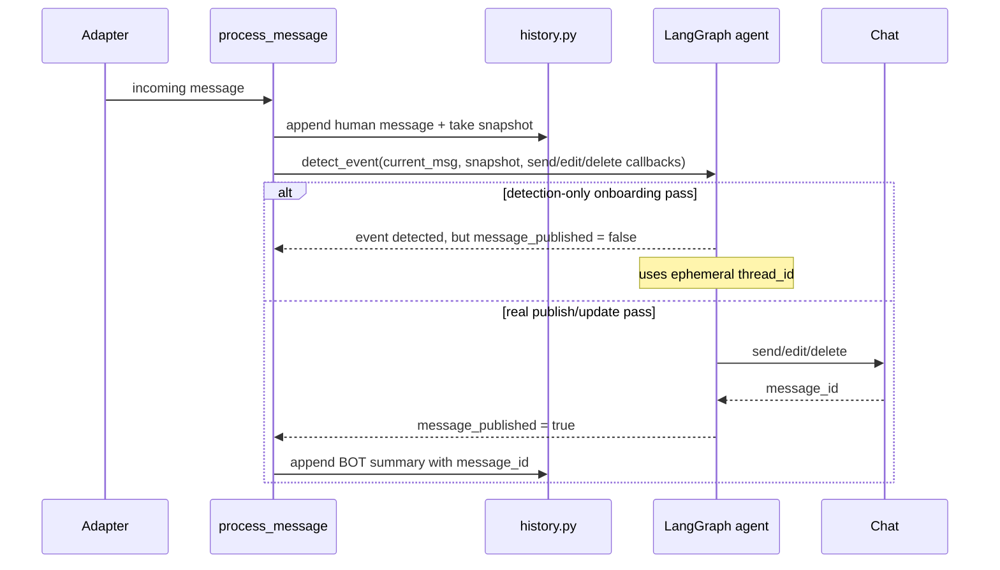

# Spec: LLM Chat Memory Model

> **Status**: Updated to current implementation  
> **Relates to**: `14_llm_module.md`, `src/event_detection/__init__.py`, `src/event_detection/history.py`, `src/event_detection/graph.py`

---

## Цель

Описать, какую именно память использует LLM/event-detection pipeline, что в неё попадает, и где проходят границы между:

- краткоживущим chat context в памяти процесса,
- persisted LangGraph thread state,
- внешними side effects в самом чате.

---

## 1. Две памяти, а не одна

В текущей реализации у нас есть **два слоя памяти**:

### 1.1 Short-term chat history (`history.py`)

Это in-memory история процесса:

- хранится в `_message_history`;
- ключ: `(platform, chat_id)`;
- типы записей: `HumanMessage`, `AIMessage`;
- используется как локальный snapshot-контекст вокруг входящего сообщения;
- очищается при рестарте процесса.

### 1.2 LangGraph thread state (`graph_checkpoints.db`)

Это persisted state агента:

- хранится через `AsyncSqliteSaver`;
- ключ thread: обычно `"{platform}_{chat_id}"`;
- для detection-only pass используется **ephemeral thread_id**, чтобы не загрязнять реальный thread;
- содержит `SystemMessage`, `HumanMessage`, `AIMessage`, `ToolMessage`, `RemoveMessage` semantics;
- переживает рестарт процесса, пока доступен sqlite checkpoints DB.

> Важно: short-term history и LangGraph thread state связаны, но не идентичны.  
> Первый слой нужен для local snapshot / processing semantics, второй — для agent-native memory.

---

## 2. Что видит LLM

При обычной обработке зарегистрированного пользователя LLM получает:

1. system prompt;
2. persisted thread state из LangGraph checkpoints;
3. текущее сообщение как `HumanMessage`.

При detection-only pass для незарегистрированного пользователя LLM получает:

1. system prompt;
2. snapshot из `history.py`;
3. текущее сообщение как `HumanMessage`;
4. **ephemeral thread_id**, чтобы не записывать fake publish/update в реальный thread.

---

## 3. Какие записи живут в памяти

### 3.1 Пользовательские сообщения

Формат в short-term history:

```text
[ISO_TIMESTAMP] [Имя]: текст сообщения
```

Пример:

```text
[2026-03-21T10:03:00Z] [Оля]: Ребят, созвон сегодня в 10, потом зум в Лондоне в 22:00
[2026-03-21T10:05:00Z] [Петя]: не смогу в 10, можно в 10:30?
```

### 3.2 BOT summary в short-term history

После **реального** `publish_event` или `update_previous_event`, если сообщение действительно было отправлено или отредактировано в чате, `process_message(...)` добавляет компактную BOT-запись в `history.py`.

Формат:

```text
[BOT]: detected: sync → 14:00, call → 16:30 (London)
```

Дополнительно в `additional_kwargs` хранится `message_id`, чтобы update logic могла найти последнее bot message.

> Detection-only onboarding pass **не должен** создавать такую BOT-запись.

### 3.3 ToolMessage в LangGraph state

В persisted thread state агент работает не с formatted chat reply, а с короткими ToolMessage-записями.

Форматы в текущем коде:

```text
✅ Event published. event_ref: 4821. Summary: sync → 14:00, call → 16:30
```

или

```text
✅ Event updated. event_ref: 4821. Summary: sync → 15:00
```

Если update не нашёл исходное событие:

```text
✅ Event published. event_ref: 5932 (fallback). Summary: sync → 15:00
```

> `event_ref` сейчас не sequence number `#1/#2/#3`, а случайный уникальный 4-digit ref внутри thread.

---

## 4. Как работает publish/update memory semantics

### 4.1 `publish_event`

Когда агент выбирает `publish_event`:

1. валидируются `points`;
2. строится reply;
3. вызывается platform `send_fn`;
4. в LangGraph state пишется `ToolMessage` с `event_ref`;
5. в short-term history добавляется BOT summary, но только если сообщение реально опубликовано.

### 4.2 `update_previous_event`

Когда агент выбирает `update_previous_event(event_ref=...)`:

1. ищется соответствующий `ToolMessage` по `event_ref`;
2. агент решает `edit in place` vs `delete + republish` по distance rule;
3. старая пара `AIMessage + ToolMessage` удаляется через `RemoveMessage`;
4. в state остаётся только актуальная версия события;
5. BOT summary в short-term history обновляется через новый append после реального side effect.

---

## 5. Поведение при незарегистрированном пользователе

Это важное отличие от старой версии спек.

Если сообщение написал незарегистрированный пользователь:

- агент всё ещё может выполнить detection-only pass;
- `event=True` может быть вычислен;
- но никаких real publish side effects быть не должно;
- никаких fake ToolMessage / BOT summary не должно попадать в реальный chat thread.

После успешного onboarding бот **не replay'ит старые сообщения**. Он начинает работать со **следующего** сообщения пользователя.

---

## 6. Side Effects Pipeline



---

## 7. Что НЕ делает LLM

- Не видит финальный platform-formatted reply как source of truth.
- Не использует platform `message_id` как primary semantic key; для update semantics используется `event_ref`.
- Не replay'ит старые onboarding-era сообщения после setup.
- Не использует backlog replay или очередь старых onboarding-сообщений.

---

## 8. Ограничения и Operational Notes

### 8.1 Per-chat serialization

Обработка сериализуется через `asyncio.Lock` на чат. Это защищает thread state от concurrent corruption, но означает:

- burst в одном чате обрабатывается по одному сообщению;
- старые сообщения могут быть отброшены по age guard, если очередь выросла.

### 8.2 Snapshot timing nuance

Сейчас `append_to_history(...)` и snapshot происходят **до** входа в per-chat lock.  
В обычной работе это нормально, но при очень высокой нагрузке snapshot timing и execution order могут слегка разойтись.

Если это станет проблемой, точка ужесточения очевидна:

- перенести `append_to_history(...)` / snapshot внутрь locked section в `process_message(...)`.

### 8.3 Short-term history is still process-local

Хотя LangGraph thread state persisted в SQLite, `history.py` остаётся in-memory и сбрасывается при рестарте процесса.

---

## 9. Open Questions

- [ ] Нужна ли отдельная memory semantics для явной отмены события, а не только update?
- [ ] Нужно ли когда-нибудь показывать LLM более структурированную BOT summary вместо строки `detected: ...`?
- [ ] Если burst-нагрузка вырастет, стоит ли делать snapshot+lock fully atomic?
