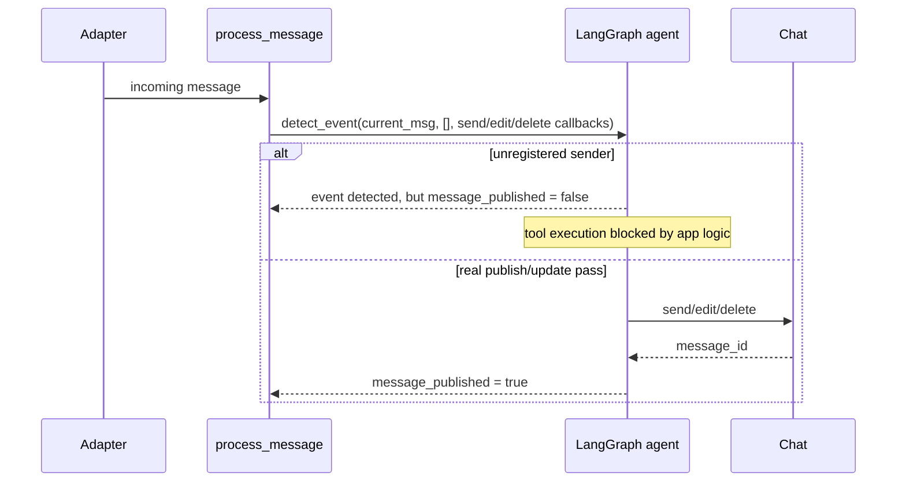

# Spec: LLM Chat Memory Model

> **Status**: Updated to current implementation  
> **Relates to**: `14_llm_module.md`, `src/event_detection/__init__.py`, `src/event_detection/runtime.py`, `src/event_detection/graph.py`

---

## Цель

Описать, какую именно память использует LLM/event-detection pipeline, что в неё попадает, и где проходят границы между:

- persisted LangGraph thread state,
- process-local runtime helpers,
- внешними side effects в самом чате.

---

## 1. Главная память

В текущей реализации reasoning-память теперь одна:

### 1.1 LangGraph thread state (`graph_checkpoints.db`)

Это persisted state агента:

- хранится через `AsyncSqliteSaver`;
- ключ thread: обычно `"{platform}_{chat_id}"`;
- содержит `SystemMessage`, `HumanMessage`, `AIMessage`, `ToolMessage`, `RemoveMessage` semantics;
- переживает рестарт процесса, пока доступен sqlite checkpoints DB.

### 1.2 Process-local runtime helpers

Кроме thread state остаются только process-local helpers:

- per-chat `asyncio.Lock`,
- invite cooldown state,
- user snapshot cache.

Это не conversational memory.

---

## 2. Что видит LLM

При обычной обработке зарегистрированного пользователя LLM получает:

1. system prompt;
2. persisted thread state из LangGraph checkpoints;
3. текущее сообщение как `HumanMessage`.

При обработке незарегистрированного пользователя LLM получает:

1. system prompt;
2. persisted thread state из LangGraph checkpoints;
3. текущее сообщение как `HumanMessage`.

Разница с зарегистрированным пользователем не в том, что используется другой thread,
а в том, что **action layer блокирует реальные publish/update side effects**.

---

## 3. Какие записи живут в памяти

### 3.1 ToolMessage в LangGraph state

В persisted thread state агент работает не с formatted chat reply, а с короткими ToolMessage-записями.

Форматы в текущем коде:

```text
✅ Event published. event_ref: 4821. Summary: sync → 14:00, call → 16:30
```

или

```text
✅ Event updated. event_ref: 4821. Summary: sync → 15:00
```

Для незарегистрированного отправителя возможен отдельный app-logic marker:

```text
No event action executed due to app logic. Reason: sender not registered; onboarding required. Detected intent: publish_event. Summary: sync → 15:00
```

Если update не нашёл исходное событие:

```text
✅ Event published. event_ref: 5932 (fallback). Summary: sync → 15:00
```

> `event_ref` сейчас не sequence number `#1/#2/#3`, а случайный уникальный 4-digit ref внутри thread.

---

## 4. Как работает publish/update memory semantics

### 4.1 `publish_event`

Когда агент выбирает `publish_event`:

1. валидируются `points`;
2. строится reply;
3. вызывается platform `send_fn`;
4. в LangGraph state пишется `ToolMessage` с `event_ref`;
5. platform `message_id` хранится в `ToolMessage.additional_kwargs`.

### 4.2 `update_previous_event`

Когда агент выбирает `update_previous_event(event_ref=...)`:

1. ищется соответствующий `ToolMessage` по `event_ref`;
2. агент решает `edit in place` vs `delete + republish` по distance rule;
3. старая пара `AIMessage + ToolMessage` удаляется через `RemoveMessage`;
4. в state остаётся только актуальная версия события;
5. в state остаётся только актуальная version trace для этого события.

---

## 5. Поведение при незарегистрированном пользователе

Это важное отличие от старой версии спек.

Если сообщение написал незарегистрированный пользователь:

- агент всё ещё может прийти к `publish_event` или `update_previous_event`;
- `event=True` может быть вычислен;
- но никаких real publish side effects быть не должно;
- вместо fake publish/update в persisted thread пишется **app-logic skip marker**;
- никаких extra BOT summaries больше не существует.

После успешного onboarding бот **не replay'ит старые сообщения**. Он начинает работать со **следующего** сообщения пользователя.

---

## 6. Side Effects Pipeline



---

## 7. Что НЕ делает LLM

- Не видит финальный platform-formatted reply как source of truth.
- Не использует platform `message_id` как primary semantic key; для update semantics используется `event_ref`.
- Не replay'ит старые onboarding-era сообщения после setup.
- Не использует backlog replay или очередь старых onboarding-сообщений.

---

## 8. Ограничения и Operational Notes

### 8.1 Per-chat serialization

Обработка сериализуется через `asyncio.Lock` на чат. Это защищает thread state от concurrent corruption, но означает:

- burst в одном чате обрабатывается по одному сообщению;
- старые сообщения могут быть отброшены по age guard, если очередь выросла.

### 8.2 Thread freshness

Хотя LangGraph thread state persisted в SQLite, сейчас у него всё ещё нет automatic freshness cutoff after long inactivity.

---

## 9. Open Questions

- [ ] Нужна ли отдельная memory semantics для явной отмены события, а не только update?
- [ ] Нужен ли freshness cutoff для очень старого persisted thread state?
