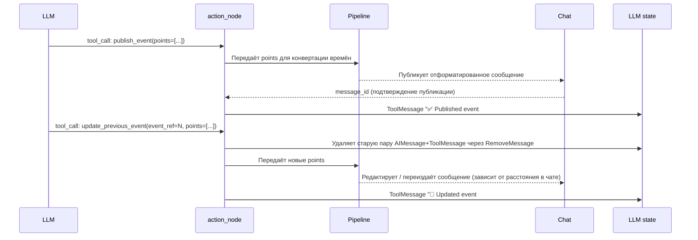

# Spec: LLM Chat Memory Model (v1.0)

> **Status**: Design Draft — 2026-03-21  
> **Relates to**: `14_llm_module.md`, `graph.py`, `prompts.py`

---

## Цель

Описать формат и содержимое "памяти чата" — той части контекста, которую ЛЛМ получает на каждом шаге  
при поступлении нового сообщения от юзера.

---

## 1. Состав памяти чата

ЛЛМ получает следующие типы записей в хронологическом порядке:

### 1.1 Пользовательские сообщения

Сообщения реальных юзеров из чата. Передаются с метаданными:

```
[ISO_TIMESTAMP] [ИМЯ]: текст сообщения
```

Пример:
```
[2026-03-21T10:03:00Z] [Оля]: Ребят, созвон сегодня в 10, потом зум в Лондоне в 22:00
[2026-03-21T10:05:00Z] [Петя]: не смогу в 10, можно в 10:30?
```

### 1.2 Записи о опубликованных событиях (от `publish_event`)

После того как ЛЛМ вызвала инструмент `publish_event`, пайплайн публикует сообщение в чат  
и добавляет в историю **упрощённую** запись о событии (не финальный отформатированный вид, а краткую).  

Формат записи в памяти:

```
✅ Published event #N: [event_name: ТИП] [time: HH:MM] [city: ГОРОД | null] [msg_ref: N]
```

Если событие сложное (диапазон времени или несколько точек встречи в один вызов):

```
✅ Published event #1: [event_name: созвон с] [time: 10:00] [city: null] [msg_ref: 3]
✅ Published event #2: [event_name: созвон до] [time: 11:00] [city: null] [msg_ref: 3]
✅ Published event #3: [event_name: зум] [time: 22:00] [city: London] [msg_ref: 3]
```

> `msg_ref` — порядковый номер **пользовательского сообщения** в памяти чата (не message_id платформы),  
> которое вызвало это событие. Нужен чтобы ЛЛМ понимала, к какому разговору привязано событие.  
> `event #N` — порядковый номер **вызова** `publish_event` в сессии. Если один вызов содержит несколько `points`,  
> все они хранятся под одним `event #N`. При обновлении ЛЛМ передаёт новый список `points` целиком — только нужные.

### 1.3 Записи об обновлённых событиях (от `update_previous_event`)

Когда ЛЛМ решает обновить уже опубликованное событие, вызывается `update_previous_event`  
с указанием `event_ref` (номер события, которое нужно изменить).

Пайплайн:
1. Обрабатывает изменение и обновляет/переиздаёт сообщение в чате.
2. **Удаляет** из памяти старую запись `✅ Published event #N` и её AI-вызов.
3. Вместо неё добавляет:

```
🔄 Updated event #N: [event_name: ...] [time: HH:MM] [city: ГОРОД | null]
```

> ЛЛМ при следующих сообщениях видит только актуальную версию события — без deprecated записей.

---

## 2. Логика поведения ЛЛМ

ЛЛМ при поступлении нового сообщения анализирует память чата и принимает одно из трёх решений:

### 2.1 Публикация нового события → `publish_event`

**Триггер**: ЛЛМ видит, что в текущем сообщении упоминается новое назначенное время или событие.

**Пример**:
```
[Оля]: созвон сегодня в 10, зум в Лондоне в 22
→ publish_event(points=[
    {event_type: "созвон с", time: "10:00", city: null},
    {event_type: "зум", time: "22:00", city: "London"}
  ])
```

> Несколько `points` в одном `publish_event` — норма если одно сообщение содержит несколько временных точек.  
> Каждая `point` записывается в память как отдельный `event #N`.

### 2.2 Обновление события → `update_previous_event`

**Триггер**: Юзеры в процессе обсуждения оспаривают или уточняют ранее установленное время.  
ЛЛМ видит в памяти `✅ Published event #N` и понимает, что это событие нужно обновить.

**Два случая**:

**A. Спор без финального решения** — ЛЛМ фиксирует оба варианта чтобы обозначить ситуацию:
```
[Оля]: давайте в 9 утра
→ publish_event → ✅ Published event #1: созвон [9:00]

[Петя]: я не успею к 9, можно в 9:30?
→ LLM видит спор, вызывает update_previous_event(event_ref=1, points=[
    {event_type: "созвон (предложение Оли)", time: "09:00", city: null},
    {event_type: "созвон (просьба Пети)", time: "09:30", city: null}
  ])
→ 🔄 Updated event #1: два варианта времени
```

**B. Финальное решение определено** — ЛЛМ обновляет одним событием:
```
[Оля]: ок, пусть будет 9:30
→ update_previous_event(event_ref=1, points=[
    {event_type: "созвон", time: "09:30", city: null}
  ])
→ 🔄 Updated event #1: созвон [9:30]
```

> ЛЛМ умеет различать эти два случая по контексту: если дискуссия продолжается — записывает оба варианта;
> если смотрит что народ согласился — передаёт только одно финальное событие.

### 2.3 Нет события → ничего

Если текущее сообщение не содержит нового времени или изменения — ЛЛМ ничего не вызывает.  
Сообщение просто добавляется в историю как контекст.

---

## 3. Пример полной памяти чата

```
[2026-03-21T10:00:00Z] [Иван]: когда созвонимся по проекту?
[2026-03-21T10:02:00Z] [Оля]: давайте в 10 утра, и вечером зум с Лондоном в 22:00
✅ Published event #1: [event_name: созвон] [time: 10:00] [city: null] [msg_ref: 2]
✅ Published event #2: [event_name: зум] [time: 22:00] [city: London] [msg_ref: 2]
[2026-03-21T10:05:00Z] [Петя]: я к 10 не успею, можно в 10:30?
🔄 Updated event #1: [event_name: созвон (Оля)] [time: 10:00] [city: null], [event_name: созвон (Петя)] [time: 10:30] [city: null]
[2026-03-21T10:10:00Z] [Оля]: ок, пусть будет 10:30
🔄 Updated event #1: [event_name: созвон] [time: 10:30] [city: null]
[2026-03-21T10:12:00Z] [Иван]: отлично, жду всех!
```

> В этой памяти ЛЛМ видит чёткую картину: созвон в 10:30 (а не несколько противоречащих записей),  
> зум в 22:00 по Лондону. Нет мусора, нет confusion.

---

## 4. Пайплайн сторон эффектов (Side Effects)



### Логика Edit vs. Re-post (для Update):

| Расстояние старого сообщения | Действие |
|---|---|
| ≤ `EDIT_THRESHOLD` (напр. 5) сообщений назад | Редактирует старое сообщение in-place |
| > `EDIT_THRESHOLD` | Удаляет старое, публикует новое внизу чата |

---

## 5. Что НЕ делает ЛЛМ

- Не видит финальное отформатированное сообщение с конвертированными временами — только краткую запись события.
- Не использует `message_id` платформы напрямую — только `event_ref` (порядковый номер внутри сессии).
- Не хранит события между перезапусками — история только in-memory.

---

## 6. Открытые вопросы

- [ ] Как обрабатывать событие которое задаёт незарегистрированный юзер? (лазивый онбординг — см. `14_llm_module.md`)
- [ ] Нужен ли `msg_ref` в записях памяти или достаточно `event_ref`?
- [ ] Что делать когда юзер хочет отменить событие полностью (а не просто перенести)?
