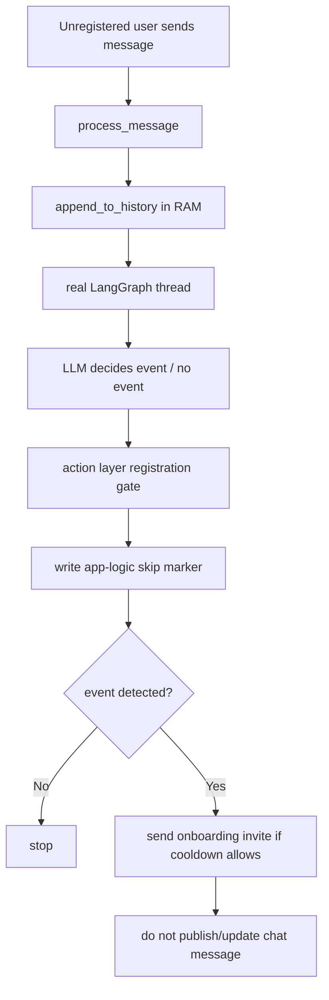
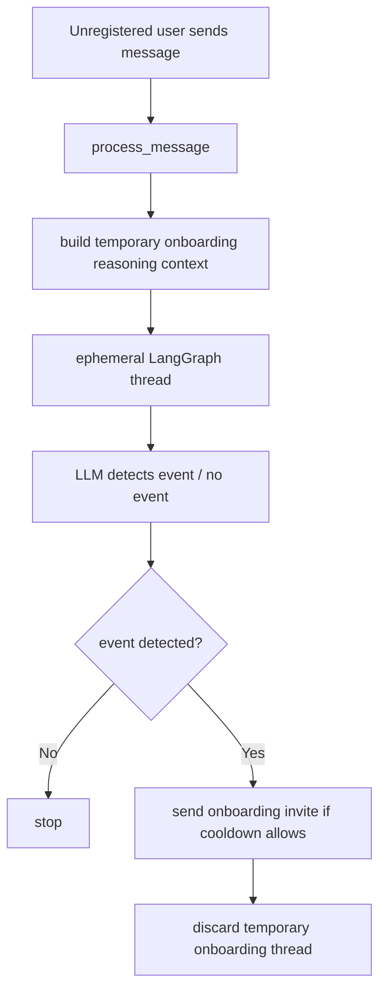
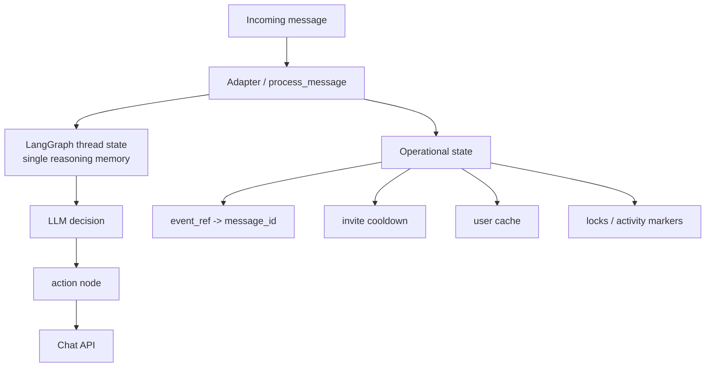
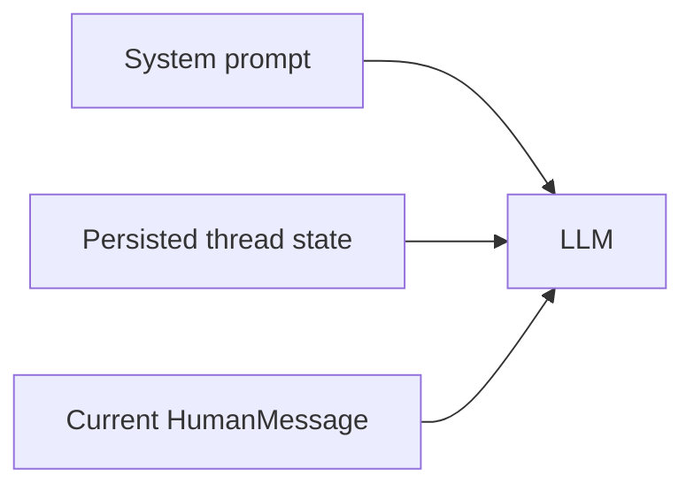
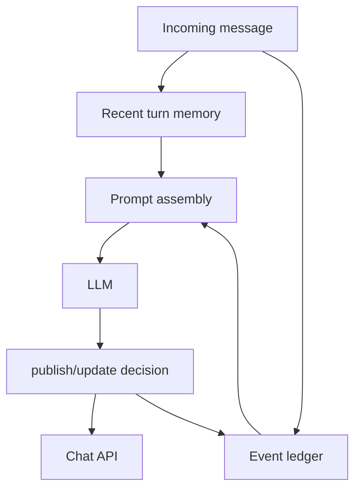
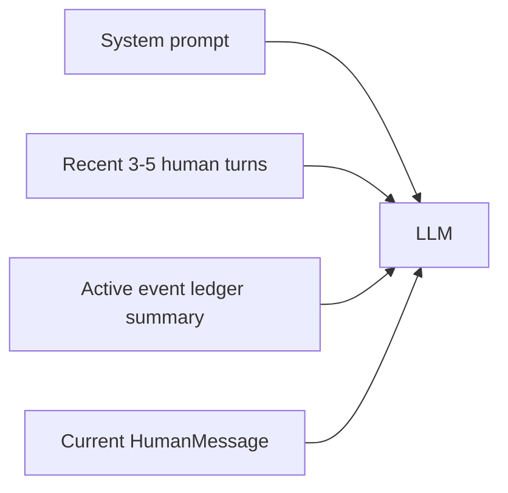

# LLM Memory Alternatives

This note proposes two alternative memory architectures for the event-detection module.

The goal is not to redesign everything at once, but to make the trade-offs explicit and compare them to the current dual-memory model.

Current baseline:

- persisted LangGraph thread state in `graph_checkpoints.db`,
- process-local short-term history in `history.py`,
- operational metadata partly embedded in both layers.

---

## How Unregistered Detection Works

This is the most confusing part of the current architecture, so it is shown first.

### Current implementation

For an unregistered user, the system now uses the **real persisted chat thread** for reasoning,
but gates side effects in the action layer.

Instead it:

1. appends the incoming message into process-local `history.py`,
2. runs the agent on the normal chat thread,
3. allows the model to choose a tool,
4. blocks real publish/update side effects if the sender is not registered,
5. writes an app-logic skip marker into thread memory,
6. triggers onboarding invite if the message is actionable.



Mental model:

- LangGraph thread stays the same,
- the distinction is in execution permission,
- app-logic skip markers preserve intent without fake publish/update traces.

This is simpler than the previous ephemeral-thread design, but the system still has two memory layers overall.

### Option 1: Single reasoning memory + separate operational state

In Option 1, the unregistered flow would still use LangGraph, but there would be **no separate `history.py` reasoning layer**.

Instead:

1. build a temporary onboarding thread,
2. seed it from a controlled recent window derived from the same single reasoning model,
3. run detection there,
4. discard it after the decision.



Mental model:

- one reasoning architecture,
- temporary thread for onboarding,
- no second local conversational memory source.

### Option 2: Recent turns + event ledger

In Option 2, unregistered detection becomes even more explicit.

The agent would read:

- a tiny recent human-turn window,
- no event ledger ownership for the new user yet,
- current message.

There is no need to pretend this is a normal persisted thread.


Mental model:

- onboarding detection is a classification pass,
- not a normal event-lifecycle pass,
- so it uses recent turns only and does not enter the durable event ledger.

### Short comparison

| Model | Where unregistered context comes from | Is real thread polluted? | Why it is easier or harder to reason about |
|---|---|---|---|
| Current | real persisted thread + app-logic action gate | Yes, but with explicit skip marker only | simpler than ephemeral mode, but still dual-memory overall |
| Option 1 | temporary context built from the single reasoning model | No | simpler: one reasoning architecture |
| Option 2 | recent-turn window only | No | simplest conceptually for onboarding |

---

## Option 1. Single Reasoning Memory + Separate Operational State

### Idea

Make LangGraph thread state the **only memory used for reasoning**.

Everything else becomes explicit operational state, not "second memory".

### Structure



### What changes

- remove `history.py` from the reasoning path;
- keep checkpoints as the only conversational memory;
- move `message_id` mapping and similar runtime data into a dedicated operational store;
- keep onboarding detection-only via ephemeral thread, but still using the same reasoning model.

### What the LLM sees



No separate local snapshot layer.

### Pros

- one source of truth for reasoning,
- easier mental model,
- simpler debugging,
- less risk of drift between two memory layers,
- cleaner future migration to summaries or retention policies.

### Cons

- detection-only onboarding loses the cheap process-local snapshot trick unless re-expressed inside LangGraph,
- some current helper behavior from `history.py` must be rebuilt as explicit metadata,
- migration requires careful handling of update semantics.

### Best fit

Best if the priority is **architectural clarity** and a stronger long-term foundation.

---

## Option 2. Recent Turn Memory + Event Ledger

### Idea

Split memory by purpose, not by storage implementation:

1. **Recent conversation memory** for local conversational context.
2. **Event ledger** for durable event lifecycle semantics.

In this model, the LLM does not read a long raw thread of mixed `Human/AI/Tool` objects.
Instead it reads:

- a small recent human-turn window,
- a compact ledger of active published events.

### Structure



### Event ledger concept

The ledger is not raw chat history. It stores only active event facts.

Example entry:

```text
event_ref: 4821
status: active
latest_points: sync -> 11:00
platform_message_id: 123456
last_updated_at: 2026-03-27T10:05:00Z
```

### What the LLM sees



### What changes

- stop using raw persisted `AIMessage + ToolMessage` chains as the main long-term reasoning substrate;
- keep a recent-turn buffer for conversational nuance;
- keep an explicit durable ledger for `publish/update` targeting;
- updates replace ledger entries directly instead of relying on ToolMessage archaeology.

### Pros

- reasoning input becomes much more intentional,
- `context_messages` can become true human-turn semantics,
- old stale chat history matters less,
- update logic becomes clearer because `event_ref` lookup is explicit,
- easier to add freshness rules like "discard conversational context after 3 days, keep only active events".

### Cons

- more custom architecture,
- less "native LangGraph messages state" out of the box,
- requires explicit prompt assembly logic,
- event ledger becomes a first-class subsystem that must be designed and tested.

### Best fit

Best if the priority is **predictable event lifecycle behavior** and **tight control over what the model sees**.

---

## Side-by-Side Comparison

| Question | Option 1: Single Reasoning Memory | Option 2: Recent Turns + Event Ledger |
|---|---|---|
| Main idea | One conversational memory source | Two intentional memories by role |
| Source of truth for reasoning | LangGraph thread state | Prompt assembler over recent turns + ledger |
| Update semantics | derived from thread ToolMessages | derived from explicit ledger entries |
| Complexity | medium | medium-high |
| Explainability | high | high if documented well |
| Native LangGraph alignment | stronger | weaker |
| Control over prompt contents | medium | strong |
| Risk of memory drift | low | low if ledger is authoritative |

---

## Recommendation

If the goal is to simplify the current system **without inventing too much custom machinery**, choose **Option 1**.

If the goal is to build the most robust event-centric model for the long term, choose **Option 2**.

My practical recommendation:

1. move first toward **Option 1**;
2. only move to **Option 2** if event lifecycle and freshness control become the dominant concerns.

That path reduces risk:

- first remove dual-memory ambiguity,
- then decide whether a dedicated event ledger is worth the added machinery.

---

## Migration Plan: Removing `history.py`

This plan assumes the currently chosen direction:

- normal agent reasoning for all users,
- app-logic skip marker for unregistered users,
- LangGraph thread as the future primary memory source.

The target is to remove `history.py` as a reasoning layer without breaking `update_previous_event(event_ref=...)`.

### Step 1. Separate operational state from conversational memory

Create an explicit operational state layer for data that should not live in conversational memory.

Move or define explicitly:

- `event_ref -> platform_message_id`
- optional `chat_last_activity_at`
- invite cooldown state
- per-chat locks

Desired result:

- conversational memory answers semantic questions,
- operational state answers execution questions.

### Step 2. Stop relying on BOT summary as a memory primitive

Today `history.py` stores BOT summaries like:

```text
[BOT]: detected: sync -> 14:00
```

These should no longer be part of the reasoning contract.

Instead:

- the real semantic source for published/updated events remains `ToolMessage` in LangGraph state;
- execution metadata moves to operational state.

Desired result:

- no reasoning-critical information depends on process-local BOT summaries.

### Step 3. Build recent-context selection from persisted thread only

Replace process-local snapshot usage with prompt assembly based on LangGraph thread state.

Recommended rule:

- select recent **human turns**, not raw last-N mixed messages;
- include the related active tool traces those turns need;
- keep token trimming as a second safety layer.

Desired result:

- `context_messages` means something stable and explainable.

### Step 4. Keep `event_ref` resolution entirely inside persisted thread state

This is the critical invariant for `update_previous_event`.

The model must continue to see enough information to answer:

1. has an event already been published?
2. which `event_ref` is the relevant one?
3. is the current message refining that event or creating a new one?

The simplest way to preserve this:

- keep `ToolMessage` entries authoritative for event lifecycle;
- keep remove-and-replace semantics on update;
- never move `event_ref` authority into RAM-only helpers.

### Step 5. Delete `history.py`

Only after steps 1-4 are complete:

- remove BOT summary append path,
- move locks elsewhere,
- remove process-local snapshot logic,
- delete `history.py`.

---

## Mental Walkthrough: Will `update_previous_event(event_ref=...)` Still Be Clear?

This is the key design check.

### Scenario A. Normal publish then update

Conversation:

1. `Human 1`: "Sync at 14:00"
2. model calls `publish_event`
3. thread gets:

```text
Human 1
AI
Tool: ✅ Event published. event_ref: 4821. Summary: sync -> 14:00
```

Then:

4. `Human 2`: "No, make it 15:00"

At reasoning time the model sees:

```text
Human 1
AI
Tool publish event_ref 4821
Human 2
```

That is enough to call:

```text
update_previous_event(event_ref=4821, ...)
```

After update, old AI+Tool pair is removed and replaced by:

```text
Human 1
Human 2
AI
Tool: ✅ Event updated. event_ref: 4821. Summary: sync -> 15:00
```

Conclusion:

- `history.py` is not required for this logic;
- `event_ref` authority already lives in persisted `ToolMessage`.

### Scenario B. Unregistered actionable message between two normal events

Conversation:

1. registered user publishes `event_ref=4821`
2. unregistered user sends actionable message
3. thread gets:

```text
Human X
AI
Tool: No event action executed due to app logic. Reason: sender not registered; onboarding required. Detected intent: publish_event. Summary: ...
```

4. later another registered user updates the original event

The update logic is still clear because:

- blocked onboarding markers do **not** look like published events,
- they do not carry `✅ Event published` / `✅ Event updated`,
- they do not claim an `event_ref`.

Conclusion:

- app-logic skip markers add noise,
- but they should not confuse `event_ref` resolution if their format stays clearly distinct.

### Scenario C. Multiple active events in the same chat

Suppose the thread contains:

```text
Tool: ✅ Event published. event_ref: 4821. Summary: sync -> 14:00
Tool: ✅ Event published. event_ref: 5932. Summary: launch -> 18:00
```

Then a new human message arrives:

```text
"Launch should be 19:00"
```

The model still has the same problem with or without `history.py`:

- it must infer that `5932`, not `4821`, is the right target.

That decision depends on:

- the clarity of recent human-turn context,
- the clarity of event summaries,
- prompt quality.

It does **not** depend on BOT summaries in `history.py`.

Conclusion:

- removing `history.py` does not fundamentally weaken multi-event update logic;
- the real quality lever is better context assembly around human turns and active event summaries.

---

## Final Check

If this migration is done carefully, `update_previous_event(event_ref=...)` remains understandable because its source of truth is already:

- `ToolMessage` history in persisted LangGraph state,
- not process-local BOT summaries.

That means the migration is viable.

The real risk is not losing `event_ref`.

The real risk is making prompt assembly worse while removing `history.py`.
