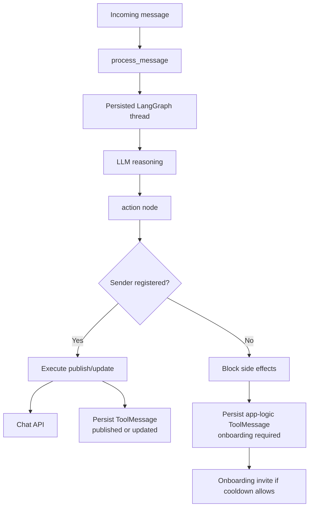
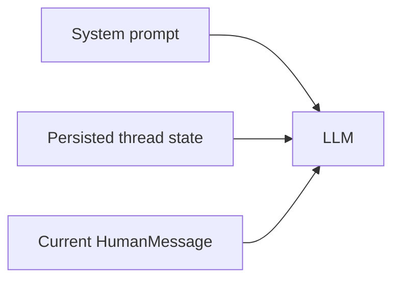
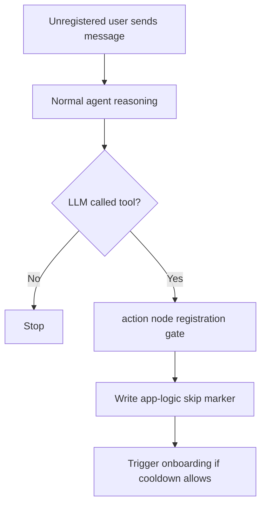
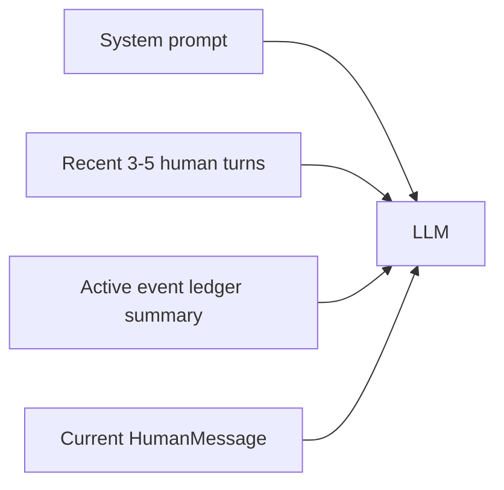
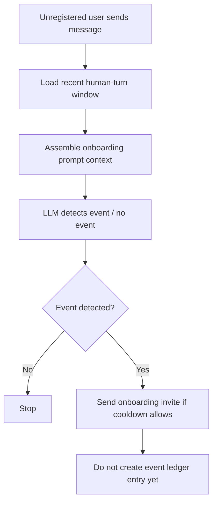

# LLM Memory Alternatives

This note compares the **current chosen memory architecture** with one stronger long-term alternative.

It is not a source-of-truth runtime spec.  
Its purpose is to explain architectural options and trade-offs around agent memory.

Current baseline:

- reasoning memory lives in persisted LangGraph thread state,
- unregistered users go through the same reasoning flow,
- action execution is gated by app logic,
- runtime helpers are limited to locks, caches, and cooldown state.

---

## Current State: Unified Reasoning + App-Logic Gated Execution

This is the architecture currently implemented in the codebase.

### Idea

All messages use the same agent reasoning model.

The difference between registered and unregistered users is not in how the model thinks, but in whether tool side effects are allowed to execute.

### Structure



### What the LLM sees



### Unregistered flow



Typical marker:

```text
No event action executed due to app logic. Reason: sender not registered; onboarding required.
```

### Pros

- one reasoning path for all users,
- simpler than dual-memory onboarding,
- no fake publish/update side effects for unregistered users,
- `event_ref` authority remains in persisted `ToolMessage` history,
- easier to explain than the old ephemeral-thread model.

### Cons

- unregistered-user markers still add some semantic noise to the thread,
- very old persisted thread state still has no freshness cutoff,
- `context_messages` is still not human-turn based.

### Best fit

Best if the priority is:

- simplicity,
- one consistent reasoning model,
- low migration risk.

---

## Alternative: Recent Turns + Event Ledger

This is still the strongest long-term alternative if event lifecycle clarity becomes more important than staying close to native LangGraph message-state semantics.

### Idea

Split memory by purpose:

1. **Recent conversation memory** for near-term conversational context.
2. **Event ledger** for durable event lifecycle semantics.

The model would no longer reason over a long mixed chain of `Human / AI / Tool` messages as the primary source of truth.

### Structure


### Event ledger concept

Example entry:

```text
event_ref: 4821
status: active
latest_points: sync -> 11:00
platform_message_id: 123456
last_updated_at: 2026-03-27T10:05:00Z
```

### What the LLM sees



### Unregistered flow



### Pros

- prompt input becomes highly intentional,
- `context_messages` can become true human-turn semantics,
- old stale thread state matters less,
- update logic becomes clearer because `event_ref` lookup is explicit,
- easy to add freshness rules like "discard conversational context after 3 days, keep only active events".

### Cons

- more custom architecture,
- weaker alignment with native LangGraph messages state,
- requires explicit prompt assembly logic,
- event ledger becomes a real subsystem with its own correctness burden.

### Best fit

Best if the priority is:

- strong event lifecycle control,
- explainable update semantics,
- tight control over prompt contents.

---

## Side-by-Side Comparison

| Question | Current State: Unified Reasoning + Gated Execution | Alternative: Recent Turns + Event Ledger |
|---|---|---|
| Main idea | One reasoning flow, app logic decides execution | Two intentional memory layers by role |
| Source of truth for reasoning | LangGraph thread state | Prompt assembler over recent turns + ledger |
| Update semantics | derived from persisted ToolMessages | derived from explicit ledger entries |
| Unregistered handling | same reasoning path, blocked tool execution | onboarding detection outside event ledger |
| Complexity | medium | medium-high |
| Explainability | good | very good if designed well |
| Native LangGraph alignment | stronger | weaker |
| Control over prompt contents | medium | strong |
| Migration risk | low | higher |

---

## Why We Chose the Current State

We explicitly moved toward the current design because it gave the biggest simplification for the least migration risk:

1. removed `history.py` from reasoning,
2. kept LangGraph thread as the main memory source,
3. kept `event_ref` semantics intact,
4. avoided a full custom event-ledger rewrite.

That made the system easier to reason about immediately, without throwing away the working publish/update machinery.

---

## Open Future Questions

1. Should `context_messages` become human-turn based instead of message-object based?
2. Should persisted thread state get a freshness cutoff after long inactivity?
3. Do app-logic skip markers create enough noise that a ledger-based model would be worth it later?
4. Should platform execution metadata be moved into a dedicated operational store instead of staying in `ToolMessage.additional_kwargs`?
